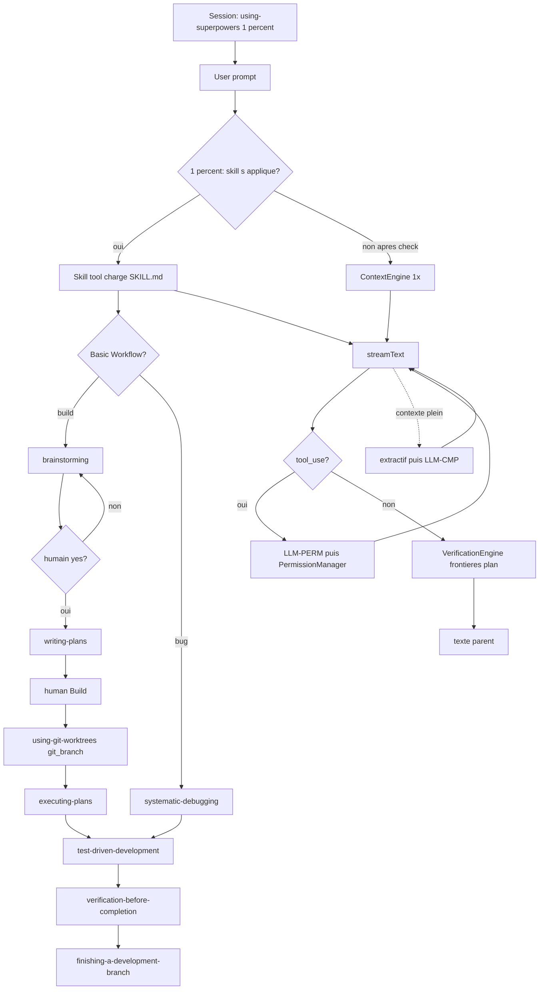

# Agent Workflow idéal — cible approuvée

Document de **cible**. Plus « à valider » : les décisions produit de cette révision sont la spec d’implémentation.

**Décisions produit déjà prises (cette révision) :**

- règle Superpowers **1 %** ;
- **The Basic Workflow** Superpowers en entier, **mandatory** ;
- bibliothèque de skills Superpowers en V1 ;
- classifieur LLM **auto-mode** (Claude Code) en V1 ;
- compact **LLM** (Claude Code) en V1.

Ce document **prime** sur [kursor-harness.md](./kursor-harness.md) §1.2 (« ne pas forcer la règle 1 % »). Le reste du harness (TS orchestre, Rust = OS, local-first, un `AIService`) reste.

Sources as-built : [Kursor](./agent-workflow.md), [Claw](../../code%20editors/claw-code/docs/architecture/agent-workflow.md), [Superpowers](../../code%20editors/superpowers/docs/architecture/agent-workflow.md) (`using-superpowers`, README Basic Workflow), [Claude Code](../../code%20editors/claude-code/docs/architecture/agent-workflow.md).

```text
GARDER     déjà dans Kursor
PRENDRE    idée d’un autre projet
REJETER    on ne le veut pas
DÉCIDÉ     choix produit ci-dessus
```

---

## 1. Intention

**Une boucle modèle/tools unique** (Claw / Claude Code) + **contexte RAG et preuves par commandes** (Kursor) + **méthode Superpowers obligatoire** (1 % rule, Basic Workflow, skills) + **classifieur permissions LLM** et **compact LLM** en V1 (Claude Code).

La réponse affichée est le **dernier texte du modèle parent**, jamais une concat de specialists Kursor.

Les workflows Superpowers sont des **obligations**, pas des suggestions. L’agent **invoque le skill pertinent avant toute action** — y compris question de clarification, exploration, lecture de fichiers.

---

## 2. Ce qu’on prend / ce qu’on refuse

### 2.1 Kursor — GARDER

- Un seul site chat (`AIService.streamChat` / `streamText`).
- `ContextEngine` **une fois** par message utilisateur (RAG, memory, graph, git, editor).
- `VerificationEngine` : commandes projet (en plus de, et aligné avec, `verification-before-completion`).
- Repair : jusqu’à 2 tours modèle si les checks échouent après mutation.
- `PermissionManager` deny-first : deny explicite **gagne toujours** sur le classifieur.
- `AgentRunEvent` persistés ; graphe Run = projection.
- Fallback modèle (`FallbackManager`) autour d’un tour.
- MCP via le registry.
- Checkpoints fichiers (rewind).

### 2.2 Claw / Claude Code — PRENDRE

- `while tool_use` : un stream par tour, jusqu’à plus de tools.
- Pas de `classifyTask` regex → 4 specialists.
- Sous-agent = autre boucle (tool `Agent`), utilisée par **SDD** / `dispatching-parallel-agents`.
- Plan mode UI optionnel **après** brainstorm (consigne Superpowers : brainstorm **avant** plan mode).
- **V1 DÉCIDÉ — classifieur LLM auto-mode** : pour les actions qui demanderaient un ask, un second appel modèle allow/deny (comme Claude Code). Ce n’est **pas** une taxonomie de prompt.
- **V1 DÉCIDÉ — compact LLM** : quand la fenêtre se remplit, résumé modèle (comme `/compact` / auto-compact Claude Code), après une passe extractive (drop vieux tool outputs) pour limiter le coût.
- Tokens **provider**.

### 2.3 Superpowers — PRENDRE TEL QUEL (DÉCIDÉ)

Bootstrap session = injection du corps `**using-superpowers**` (règle 1 %, red flags, priorité process → implementation, `SUBAGENT-STOP`).

**The Basic Workflow** (README Superpowers) — mandatory :

1. **brainstorming** — avant d’écrire du code. Questions, alternatives, design par sections, spec fichier si architectural. **HARD-GATE** yes humain.
2. **writing-plans** — design approuvé. Tâches 2–5 min, chemins exacts, code, vérifs. Écrit sur la branche courante (Plan mode) ; pas de `checkout -b` ici.
3. **using-git-worktrees** — après **Build** (`planApproved`), avant toute mutation de code. Branche Git **in-place** dans le checkout éditeur (`git_branch` / `checkout -b`). Pas de copie `.worktrees/`.
4. **executing-plans** — plan en main. Le parent implémente. TDD obligatoire. Explore subagents seulement en brainstorm/plan. Implement optionnel. Pas de revue subagent par tâche.
5. **test-driven-development** — pendant l’implémentation. RED-GREEN-REFACTOR ; supprimer le code écrit avant les tests.
6. **verification-before-completion** — tous les todos du plan sont complets. Puis suite harness.
7. **finishing-a-development-branch** — après VBC. Verify tests, puis merge local obligatoire (checkout base → merge → conflits listés, continue). Cleanup = `git branch -d`.

**Règle 1 %** (`using-superpowers`) :

> If you think there is even a 1% chance a skill might apply, you ABSOLUTELY MUST invoke the skill.  
> Invoke **before** any response or action — clarifying questions, exploring, checking files.  
> « This is just a simple question » = encore un skill check.

Priorité : « Let's build X » → brainstorming d’abord ; « Fix this bug » → systematic-debugging d’abord.

Instructions humaines (CLAUDE.md, demande explicite) **prime** sur les skills. On ne skip le workflow que si l’humain l’a dit clairement.

Skills = Markdown. **Pas** un second `AgentLoop`. Le harness Kursor **exécute** : Skill tool, Agent tool, branche in-place (`git_branch`), deny mutations sans HARD-GATE / sans branche après Build, VerificationEngine.

### 2.4 Bibliothèque de skills V1

Porter les skills Superpowers (corps Markdown, mapping tools Kursor à part — ne pas réécrire les SKILL.md pour « coller » à Kursor).

**Testing**


| Skill                     | Rôle                               |
| ------------------------- | ---------------------------------- |
| `test-driven-development` | RED-GREEN-REFACTOR ; anti-patterns |


**Debugging**


| Skill                            | Rôle                                                                    |
| -------------------------------- | ----------------------------------------------------------------------- |
| `systematic-debugging`           | 4 phases, root-cause-tracing, defense-in-depth, condition-based-waiting |
| `verification-before-completion` | Preuve avant « done / fixed »                                           |


**Collaboration**


| Skill                            | Rôle                                                |
| -------------------------------- | --------------------------------------------------- |
| `brainstorming`                  | Design socratique, spike / bounded / architectural  |
| `writing-plans`                  | Plan d’implémentation                               |
| `executing-plans`                | Exécution parent après Build                        |
| `subagent-driven-brainstorming`  | Explore avant le design                             |
| `subagent-driven-planning`       | Explore avant create_plan                           |
| `dispatching-parallel-agents`    | Fan-out sous-agents indépendants                    |
| `requesting-code-review`         | Review vs plan, critical bloque                     |
| `receiving-code-review`          | Traiter un review (pas d’acquiescement performatif) |
| `using-git-worktrees`            | Branche in-place après Build (`git_branch`)         |
| `finishing-a-development-branch` | Merge local obligatoire ; conflits listés           |


**Meta**


| Skill               | Rôle                                       |
| ------------------- | ------------------------------------------ |
| `using-superpowers` | Injecté session start ; 1 % rule           |
| `writing-skills`    | Auteur de skills (TDD appliqué à la prose) |


### 2.5 REJETER (toujours)


| Idée                                     | Pourquoi                              |
| ---------------------------------------- | ------------------------------------- |
| 4 specialists dès `medium`               | Coût, RAG ×4, concat                  |
| `classifyTask` comme fork d’architecture | Regex ≠ intention                     |
| Orchestrateur Kursor toujours-on         | Remplacé par SDD / Agent à la demande |
| Client LLM dans un plugin parallèle (SG) | Un seul `AIService`                   |
| Boucle agent en Rust                     | Non-objectif harness                  |
| 27 hooks Claude Code / Ralph infini      | Hors V1                               |
| Réponse = concat de reports              | Ment à l’utilisateur                  |


---

## 3. Boucle cible

```text
Session start (1×)
  inject using-superpowers  (1 % rule, verbatim skill)
  catalogue TOUTES les skills Superpowers (name + description YAML)
  MCP tools/list déjà sync

User prompt
  trim → user_prompt_submit
  slash-skill éventuel
  PAS de classifyTask fork

  ContextEngine.build (1×)

  AgentLoop
    repeat:
      si fenêtre saturée:
        1) drop vieux tool outputs (extractif)
        2) LLM-CMP résumé conversation          // V1 DÉCIDÉ, Claude Code
      streamText (tools on)
      si tool_use:
        PreToolUse
        LLM-PERM classifieur auto-mode          // V1 DÉCIDÉ, si pas deny/allow explicite
        PermissionManager (deny explicite gagne)
        HARD-GATE brainstorm: mutation sans designApproved → deny tool
        execute → PostToolUse
      sinon: break

    si frontière plan (todo completed / VBC):
      VerificationEngine
      fail → LLM-001-VRP ≤2

  final = dernier texte parent
  events tout du long
```




Le nœud `CHK` n’est **pas** un LLM de classification d’intention Kursor. C’est le **modèle du tour** (LLM-001) qui **doit** appeler `Skill` avant d’agir — imposé par le bootstrap +, côté harness, refus des tools « travail » (Read exploratoire inclus) tant qu’aucun skill check n’a eu lieu **dans ce tour** sauf si un skill est déjà chargé pour ce but.

**Filet harness (DÉCIDÉ, en plus de la prose) :** au premier pas d’un tour user, si le modèle n’a pas encore fait `Skill` / slash-skill, les tools hors `Skill` / `AskUserQuestion` sont **deny** avec le message « invoke a skill first (1% rule) ». Exception : l’humain a dit explicitement de skip. Les sous-agents respectent `SUBAGENT-STOP` (pas de 1 % sur using-superpowers).

---

## 4. Quand le modèle a le droit d’écrire


| Situation                            | Mutations                                        | Workflow                                                                              |
| ------------------------------------ | ------------------------------------------------ | ------------------------------------------------------------------------------------- |
| Toute action, y compris explain      | Skill check 1 % d’abord                          | `using-superpowers`                                                                   |
| « Explique ce fichier »              | Interdites (pas du creative work)                | Check skills ; pas brainstorm obligatoire si le skill brainstorming ne s’applique pas |
| « Let's build / ajoute une feature » | Interdites jusqu’à **yes**                       | brainstorming → HARD-GATE                                                             |
| Après yes, avant code                | Plan Markdown (Plan mode, read-only)             | `writing-plans` / `create_plan`                                                       |
| Après Build, avant mutations         | Branche in-place (`checkout -b`)                 | `using-git-worktrees` / `git_branch`                                                  |
| Architectural                        | Spec puis plan fichiers                          | `writing-plans` puis SDD ou `executing-plans`                                         |
| Bounded                              | Design court en chat + yes ; pas de plan fichier | TDD dans le parent (skill brainstorming)                                              |
| Spike                                | Throwaway only                                   | Reco ; pas de feat commit                                                             |
| « Fix ce bug »                       | Après phase 1 debug                              | `systematic-debugging` puis TDD                                                       |
| Plan mode UI                         | Pas de source edits                              | Seulement **après** brainstorm si pas déjà fait                                       |
| Critical review                      | Bloque la tâche suivante                         | `requesting-code-review`                                                              |
| Fin                                  | Verify + merge local                             | `finishing-a-development-branch`                                                      |


`designApproved` et `planApproved` sont du **état de session** harness, pas seulement du texte modèle.

---

## 5. Inventaire LLM V1

Un seul site : `AIService.streamChat`.


| ID          | Quand                                           | Rôle                             |
| ----------- | ----------------------------------------------- | -------------------------------- |
| LLM-001     | Chaque tour parent                              | Analyse + Skill + tools + texte  |
| LLM-001-SUB | SDD implementer / reviewer / parallel / explore | Boucle isolée                    |
| LLM-001-VRP | VerificationEngine KO                           | Repair ≤2                        |
| LLM-PERM    | Tool qui serait en *ask*                        | Classifieur auto-mode allow/deny |
| LLM-CMP     | Fenêtre saturée (auto ou `/compact`)            | Résumé d’historique              |
| EMB-001     | ContextEngine du message user                   | 1 embed query                    |


**Pas de** planner LLM séparé, pas de `classifyTask` LLM, pas de verifier-LLM, pas de RAG-rewrite LLM. Brainstorm / plan = LLM-001 + skills.

### LLM-PERM (classifieur auto-mode)

- Déclenché **après** les règles deny/allow explicites, **avant** l’execute, pour les tools qui seraient `ask`.
- System **court** (pas le gros contexte Kursor / RAG) — leçon Claude Code : le classifieur n’embarque pas le system agent.
- Entrée : nom du tool, args résumés, cwd, permission mode.
- Sortie structurée : `allow`  `deny`  `ask_human`.
- Deny explicite settings **ne passe pas** par LLM-PERM.
- Fail-open : **non**. Échec API → `ask_human` (l’humain reste aux commandes).
- Events : `permission-classifier`.

### LLM-CMP (compact LLM)

- Ordre Claude Code : (1) jeter les vieux tool outputs, (2) si encore trop plein, **un** LLM-001-like résumé.
- Préserver objectifs, chemins touchés, decisions, `designApproved` / plan path, findings review.
- Relire `using-superpowers` **après** compact (leçon Hermes : bootstrap perdu).
- Event `compact_boundary`. Thrashing (re-remplissage immédiat) → erreur visible, pas de boucle infinie.
- `/compact` utilisateur = même chemin, `trigger: manual`.

---

## 6. Skills dans le harness

- Discovery : fichiers `skills/*/SKILL.md` (copie vendored Superpowers + mapping `references/kursor-tools.md`).
- Session start : injecter **tout** `using-superpowers` (pas une version « courte » qui enlève la 1 %).
- Invoke : tool `Skill` / `load_skill` ; slash `/brainstorming` etc.
- Descriptions YAML dans le catalogue à **chaque** LLM-001 parent.
- Sous-agent : ignorer `using-superpowers` (`SUBAGENT-STOP`) ; TDD dans le prompt implementer.

---

## 7. Sous-agents (recherche + implement optionnel)

Défaut **après un plan** : **executing-plans**. Les sous-agents `explore` servent brainstorm et planning. `implement` reste disponible après Build + TDD. `review` n’est plus orchestré par tâche.

| Étape                    | Appel                                                                 |
| ------------------------ | --------------------------------------------------------------------- |
| Explore / brainstorm     | LLM-001-SUB, `explore-prompt.md`                                      |
| Explore / plan           | LLM-001-SUB, `explore-prompt.md`                                      |
| Implementer (optionnel)  | LLM-001-SUB, prompt `implementer-prompt.md`, TDD                      |
| Review branche           | `requesting-code-review` (optionnel)                                  |
| Parallel            | `dispatching-parallel-agents` si tâches indépendantes                 |


Pas de pipeline Kursor research → coding → testing → review.

Parent : coordination. Les explore subagents recherchent ; le parent écrit le design et le plan.

---

## 8. Contexte par invocation

```text
LLM-001 parent
  using-superpowers (réinjecté post-compact)
  catalogue skills Superpowers
  rules / CLAUDE.md projet
  ContextEngine 1× (RAG …)
  historique (post LLM-CMP si compacté)
  tools + MCP

LLM-PERM
  system court classifieur
  action proposée
  PAS de RAG, PAS du catalogue skills complet

LLM-CMP
  transcript à résumer + Compact Instructions projet
  PAS d’outils mutants

LLM-001-SUB
  prompt recherche / implementer / skill TDD
  tools filtrés
  pas using-superpowers
```

---

## 9. Vérification, permissions, recovery

```text
TDD pendant implement          skill + le modèle lance les tests
VerificationEngine après tour  harness, commandes projet
verification-before-completion  pas de claim sans evidence dans CE tour
finishing-a-development-branch  full suite puis merge local obligatoire
```

Permissions V1, ordre :

1. Deny rules (settings / Rust) → deny.
2. Allow rules de confiance → allow.
3. Sinon **LLM-PERM** (auto-mode).
4. `ask_human` → UI Kursor.
5. HARD-GATE design → deny mutation.

Recovery : checkpoints + branche in-place. Pas Ralph.

---

## 10. Observabilité


| Event                          | Source                           |
| ------------------------------ | -------------------------------- |
| `skill-check` / `skill-loaded` | 1 % + Skill tool                 |
| `design-gate`                  | HARD-GATE                        |
| `branch-created` / `merge-conflicts` | using-git-worktrees / finishing |
| `plan-written`                 | writing-plans                    |
| `subagent-task-*`              | explore / implement                  |
| `llm-started`                  | LLM-001 / SUB / VRP / PERM / CMP |
| `permission-classifier`        | LLM-PERM                         |
| `compact_boundary`             | LLM-CMP                          |
| `verification-*`               | VerificationEngine               |
| `context-assembled`            | 1× / message user                |


Tokens provider. Alerter si un « explain » déclenche SDD (régression).

---

## 11. Scénarios

### 11.1 « Explique-moi ce fichier »

```text
1 % : Skill check (using-superpowers)
  brainstorming ne s’applique pas (pas creative work)
LLM-001 Read → texte
0 mutation, 0 branche agent, 0 SDD
LLM-PERM possible sur Read hors cwd
```

### 11.2 « Let's make a react todo list »

```text
Skill(brainstorming) AVANT tout Read/Write
classification spike | bounded | architectural
HARD-GATE yes
writing-plans (Plan mode) puis Build humain
git_branch in-place (éditeur + panneau Git)
architectural → SDD (implementer+reviewer / tâche)
  TDD dans chaque implementer
  requesting-code-review entre tâches ; critical bloque
  finishing-a-development-branch (merge checkout base, conflits listés)
bounded → TDD dans le parent, pas de plan fichier
0 Write avant yes
```

### 11.3 « Les tests auth échouent »

```text
Skill(systematic-debugging) avant patch
phases 1–4 puis TDD + VerificationEngine
verification-before-completion avant « fixed »
```

### 11.4 Fenêtre pleine / tool risqué

```text
contexte plein → extractif → LLM-CMP → réinject using-superpowers
Bash mutant → LLM-PERM → allow | deny | ask
```

---

## 12. Décisions

### Déjà tranchées


| #   | Décision                                                                 |
| --- | ------------------------------------------------------------------------ |
| E   | Superpowers **tel quel** : 1 % + Basic Workflow + bibliothèque §2.4      |
| F   | Compact **LLM** V1 (après passe extractive)                              |
| G   | Classifieur **LLM** auto-mode V1                                         |
| H   | SDD **V1** dès qu’il y a un plan (sinon executing-plans au choix humain) |
| B   | **Supprimer** le fork 4 specialists / `classifyTask` architecture        |


### Encore à valider

**A. Filet HARD-GATE harness** (en plus de la prose)

- [x] Deny mutations sans `designApproved` sur *build/add/create/implement* **et** deny tools non-Skill tant que pas de skill check du tour (recommandé, aligné 1 %)
- [ ] Prose seule (le modèle peut tricher)

**C. Plan mode UI**

- [x] `EnterPlanMode` **après** brainstorm seulement (recommandé)
- [ ] Pas de plan mode UI V1 (writing-plans suffit)

**D. Types Agent V1**

- [x] `implement` / `review` / `explore` suffisent pour SDD + parallel (recommandé)
- [ ] Plus de types (architect, etc.)

---

## 13. Hors scope

- Boucle conversationnelle Rust, marketplace, Ralph, 27 hooks, cron.
- Plugin security-guidance comme second client HTTP.
- Réécrire les SKILL.md Superpowers « pour Kursor » (mapping tools à part).

---

## 14. Critères de succès

- « Explique ce fichier » : skill check, **pas** brainstorm, **pas** Write, **pas** SDD.
- « Let's make a react todo list » : **brainstorming avant tout code** (test d’acceptance Superpowers).
- Après yes architectural : writing-plans → Build → `git_branch` in-place → SDD (ou executing-plans) → TDD → review → finishing-branch (merge checkout base, conflits listés).
- Critical review : la tâche suivante ne part pas.
- « done / fixed » : VerificationEngine + skill evidence dans le tour.
- Tool en *ask* : event `permission-classifier` (LLM-PERM).
- Session longue : event `compact_boundary` + `using-superpowers` encore dans le contexte.
- Graphe Run = journal d’events (plus le pipeline 4 specialists).

---

## 15. Philosophie (Superpowers, V1)

- Test-Driven Development — tests d’abord, toujours (quand on implémente).
- Systematic over ad-hoc — process plutôt que deviner.
- Complexity reduction — simplicité comme but.
- Evidence over claims — vérifier avant de déclarer le succès.

