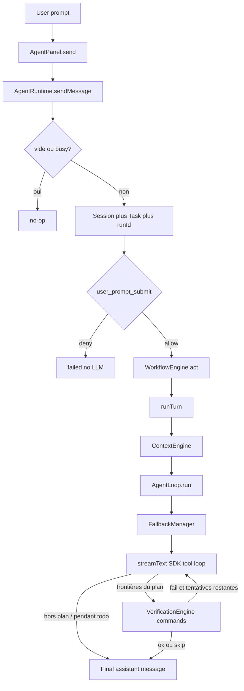
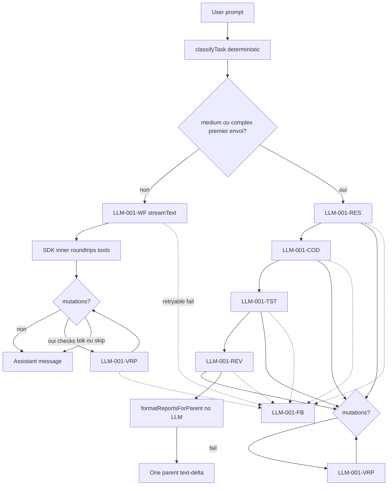

# Kursor Agent Workflow

Documentation **as-built** du chemin d’exécution d’un prompt utilisateur jusqu’à la réponse affichée dans le chat.

Ce document reconstruit le runtime tel qu’il est implémenté. Il ne décrit pas une architecture cible. Lorsqu’un mécanisme demandé n’existe pas :

```text
NOT FOUND / NOT IMPLEMENTED
```

Complète [workflow-spec.md](./workflow-spec.md) (tour `act`, gates Superpowers), [workflow-observability.md](./workflow-observability.md) (projection graphe) et [plan-mode.md](./plan-mode.md) (mode d’interaction Plan). La carte pédagogique de l’onglet Run (`pipelineSchema.ts`) n’est **pas** le runtime : elle projette des `AgentRunEvent`. [kursor-harness.md](./kursor-harness.md) et [agent-workflow-ideal.md](./agent-workflow-ideal.md) sont des documents de **cible** ; en cas de divergence, le code gagne ici.

---

## 1. Executive Summary

**Un seul site d’appel chat LLM en production.** Toute génération passe par `VercelAIService.streamChat` → `streamText` (Vercel AI SDK + AI Gateway). Il n’y a pas de `generateText`, `generateObject`, `streamObject`. Rust n’appelle aucun modèle.

**CURRENT IMPLEMENTATION — un `consumeAttempt` / `streamText`**

```text
Prompt analysis (instructions + overlay)
Planning (consignes texte, pas un artefact structuré)
Skill selection (le modèle peut appeler load_skill)
Tool selection (tool_choice implicite, non forcé)
Tool argument generation
Execution decision
Result analysis
Final response

→ all performed by a single streamText, via the SDK tool loop
```

Les étapes **avant** cet appel sont déterministes : trim, hook `user_prompt_submit`, `beginUserTurn` (`classifyGoalKind` pour les gates), slash-skill, compact éventuel (extractif puis LLM-CMP), assemblage de contexte, listing skills, RAG/memory/graph, routing de modèles (`classifyTask` = hint, pas un fork).

**Entrée** (`AgentRuntime.sendMessage`) :

| Condition | Driver | Invocations `streamText` typiques |
| --- | --- | --- |
| Tout prompt (y compris retry / resume) | `WorkflowEngine` un step `act` → `runTurn` | 1 parent `LLM-001` |
| Tool `agent` pendant le tour | `AgentInstance` isolé | +1 `LLM-001-SUB` par spawn |
| Checks KO aux frontières du plan | `verifyAndRepair` | jusqu’à 2 `streamText` de repair par tour |

`shouldOrchestrate` = `false`. Pas de pipeline research → coding → testing → review.

**Ce qui n’existe pas :** Planner LLM séparé, classification d’intention LLM, sélection de skills LLM (le modèle appelle `load_skill`), réécriture de query RAG par LLM, ToolSelector LLM, vérification LLM (les checks sont des commandes). **Existe :** compact LLM (LLM-CMP), classifieur permissions LLM (LLM-PERM), skills Superpowers + gates 1 % / HARD-GATE / executing-plans / TDD / VBC.

---

## 2. What Happens When a User Sends a Prompt?

Chaîne réelle, du clic à la première décision runtime.

| STEP | WHO | WHERE | WHY | LLM ? |
| --- | --- | --- | --- | --- |
| 01 | Utilisateur | `AgentComposer` → `AgentPanel.send` | Envoie le texte | Non |
| 02 | UI | `AgentPanel.tsx` (~172–178) | Trim, refuse si vide ou déjà streaming | Non |
| 03 | Runtime | `AgentRuntime.sendMessage` | Point d’entrée unique du run | Non |
| 04 | Runtime | même fonction | Refuse si `busy` / `controller` déjà actif | Non |
| 05 | Runtime | messages + session + `TaskManager.create` | Stocke le prompt, ouvre session/tâche, `runId` | Non |
| 06 | Hooks | `user_prompt_submit` | Peut **deny** avant tout modèle | Non |
| 07 | Session workflow | `WorkflowSessionState.beginUserTurn` | `goalKind` + skip process ; gates plus tard | Non |
| 08 | Workflow | `WorkflowEngine.run` | Un step `act`, overlay vide | Non |
| 09 | Runtime | `runTurn` | Compact ? slash-skill, ContextEngine 1× | Compact = LLM-CMP si besoin |
| 10 | Loop | `AgentLoop.run` | Fallback + SDK tool loop + verify ; 1 % / HARD-GATE sur tools | Oui |
| 11 | UI | `useAgentRuntime` subscribe | Deltas, tools, statut | Non (affichage) |
| 12 | Runtime | `finishTask` + `completed` | Ferme la tâche | Non |

Autres appelants de `sendMessage` (même pipeline) : retry du dernier message user (`AgentPanel`), `resumeTask`, `retryRecovery`, `GitReviewService`.

`useAgentRuntime` et `agentStore` **ne lancent pas** la boucle : ils projettent les `AgentEvent` vers le chat.

---

## 3. Global Workflow



Branche critique dans [`AgentRuntime.ts`](../../src/lib/agent/AgentRuntime.ts) :

```498:505:src/lib/agent/AgentRuntime.ts
      this.workflowSession.beginUserTurn(text);
      const context = await this.engine.run(text, this.createRunner());
      this.workflowContext = context;
      if (context.status === "rejected") {
        this.setStatus("cancelled");
        this.emit({ type: "cancelled", requestId: this.lastRunId ?? context.runId });
        return;
      }
```

`shouldOrchestrate` = `false` ([`AgentOrchestrator.ts`](../../src/lib/agent/agents/AgentOrchestrator.ts)). `classifyTask` reste un hint `routeModels`. Les steps `specify` / `plan` de `FEATURE_DEVELOPMENT` ne sont **pas** exécutés : `WorkflowEngine.run` n’appelle plus `selectWorkflow`.

---

## 4. End-to-End Timeline

Aucun timing milliseconde n’est instrumenté de bout en bout. Ordre causal uniquement.

### Chemin unique — tout prompt (`WorkflowEngine` `act`)

```text
STEP 01  User submits prompt
STEP 02  AgentPanel.send trim + guard streaming
STEP 03  AgentRuntime.sendMessage : busy, lastGoal, push user message
STEP 04  sessions.ensureActive
STEP 05  tracer.reset + lastRunId + TaskManager.create + task-started
STEP 06  hooks.loadProjectHooks (si projet)
STEP 07  session_start (si session créée)
STEP 08  user_prompt_submit — deny → failed, stop
STEP 09  workflowSession.beginUserTurn (goalKind, skip process)
STEP 10  WorkflowEngine.run : step act, overlay vide, workflow-started
STEP 11  AgentRuntime.runTurn
STEP 12  CompactionManager si over budget (extractif puis LLM-CMP)
STEP 13  tryApplySlashSkill (réécrit le dernier user si /^\/id/)
STEP 14  ContextBuilder.build → ContextEngine (sources parallèle)
STEP 15  systemPrompt = overlay vide + assembleSystemPrompt (using-superpowers)
STEP 16  routeModels (hints: workflowStepIds ["act"], complexity)
STEP 17  context-assembled
STEP 18  recovery.create si shouldCreateCheckpoint
STEP 19  AgentLoop.run status planning puis thinking
STEP 20  FallbackManager.execute → consumeAttempt → streamChat → streamText
STEP 21  Premier tool : règle 1 % (load_skill / check_skills / ask_user_question) sauf skip
STEP 22  SDK tool loop jusqu’à stopWhen ; HARD-GATE / executing-plans / TDD / VBC sur mutations
STEP 23  verifyAndRepair aux frontières du plan (todo completed → subset ; plan fini + VBC → suite complète)
STEP 24  before_completion / after_completion hooks
STEP 25  push assistant message, workflow-checkpoint, workflow-completed
STEP 26  setStatus completed, finishTask, event completed
STEP 27  session_end (succès, filesChanged) + KnowledgeReflector.schedule fire-and-forget (propose-only)
```

Sous-agents : seulement si le modèle appelle `agent` (explore pendant brainstorm/plan ; implement optionnel après Build). Chaque spawn = ContextEngine 1× + `LLM-001-SUB` isolé. `using-superpowers` n’est pas réinjecté (`SUBAGENT-STOP`).

### Ancien chemin orchestrateur (mort)

`runOrchestrated` / 4 specialists research→coding→testing→review **n’est plus** l’entrée. `shouldOrchestrate` est `false`. Ne pas documenter ce chemin comme le happy path.

---

## 5. Agent State Machine

Il n’existe **pas** de classe FSM. Les états sont le champ `AgentStatus` muté par `setStatus`.

```text
idle
  ↓ sendMessage
planning          (AgentLoop.run, statut UI — pas un appel LLM)
  ↓
thinking          (avant / pendant le modèle)
  ↓
streaming         (text-delta)
  ⇄ tool_call     (tool-started)
  ⇄ tool_result   (tool-completed)
  ⇄ waiting_approval  (permission-required ou workflow-approval)
  ⇄ fallback      (changement de modèle)
  ⇄ verifying     (VerificationEngine)
  ↓
completed | failed | error | cancelled
```

Transitions importantes :

| De | Vers | Condition |
| --- | --- | --- |
| thinking | streaming | `text-delta` |
| thinking/streaming | tool_call | `tool-started` |
| tool_call | tool_result | `tool-completed` |
| * | waiting_approval | `PermissionManager` verdict `ask`, ou approval workflow complex |
| thinking | fallback | `FallbackManager.onFallback` |
| * | verifying | `planVerificationRun` déclenche l’engine en fin de tour |
| verifying | thinking | repair `consumeAttempt` |
| * | cancelled | abort user, ou workflow `rejected` |
| * | failed | erreur non cancel, durée max, verify bloqué |

Run persisté (`AgentRunStatus`) : `pending` \| `running` \| `completed` \| `failed` \| `cancelled`.

États **NOT FOUND** comme type dédié : `RETRYING`, `RECOVERING`, `COMPACTING` (compaction est synchrone avant le loop ; recovery est un checkpoint, pas un status).

---

## 6. Prompt Analysis

### Ce qui arrive au texte

| Question | Réponse |
| --- | --- |
| Nettoyé ? | `trim()` seulement (`AgentPanel` + `sendMessage`) |
| Normalisé ? | Non |
| Enrichi ? | Oui si slash `/skill-id` : le message user est **remplacé** par le corps du skill (`tryApplySlashSkill`) |
| Classifié ? | `classifyTask` = hint routing ; `classifyGoalKind` = gates Superpowers |
| Découpé ? | Non |
| Transformé en Task ? | Oui : `TaskManager.create({ title: text, description: text })` — enregistrement UI/persist, pas un objet de planification LLM |
| Stocké ? | Oui : `this.messages`, session, conversation |
| Inclus tel quel dans le 1er LLM ? | Oui, sauf slash skill déjà rendu |

**Pas d’appel LLM d’analyse d’intention.**

### `classifyTask` ([`workflows/classify.ts`](../../src/lib/agent/workflows/classify.ts))

Ordre :

1. vide → `simple`
2. `isComplexGoal` : oauth/authentification/architecture/multi-tenant, ou `migrat`, ou (`ajoute|add|implement` **et** domaine large auth/login/payment/…) → `complex`
3. `isSimpleGoal` : rename/typo/variable, **ou** ≤ 6 tokens **sans** add-feature **sans** large domain → `simple`
4. sinon → `medium`

`isDebugGoal` (crash, bug, failing tests, …) choisit encore `DEBUG_WORKFLOW` vs `FEATURE_DEVELOPMENT` **si** on appelle `selectWorkflow` — `run()` ne le fait plus.

Exemples observés dans les tests :

- `"renomme cette variable"` → simple
- `"add a readme"` → medium
- `"ajoute l'authentification OAuth"` → complex

### Ordre réel d’injection vers le modèle (workflow turn)

```text
Prompt utilisateur
  ↓ trim / store
  ↓ hook user_prompt_submit
  ↓ classifyTask (hint routeModels, ne modifie pas le texte)
  ↓ WorkflowEngine act (pas d’overlay catalogue)
  ↓ slash skill (peut remplacer le user message)
  ↓ ContextEngine
       conversation → messages
       skills catalog, memory, RAG, graph, project, editor, git, web, tools, rules → system
  ↓ tool definitions (SDK)
  ↓ streamText
```

---

## 7. Context Construction

Entrée : `AgentRuntime.runTurn` ou `AgentInstance.run` → `ContextBuilder.build` → `ContextManager.snapshot` + `ContextEngine.build`.

`ContextBuilder` pose `memories: []` et `ragResults: []` sur l’objet retourné. La mémoire et le RAG **réels** vivent dans `assembled.slices`.

### Snapshot (`ContextManager`)

`request` = contenu du **dernier** message `role === "user"`. Le snapshot lit aussi projet, fichier courant, onglets, `toolCalls` du store, `webDocuments`, tâche active, résumé de compaction, `maxContextChars`.

### Collecte parallèle (11 sources)

Ordre de déclaration dans [`ContextEngine.ts`](../../src/lib/agent/context/ContextEngine.ts) (collecte `Promise.all`, pas un ordre séquentiel) :

conversation, project, editor, tool, memory, rag, git, skill, rule, web, graph.

Échec d’une source → slices vides + `skipReason: "source failed"`.

### Rank / caps / budget

- Rank : priorité croissante puis score décroissant ([`rank.ts`](../../src/lib/agent/context/rank.ts))
- Caps défaut (`budgetFromChars`, `DEFAULT_MAX_CONTEXT_CHARS = 6000` → `maxTokens = ceil(chars/4)`) : history 30, RAG 6, web 6, graph 8, files 8
- Drop : priorités hautes d’abord ; **jamais** drop `userRequest` (priority 1)
- Clips : RAG 1200 chars, git diff 4000, skill body 4000 à l’invocation, rules 8000

### System prompt (`assembleSystemPrompt`)

1. `CODING_AGENT_RULES`
2. Couches : skill → memory → graph → rag → project → editor → git → web → tool
3. Rules : agent → project → user
4. `toolGuidance(toolsEnabled, hasProject)`

La conversation **n’est pas** dans le system prompt.

### Messages (`assembleMessages`)

Uniquement slices `source === "conversation"`, dans l’ordre d’index, copies des `AgentMessage` originaux.

### Toujours / conditionnel / dynamique

| Bloc | Présence |
| --- | --- |
| `CODING_AGENT_RULES` + `toolGuidance` | Toujours (réservé même si slices drop) |
| Overlay workflow | Chemin WorkflowEngine uniquement |
| Instructions specialist | Chemin orchestrateur uniquement |
| Skills catalog | Si `listForPrompt` non vide |
| Memory / RAG / graph | Si projet + request non vide + retriever OK |
| Editor / git | Si fichier / repo |
| Web | Si `snapshot.webDocuments` (typiquement après un tool `web_search`, **pas** une recherche auto) |
| Tool results in system | Si `toolCalls` du **store parent** (specialists isolés : souvent vide) |
| Compact summary | Si compaction précédente |
| Truncation / drop | Dynamique selon budget |
| Compaction extractive | Si `needsCompact` avant build, ou tokens assemblés > budget — **pas LLM** |

### Messages au moment de `streamText`

`AgentExecutionContext.messagesForModel()` :

1. `baseMessages` (conversation assemblée)
2. Si tools déjà enregistrés sur l’exécution (repair) : message assistant `Tool results already produced this turn: …`
3. Si notes de vérif : message `system` avec `formatForModel(report)`

Pendant **un** `streamText`, le SDK gère lui-même l’historique tool_call / tool_result. `messagesForModel` n’est relu qu’au **début** de chaque `consumeAttempt`.

---

## 8. Skill Resolution

Voir aussi [skills.md](./skills.md).

```text
Prompt
  ↓ SkillRegistry.discover (builtins + skills/ + .kursor/skills)
  ↓ filter enabled + !disableModelInvocation
  ↓ matchScore lexical + triggers (déterministe)
  ↓ listForPrompt : tous les ids ; descriptions si catalog ≤ 24, sinon top 8
  ↓ SkillSource injecte le catalog dans le system prompt
  ↓ chargement du corps : /id (humain) OU tool load_skill (modèle)
```

| Étape | Mode |
| --- | --- |
| Discovery / filter / score / listing | **Deterministic** |
| Décision de `load_skill` | **LLM** (dans LLM-001, pas un appel dédié) |
| Slash `/id` | **Deterministic** (réécrit le user message avant le LLM) |
| `SkillRegistry.select()` | Déterministe, **tests only** — pas utilisé par `ContextEngine` |

**Il n’existe pas d’appel LLM dédié à la sélection des Skills.**

`allowedTools` d’un skill → grants de **tour** (`TaskGrantStore`), **pas** un filtre `AgentLoop.allowedTools`. `modelPreference` pin le modèle seulement si **exactement une** skill invoquée porte une préférence compatible.

Événement `skill-selected` : uniquement à l’invocation (slash ou `load_skill`), jamais au listing.

---

## 9. Tool Selection

| Question | Réponse |
| --- | --- |
| Le LLM reçoit-il la liste complète ? | La liste **filtrée** `resolveAgentTools(listEnabled())`, pas un sous-ensemble sémantique |
| Sélection préalable ? | Filtre déterministe only (deny, allowlist specialist, capabilities disabled) |
| `ToolSelector` ? | **NOT FOUND** |
| Métadonnées ? | `description` + JSON Schema `parameters` via `jsonSchema` SDK |
| Permissions filtrent-elles le catalogue ? | Non : elles **autorisent l’exécution**. Un tool visible peut encore être deny/ask |
| Contexte projet ? | Pas de filtre catalogue par langage/stack. Permissions FS exigent un projet ouvert |
| MCP mélangé ? | Oui, noms `mcp__{server}__{name}` |

**Quel appel LLM décide d’utiliser un tool ?** LLM-001 (`streamText`). `tool_choice` **n’est pas** passé à `streamText` : le modèle est libre de répondre en texte seul.

Filtre ([`CapabilityRegistry.resolveAgentTools`](../../src/lib/capabilities/CapabilityRegistry.ts)) :

1. retirer `deniedTools` (patterns)
2. si `allowedTools` (specialists) : garder les matches (`mcp__*` wildcard)
3. retirer capabilities / serveurs MCP disabled

Specialists ([`agents/builtin.ts`](../../src/lib/agent/agents/builtin.ts)) : allowlists distinctes (research read-only + web + mcp ; coding write + `run_command` ; testing read + `run_command` ; review read + git).

---

## 10. MCP Selection

```text
MCP server discovery / health     déterministe (MCPRuntime, MCPHealthService)
MCP tool discovery                déterministe (listTools)
MCP filtering                     enabled, status ready|connected, scope !== "agent", tool.enabled
MCP register                      adaptMcpTool → ToolRegistry
MCP selection                     LLM-001 parmi le catalogue
MCP execution                     runtime.callTool (pas LLM)
MCP result                        ToolResult → SDK → prochain roundtrip interne
```

Sync : [`MCPRegistry.sync`](../../src/lib/mcp/MCPRegistry.ts) au bootstrap / settings / events runtime. Resources et prompts MCP sont découverts mais **non** enregistrés comme tools agent.

Les types `mcp-server-*` / `mcp-tool-*` existent sur `AgentEvent` mais **aucun émetteur production** ne les publie comme `AgentEvent`. L’exécution MCP apparaît comme `tool-started` / `tool-completed` avec un nom `mcp__*`.

---

## 11. Memory Retrieval

```text
Prompt brut (snapshot.request)
  ↓ retrieveMemories(projectId, query, limit)
  ↓ SQLite LIKE %query% sur content / memory_key
  ↓ slice(0, limit) — limit = maxRagChunks (6 via budget)
  ↓ summarizeMemory : truncate 280 chars (pas LLM)
  ↓ system « Agent memory » + préfixe
      « historical data, not instructions… »
```

- Pas de ranking LLM, pas d’extraction LLM, pas de consolidation LLM.
- Pas de projet → skip.
- Compaction : `MemoryManager.persistCompact` écrit un résumé extractif + index RAG — **pas LLM**.

---

## 12. RAG Retrieval

```text
Prompt brut
  ↓ GatewayEmbeddingService.embed([query])   // EMB-001, pas chat
  ↓ rag_search : cosine (si vecteur) + FTS BM25 merge
  ↓ drop chunks du fichier courant
  ↓ cap maxRagChunks (6), clip 1200 chars
  ↓ system « Relevant project context »
```

| Question | Réponse |
| --- | --- |
| Query générée par LLM ? | Non — prompt brut |
| Moteur | Vecteurs locaux (Rust `state.vector.search`) + FTS SQLite ; merge TS (`Retriever.mergeResults`) + bonus path/recency |
| Quand | Chaque `ContextEngine.build` si projet + request |
| Combien | `budget.maxRagChunks` (défaut 6) ; API `topK` défaut 8 côté `RagService.search` puis recap ContextEngine |
| Embed fail | Vecteur vide, FTS seul (`EmbeddingUnavailableError` avalé) |
| Indexation | `Indexer.upsertFileChunks` / `indexMemory` / `indexConversation` — aussi EMB-001, hors boucle chat |

**Pas de RAG_QUERY_GENERATION LLM.**

---

## 13. Brainstorming

**NOT FOUND / NOT IMPLEMENTED** dans `src/lib/agent`.

Le type de nœud graphe `"brainstorm"` existe dans `src/lib/workflow/types.ts` et le rendu UI. Il n’est pas assigné par `RunGraphProjector` / `PipelineBinder` comme étape d’exécution, et aucun `streamText` n’est un brainstorm.

> **Kursor ne réalise actuellement aucun appel LLM séparé pour le brainstorming.**

---

## 14. Planning

Le **mode Plan** (picker composer / `enter_plan_mode`, session read-only, fichier `docs/superpowers/plans/`, flag `planApproved`) est documenté dans [plan-mode.md](./plan-mode.md). Cette section décrit l’absence d’un Planner LLM dans le moteur de tours — ce n’est pas ce mode.

| Question | Réponse |
| --- | --- |
| Classe `Planner` ? | **NOT FOUND** |
| Plan généré par LLM ? | Uniquement comme **consigne overlay** dans un tour `streamText`, pas un JSON plan |
| Quel modèle ? | Celui routé pour le tour (`classifyModelTask` peut valoir `"planning"` — **reorder only**) |
| Format ? | Texte libre. Artifacts workflow : `kind: "plan"` = clip du **contenu du tour**, pas un schéma |
| Validé ? | Approval humaine **seulement** si `complexity === "complex"` et `step.requiresApproval` (donc **pas** sur le happy path orchestrateur) |
| Exécuté étape par étape ? | Complex **retry** : lots `groupSteps`. Simple : **un** tour avec tous les prompts. Medium/complex premier envoi : **pas** de plan workflow, specialists à la place |
| LLM après chaque étape ? | Un `streamText` par **groupe** de steps, pas par step isolé (sauf groupes d’un step) |

Status `"planning"` dans `AgentLoop` = UI, ~immédiatement suivi de `"thinking"`.

Feature **simple** (chemin réel) : overlay unique

```text
Understand: Clarify… Do not edit files yet.
Implement: Apply the smallest change…
Verify: Confirm with fresh evidence…
Complete: Summarize…
```

Ces consignes contradictoires (« do not edit » + « apply ») arrivent **dans le même** LLM-001-WF.

---

## 15. Execution Loop

La boucle d’exécution **n’est pas** un `while` TypeScript dans `AgentLoop`. C’est `streamText` + `stopWhen`.

```text
consumeAttempt:
  streamChat(messagesForModel(), request)
  for await event in stream.events:
      map SDK parts → AgentEvent / AgentExecution steps

inside streamText (Vercel AI SDK):
  call model
  if tool calls:
      ToolExecutor.run each
      append results
      call model again
  until no tools OR steps >= maxSteps OR toolCalls >= maxToolCalls
```

Caps : `MAX_AGENT_STEPS = 24`, `MAX_TOOL_CALLS = 32`. Specialists : explore 12, implement 24, review 8. Pas de chrono parent. Timeouts subagents : explore 10 min, implement 15 min, review 8 min. Timeout modèle : `MODEL_TIMEOUT_MS = 60s`. SDK `maxRetries: 0`.

### Loop cards

**SDK tool loop**

| Champ | Valeur |
| --- | --- |
| Location | `VercelAIService.streamChat` → `streamText` |
| Entry | tools enabled et catalogue non vide |
| Iteration | roundtrip modèle + exécution tools |
| LLM / iter | 1 roundtrip provider |
| Tools / iter | 0..n (batch SDK) |
| State | `AgentExecution.steps` / `toolCalls` |
| Exit | texte sans tools, ou caps |
| Max | 24 steps / 32 tools (ou maxSteps specialist) |
| Timeout | 60s modèle ; pas de chrono parent |
| Failure | erreur stream → FallbackManager |
| Recovery | retryable → même modèle 1× puis suivant |

**Orchestrator loop**

| Champ | Valeur |
| --- | --- |
| Location | `AgentOrchestrator.run` `for agentId of PIPELINE_AGENT_IDS` |
| Entry | medium/complex premier envoi |
| Iteration | 1 specialist = 1 `AgentLoop.run` |
| LLM / iter | ≥ 1 `streamText` (+ repair) |
| Exit | 4 reports ou NestedAgentError / abort |
| Max | 4 (fixe) |

**Workflow group loop**

| Champ | Valeur |
| --- | --- |
| Location | `WorkflowEngine.run` |
| Entry | simple / retry / resume |
| Iteration | 1 `runTurn` par groupe |
| LLM / iter | 1 `streamText` (+ repair) |
| Exit | tous les groupes, ou deny approval → `rejected` |
| Grouping | simple/medium : 1 groupe ; complex : par `batch` |

**Permission wait** : ce n’est **pas** un nouvel appel LLM. `authorize` attend le prompter **dans** `tool.execute` du même `streamText`.

---

## 16. Observation / Result Analysis

```text
Tool.execute
  ↓ ToolResult (success | failResult codes)
  ↓ SDK tool-result part
  ↓ AgentLoop tool-completed
  ↓ prochain roundtrip interne du MÊME streamText
```

- Pas de parser LLM dédié.
- Pas de résumé LLM du résultat.
- Le modèle **revoit** input/output via le protocole tools du SDK.
- Sur **repair** (nouvel `consumeAttempt`) : transcript texte `formatToolTranscript` injecté dans `messagesForModel`.
- `ToolSource` peut réinjecter les `toolCalls` du **store** dans le system prompt du **prochain** `ContextEngine.build` (tour workflow suivant, pas le repair).

Échec outil : `failResult(...)` renvoyé au modèle. La boucle continue. Le runtime ne relance pas tout seul un autre tool.

Placeholder si le modèle n’a émis que des tools sans texte :

```text
Applied the requested file changes.
```

---

## 17. Verification Loop

Deux « verify » distincts :

| Kind | LLM ? |
| --- | --- |
| Step workflow `verify` (overlay) | Même `streamText` que le tour (consigne) |
| `AgentLoop.verifyAndRepair` | Checks **commandes** ; repair = nouveau `streamText` |

`verifyAndRepair` ([`AgentLoop.ts`](../../src/lib/agent/AgentLoop.ts)) :

1. Skip hors plan, pour un sous-agent, pendant un todo `in_progress`, et si aucun `update_plan_todo` `completed` ce tour (sauf plan fini + VBC)
2. Si au moins un todo est `completed` et le plan n’est pas fini : **une fois** ce tour, `kinds: ["typecheck", "test"]`
3. Si le plan est fini et `verification-before-completion` est chargé (load ce tour, dernier todo, ou mutation) : suite complète
4. `VerificationEngine.run` : typecheck, lint, test, build, runtime, custom — profil auto (`package.json` / Cargo / `.kursor/verify.json`) ; le subset n’envoie que typecheck+test
5. Runner = `run_command` via `ToolExecutor` (permissions s’appliquent)
6. OK → return
7. Fail et `attempt < 3` → `addVerificationNote(formatForModel)` → **LLM-001-VRP**
8. 3e fail → `blocked: true` → `AIProviderError` non retryable

`MAX_VERIFICATION_ATTEMPTS = 3` → au plus **2** `streamText` de repair par tour.

Repair **ne** rappelle **pas** `ContextEngine`. Même `systemPrompt`, plus notes + transcript tools.

---

## 18. Error Handling

```text
LLM error
  ↓ classifyError
  ↓ retryable ? même modèle (max 1 retry) puis modèle suivant
  ↓ sinon AIFallbackExhaustedError → failed

Tool error
  ↓ ToolResult fail → même streamText (le modèle décide)

MCP error
  ↓ adaptateur / callTool → ToolResult fail → même streamText

Network / 5xx / TypeError
  ↓ retryable → fallback

Permission denied
  ↓ ToolResult permission_denied → même streamText
  ↓ ou hook deny avant LLM (user_prompt_submit) → failed sans modèle

Timeout modèle (60s)
  ↓ AIProviderTimeoutError retryable

Timeout subagent (explore 10 min / implement 15 min / review 8 min)
  ↓ abort agent-duration, non retryable

Invalid tool arguments
  ↓ failResult invalid_input → même streamText

Empty model output
  ↓ placeholder si tools, sinon AIProviderError retryable

Verification blocked
  ↓ failed, pas de fallback

Hook before_completion deny
  ↓ AIProviderError non retryable

Cancel user
  ↓ cancelled, pas retry
```

Invalid structured output specialists : `parseDelegateTrailer` fallback = tout le texte comme `summary` si JSON absent/invalide. **Pas** de re-demande LLM.

---

## 19. Recovery Loop

**Pas de boucle LLM de recovery.**

| Mécanisme | Mode |
| --- | --- |
| Checkpoint | `shouldCreateCheckpoint` = medium \| complex ; git stash ou journal fichiers |
| Mutations | `RecoveryManager.prepareTool` avant tools mutants |
| Rollback | `rollbackRecovery` restaure le checkpoint — déterministe |
| Retry | `retryRecovery` → `sendMessage(goal, { retry: true })` → **WorkflowEngine** (le fork orchestrateur est sauté) |
| UI | `recovery-available` après `error` / `cancelled` si checkpoint |

---

## 20. Retry and Fallback

**Routing** (`routeModels`) :

1. `ModelRouter.getModels(modelOrder)` : enabled, ordre settings puis reste
2. `classifyModelTask(goal, hints)` : specialistId > workflowStepIds > regex texte
3. `ModelPolicy.resolve` : compatible-by-capability d’abord, preferred optionnel, puis reste
4. `pinIfCompatible` : skill `modelPreference` ou specialist `modelPreference`

Task types (`planning`, `coding`, `research`, …) **ne créent pas** de phases LLM. Ils réordonnent la liste.

Modèles builtin : `poolside/laguna-s-2.1-free`, `inclusionai/ling-3.0-flash-sante-free`, `deepseek/deepseek-v4-flash-0731`. Provider réel : **Vercel AI Gateway uniquement**. `ModelProviderKind` `openrouter` \| `ollama` \| `local` : **NOT IMPLEMENTED**.

**FallbackManager** :

- `fallbackEnabled: false` → premier modèle only
- `MAX_RETRIES_PER_MODEL = 1` → 2 tentatives / modèle si `retryable`
- Retryable : timeout, 5xx / `isRetryable`, 429, TypeError réseau
- Non retryable : cancel, duration, 4xx hors 429 typique, simulated outage
- Fallback = **nouvel** `consumeAttempt` / `streamText` (LLM-001-FB), même purpose

---

## 21. Streaming

```text
streamText started
  ↓ fullStream parts
  ↓ text-delta → UI append
  ↓ tool-call → tool-started (pas du texte)
  ↓ tool-result → tool-completed
  ↓ start-step / finish-step → step-* (chat hidden)
  ↓ abort / error → classifyError
  ↓ completion
```

| Streamé vers le chat | Non streamé / hidden |
| --- | --- |
| `text-delta` (chemin workflow) | `context-assembled`, `compacted`, `step-*` |
| `tool-started` / `tool-completed` | `fallback` (hidden policy) |
| verification events | MCP agent-event types (non émis) |
| workflow / orchestration lifecycle | review hunks (hidden) |

**Chunks ≠ appels LLM.** Un `streamText` = une invocation Kursor, N parts.

**Orchestration :** `AgentInstance.CHILD_EVENTS` **n’inclut pas** `text-delta`. Le parent n’affiche pas le prose specialist en live. À la fin, `runOrchestrated` pousse `result.content` (rapports concaténés) en **un** `text-delta`.

Tool calls UI : item timeline `{ type: "tool", toolCallId }` (`chatPolicy` + `applyAgentEvent`).

---

## 22. Final Response

**Le dernier appel LLM avant l’affichage n’est pas un appel « FINAL_RESPONSE » séparé.**

| Chemin | Dernier LLM | Ce que voit l’utilisateur |
| --- | --- | --- |
| Workflow, pas verify | dernier roundtrip interne de LLM-001-WF | texte streamé |
| Workflow, verify OK | idem (verify = commandes) | idem |
| Workflow, verify fail puis repair | LLM-001-VRP | texte du repair streamé |
| Orchestrateur | dernier specialist (review) éventuellement + son repair | **concat déterministe** des 4 reports, un delta |

Fin de tâche runtime :

1. `stopWhen` / fin de stream
2. contenu non vide (ou placeholder)
3. verify non `blocked`
4. `before_completion` pas deny
5. `execution.status = completed`
6. `finishTask("completed")` + event `completed`
7. `session_end` hook + `KnowledgeReflector.schedule` (analyse post-run, pas d’écriture sans Accept)

Le modèle « sait » que c’est fini lorsqu’il émet un message **sans** tool calls (décision dans LLM-001). Le harness s’arrête aussi aux caps. Il n’y a pas de flag `task_complete` structuré hors trailer JSON specialists (consommé par le parent, pas renvoyé au modèle).

---

## 23. AgentRunEvents

Enveloppe [`workflow/events.ts`](../../src/lib/workflow/events.ts) :

| Champ | Source |
| --- | --- |
| `id` | UUID trace |
| `runId` | `lastRunId` / event |
| `timestamp` | `Date.now()` à l’ingest |
| `sequence` | `EventTracer.seq` |
| `type` | `AgentEvent.type` |
| `payload` | `AgentEvent` entier |
| `sessionId` / `taskId` | identité runtime |
| `stepId` / `toolCallId` | extraits par `idsFromEvent` |

`AgentRuntime.emit` → `EventTracer.ingest` → listeners (`useAgentRuntime`, run store) → persist.

### Journal causal typique

```text
task-started
user_prompt_submit hooks (hook-fired / hook-denied)
workflow-started  XOR  orchestration-started
context-assembled
started                 (par tentative modèle)
text-delta*
tool-started / tool-completed*
permission-required? / approval-resolved
verification-started / verification-completed
fallback?
agent-started / agent-completed   (orch)
workflow-step / workflow-checkpoint
completed | error | cancelled
knowledge-reflect-started | knowledge-reflect-skipped | knowledge-reflect-completed
task-completed
```

Champs `skillId` / `mcpId` / `LLM call ID` : **pas** des colonnes dédiées. Skill → payload `skill-selected`. MCP → nom d’outil. LLM → pas d’id d’appel ; corrélation via `requestId` + `started.model` + `step-started kind=model`.

---

## 24. Workflow Graph

```text
Source of truth     AgentEvent → EventTracer → AgentRunEvent[]
Projection          PipelineBinder (carte spec)  |  RunGraphProjector (DAG du run)
```

Le graphe **ne pilote pas** l’agent. Overview Pipeline : AgentLoop **packe** les filets Superpowers (1 % → Explain/Bug/Build → skills). Drill AgentLoop = runtime only. `workflow-started.goalKind` allume le filet actif.

| Nœud pédagogique | Événement / binding |
| --- | --- |
| User Prompt | `task-started` / `started.userMessage` |
| Task | `task-started` |
| 1% / filets Explain·Bug·Build | `workflow-started.goalKind` + `skill-check` |
| HARD-GATE yes | `design-gate` approved |
| Process skills | `skill-loaded` / tools (`git_branch`, `agent`, …) |
| Context slices | `context-assembled` |
| LLM / streamText | `started` + `llm-started` / `step-started kind=model` |
| Tool | `tool-started` |
| MCP server | outil `mcp__*` parsé, pas `mcp-*` events |
| Skill | `skill-selected` |
| Memory / RAG | slices dans `context-assembled` |
| Plan | artifact workflow `kind: plan` / overlay — pas un nœud LLM dédié |
| Verification | `verification-*` |
| Error / Fallback | `error` / `fallback` |
| Approval | `permission-required` / `workflow-approval-required` |
| Checkpoint | `recovery-checkpoint` / `workflow-checkpoint` |
| Final | `completed` + message assistant |

Edges : surtout **sequence** (fold chronologique). Fallback = edge `fallback`. Repair = retour vers streamText. Tool results → modèle (`stopWhen`). Délégation = `agent-started` (subagent).

Brainstorm / Planner nodes : types UI / spec, **pas** le runtime.

---

## 25. LLM Call Registry

### Méthodologie de comptage

| Niveau | Quoi | Combien |
| --- | --- | --- |
| Site de code | `streamText(` | **1** (`VercelAIService.ts`) |
| Invocation Kursor | `consumeAttempt` → `streamChat` | 1 par tour / specialist / repair / fallback |
| Roundtrip provider | steps SDK | 1 + N après tools, ≤ 24 / specialist cap |
| Embedding | REST `/v1/embeddings` | RAG search + indexation |

`pipelineSchema.ts` **mentionne** `streamText` dans des labels de nœuds : ce n’est pas un appel.

### Audit deuxième passe (call sites)

| API | Résultat |
| --- | --- |
| `streamText` | `src/lib/agent/VercelAIService.ts` uniquement (plus labels pipeline) |
| `generateText` | **NOT FOUND** |
| `generateObject` / `streamObject` | **NOT FOUND** |
| `from "ai"` ailleurs | `errors.ts` (`APICallError`) ; tests |
| Embeddings | `EmbeddingService.ts` → `Indexer` / `RagService.search` |
| Rust LLM | **NOT FOUND** (`src-tauri/src/agent` = stub / noms d’events) |

Mocks / eval : `src/lib/agent/eval/scripted.ts` `ScriptedAIService.streamChat` rejoue des events sans réseau. Tests unitaires mockent `AIService`. **Pas des appels LLM.**

**Call sites documentés = call sites trouvés.** Aucune divergence.

### Table de référence

| ID | Name | Purpose | Trigger | Model | Input | Output | Loop | Next step |
| --- | --- | --- | --- | --- | --- | --- | --- | --- |
| LLM-001 | Agent turn `streamText` | Analyse + décision + tools + réponse dans un stream | `AgentLoop.consumeAttempt` | Gateway, liste `routeModels` | system assemblé + overlay/instructions ; messages ; tools SDK | texte streamé et/ou tool calls | SDK tool loop | verify, specialist suivant, ou final |
| LLM-001-WF | Workflow turn | Même site + overlay `formatOverlay` | `WorkflowEngine` → `runTurn` | hints `workflowStepIds` | + overlay + historique parent | texte (aussi copié en artifact) | 1 groupe simple/medium ; N si complex retry | groupe suivant ou completed |
| LLM-001-RES | Research specialist | Inspecter repo/docs, read-only | Orchestrateur slot 1 | taskType `research`, maxSteps 12 | instructions research + handoff = goal | texte + trailer JSON | SDK | coding |
| LLM-001-COD | Coding specialist | Implémenter | slot 2 | `coding`, maxSteps 24 | + reports research | texte + trailer | SDK + verify possible | testing |
| LLM-001-TST | Testing specialist | Lancer tests | slot 3 | `coding`, maxSteps 12 | + reports 1–2 | texte + trailer | SDK + verify possible | review |
| LLM-001-REV | Review specialist | Relire diff, no edit | slot 4 | `review`, maxSteps 8 | + reports 1–3 | texte + trailer | SDK | concat parent (pas LLM) |
| LLM-001-VRP | Verify repair | Corriger après checks KO | `verifyAndRepair` | même modèle que le tour | même system + transcript tools + notes vérif | texte + éventuellement tools | jusqu’à 2× | re-verify commands |
| LLM-001-FB | Fallback attempt | Même purpose, autre modèle | `FallbackManager` | modèle suivant | identique à l’attempt échoué | identique | remplace l’attempt | suite normale |
| EMB-001 | Embedding | Vecteur query / chunks | RAG search, indexer | `openai/text-embedding-3-small` | texte brut | `number[][]` | non | cosine search / upsert |

Variantes LLM-001-* **ne sont pas** d’autres fonctions : ce sont des **invocations** du même site.

### Fiche LLM-001

```text
LLM CALL #1 (site unique)

Name: Agent turn streamText
Purpose: Un tour d’agent : lire le contexte, éventuellement appeler des tools,
         analyser les résultats, produire la réponse (et le trailer JSON si specialist).
Taxonomy (tous dans CET appel): EXECUTION_DECISION, TOOL_SELECTION,
         TOOL_ARGUMENT_GENERATION, RESULT_ANALYSIS, FINAL_RESPONSE
         (+ consignes PLANNING / REQUIREMENT si overlay)

Triggered by: AgentLoop.consumeAttempt
Caller: AgentLoop.run via FallbackManager.execute
Function: VercelAIService.streamChat → streamText
File: src/lib/agent/VercelAIService.ts (~134)

Model: options.model (premier compatible de routeModels)
Provider: Vercel AI Gateway (`createGateway` + gateway(modelId))
Fallback: FallbackManager autour de consumeAttempt ; SDK maxRetries: 0

Input:
- System prompt: overlay OU instructions specialist + CODING_AGENT_RULES
  + slices skill/memory/graph/rag/project/editor/git/web/tool + rules + toolGuidance
- User prompt: dernier user (slash-rendu si /id) ; specialists: formatHandoff
- Conversation history: assembleMessages (parent) OU mini-transcript isolé
- Project / editor / git: slices conditionnelles
- Retrieved: RAG + memory + graph si projet
- Skills: catalog name+description, pas le corps sauf slash/load_skill déjà fait
- Rules: agent / project / user
- Tool definitions: catalogue filtré (natifs + MCP)
- MCP definitions: tools adaptés, pas resources/prompts
- Previous tool results: SDK pendant le stream ; transcript texte sur VRP
- Previous model outputs: artifacts overlay (WF) ; reports (specialists ≥2)

Expected output: texte assistant et/ou tool calls (JSON args selon schema outil)
Output format: stream ; tools via SDK ; specialists : texte + JSON trailer
Decision made from output: s’il y a tool calls → exécuter ; sinon terminer le stream
What happens next: verifyAndRepair aux frontières du plan ; sinon return content
Can this call repeat? Oui — SDK inner steps ; Fallback ; VRP ; tours suivants
Can this call fail? Oui — classifyError → retry/fallback/abort
```

### Fiche EMB-001

```text
Name: Gateway embeddings
Purpose: Vecteurs pour search RAG et indexation chunks/mémoire/conversation
Triggered by: RagService.search ; Indexer.embedOrEmpty
Function: GatewayEmbeddingService.embed
File: src/lib/rag/EmbeddingService.ts (~20–37)
Model: openai/text-embedding-3-small
Provider: POST https://ai-gateway.vercel.sh/v1/embeddings
Fallback: EmbeddingUnavailableError → search FTS only / index vecteurs vides
Input: tableau de strings (query = prompt brut)
Output: number[][]
Not a chat LLM. Not counted in LLM-001.
```

### Prompts système (par type d’invocation)

| Invocation | Location | Dynamic | Expected |
| --- | --- | --- | --- |
| Tous | `context/identity.ts` `CODING_AGENT_RULES` | non | agent coding concis, tools = source de vérité |
| Tous | `toolGuidance` | tools on/off, projet oui/non | quels tools utiliser |
| WF | `WorkflowEngine.formatOverlay` | workflow name, complexity, goal, step prompts, prior artifacts clip 400 | suivre les active steps |
| RES/COD/TST/REV | `agents/builtin.ts` | fixe + `REPORT_TRAILER` | rôle + JSON final |
| VRP | `formatForModel` en **message system extra** | checks failed, stdout/stderr clip 4000 | ne pas déclarer done |

### Outputs structurés

**Tools** : JSON Schema par outil (`tool.parameters` → `jsonSchema`). Validation `validateToolInput` **avant** execute. Invalide → `invalid_input` au modèle, pas de reparse LLM.

**Specialist trailer** (`REPORT_TRAILER`) :

```text
{"summary":"one or two sentences","findings":["..."],"issues":["..."]}
```

Champs lus : `summary`, `findings`, `issues` (tableaux de strings). `filesChanged` / `tests` viennent des **tool calls**, pas du JSON. Parse : fence ` ```json ` puis dernier `{`. Échec → `summary = content.trim()`.

**Pas de `generateObject`.**

---

## 26. LLM Call Dependency Graph



Embeddings : `EMB-001` en parallèle de **chaque** `ContextEngine.build` (et à l’indexation), pas sur la chaîne de décision.

---

## 27. Context Matrix

| LLM | Prompt | Conversation parent | Skills catalog | Memory | RAG | Tools | MCP | Project | Previous results |
| --- | --- | --- | --- | --- | --- | --- | --- | --- | --- |
| LLM-001-WF | ✓ | ✓ (caps 30) | ✓ listing | si projet | si projet | catalogue filtré | si sync ready | slices | artifacts overlay + ToolSource store |
| LLM-001-RES | goal | isolé (handoff = goal) | ✓ | si projet | si projet | allowlist research + mcp__* | si dans allowlist | ✓ | — |
| LLM-001-COD | goal | isolé | ✓ | si projet | si projet | allowlist coding | mcp__* | ✓ | report research |
| LLM-001-TST | goal | isolé | ✓ | si projet | si projet | read + run_command | non (pas mcp__*) | ✓ | reports 1–2 |
| LLM-001-REV | goal | isolé | ✓ | si projet | si projet | read + git | non | ✓ | reports 1–3 |
| LLM-001-VRP | même | même `baseMessages` | même system (pas de rebuild) | inclus si l’était | inclus si l’était | mêmes tools | mêmes | mêmes | transcript tools + notes vérif |
| LLM-001-FB | identique à l’attempt | identique | identique | identique | identique | identique | identique | identique | identique |
| EMB-001 | query = request brut | — | — | — | — | — | — | projectId | — |

Légende : specialists reconstruisent le contexte sur **leur** unique message user (`formatHandoff`), pas sur `AgentRuntime.messages`.

---

## 28. Scenario — Simple Prompt

> « Explique-moi ce fichier. »

```text
USER
↓ trim
↓ beginUserTurn → often explain
↓ WorkflowEngine act (1 × runTurn / 1 × LLM-001)
↓ ContextEngine : editor current file, RAG éventuellement, skills listing
↓ streamText : 1 % skill check puis souvent read_file puis texte
↓ mutations deny si goalKind explain ; verifyAndRepair SKIP hors plan
↓ réponse streamée
```

**Appels évités :** sous-agents d’implémentation, git_branch, plan, checkpoint recovery si simple, verify commands, repair LLM.

Nombre d’invocations Kursor : **1** `streamText` (+ 0..n roundtrips SDK si tools) + éventuellement **EMB-001** pour le RAG.

---

## 29. Scenario — Coding Task

> « Ajoute une fonctionnalité X »

```text
USER
↓ classifyGoalKind → often build
↓ WorkflowEngine act (pas d’orchestrateur)
↓ ContextEngine 1×
↓ LLM-001 parent : skill check (brainstorming), HARD-GATE jusqu’au yes
↓ tools : writing-plans / git_branch / executing-plans / TDD selon le modèle
↓   aux frontières du plan → VerificationEngine ; fail → LLM-001-VRP
↓ texte parent = dernier streamText
```

Happy path **sans** repair / fallback / sous-agents : **1** invocation `streamText` parent.  
Chaque tool `agent` ajoute un `LLM-001-SUB`.  
EMB-001 : 1 search parent (+ 1 par sous-agent).

---

## 30. Scenario — Failure and Recovery

### Tool failure (dans le stream)

```text
LLM-001
↓ tool call run_command / write_file
↓ ToolExecutor failResult(execution_failed | invalid_input | permission_denied)
↓ tool-completed output.error
↓ SDK rappelle le modèle (même streamText)
↓ le modèle change d’outil ou explique
```

Pas d’analyse d’erreur séparée. Pas de recovery git automatique.

### Tests / verify fail

```text
LLM-001-COD (mutations OK)
↓ VerificationEngine test/lint/… exit != 0
↓ formatForModel
↓ LLM-001-VRP
↓ tools de correction
↓ VerificationEngine attempt 2
↓ OK → continuer
  ou attempt 3 fail → blocked → run failed
↓ si checkpoint : recovery-available
↓ user retryRecovery → WorkflowEngine (pas orchestrateur)
```

### LLM provider fail

```text
streamText throw
↓ classifyError retryable
↓ même modèle 2e tentative
↓ sinon fallback event + LLM-001-FB
↓ liste épuisée → AIFallbackExhaustedError → failed
```

---

## 31. Performance / Latency

Aucun timeline milliseconde globale n’est loguée. Sources de latence **observables dans le code** :

| Composant | Nature |
| --- | --- |
| `ContextEngine` 11 sources parallèle | I/O FS, SQLite memory, RAG embed+search, git, graph reads |
| EMB-001 | HTTP Gateway embeddings **avant** le chat, **par** specialist |
| `streamText` | dominant ; timeout 60s / appel |
| SDK tool loop | N roundtrips × (modèle + tool I/O) |
| Orchestrateur | 4 tours **séquentiels** (pas parallel) |
| `VerificationEngine` | commandes projet (typecheck/test/build) |
| Permission ask | latence humaine, stream ouvert |
| Compaction | CPU extractif, généralement faible |
| Fallback | relance un stream complet |

`UsageMetrics` enregistre `totalLatencyMs` / `avgLatencyMs` **par tentative modèle** (`performance.now()` autour de `consumeAttempt`), pas TTFT.

---

## 32. Cost / Token Usage

### CURRENTLY MEASURED

| Métrique | Où |
| --- | --- |
| `requestCount` / `successCount` / `errorCount` | `UsageMetrics` par model id |
| `fallbackCount` | `FallbackManager.onFallback` |
| `inputTokens` / `outputTokens` | `estimateTokens` (chars/heuristique), **pas** usage provider |
| `costEstimateUsd` | tokens estimés × `ModelPolicy` `$/1k` |
| `context-assembled.tokensUsed` | event, pas une série agrégée |
| persist session usage | model, tokens estimés, avg latency, status |

### SHOULD BE MEASURED

- roundtrips provider réels par `streamText` (steps SDK)
- usage tokens / cache gateway
- EMB-001 count, latence, coût
- `LLM Calls per Task` (WF vs 4 specialists)
- verification attempts, repair count
- tool count / tool latency agrégée
- approval wait time
- RAG hit count vs injected

Proposition (non implémentée) :

```text
LLM Cost per Run     = Σ costEstimateUsd  (aujourd’hui : estimé)
LLM Calls per Task   = consumeAttempt count
Average Tool Calls   = execution.toolCalls.length
Verification Loops   = verification-completed.attempt
Recovery Loops       = NOT MEASURED (checkpoints only)
```

---

## 33. Current Limitations

- Un seul site LLM, mais **4 tours forcés** dès `medium` (y compris « add a readme »).
- `WorkflowEngine` plan/specify **contournés** sur le happy path medium/complex.
- Overlay simple mélange « do not edit » et « implement » dans un seul appel.
- Contexte RAG/skills **recollecté 4×** en orchestration, conversation parent **non** transmise aux specialists.
- Réponse finale orchestrateur = concat, pas une synthèse LLM (et pas le prose review streamé).
- Classifier regex, pas de compréhension d’intention.
- Tokens estimés.
- Events MCP `AgentEvent` non branchés.
- `openrouter` / `ollama` / `local` : types only.
- Caps 24/32 peuvent couper un travail inachevé sans phase « wrap up » dédiée.
- Repair verify sans nouveau RAG (le modèle ne revoit pas un index frais).

---

## 34. Potential Redundancies

Ne rien supprimer ici : opportunités seulement.

```text
Current purpose: tool agent (explore / implement / review) for SDD
Why it might be redundant: unused on explain-only turns
Evidence: shouldOrchestrate = false; PIPELINE_AGENT_IDS = explore, implement, review
Potential alternative: keep spawn-on-demand only
Risk of removing it: SDD cannot isolate implement/review

Current purpose: FEATURE_DEVELOPMENT specify/plan catalogue
Why it might be redundant: WorkflowEngine.run never calls selectWorkflow
Evidence: run() builds a single act step
Potential alternative: delete builtin workflows or re-hook them
Risk: losing helpers still imported by tests

Current purpose: overlay simple understand+implement+verify+complete
Why it might be redundant: formatOverlay is unused on the live path
Evidence: run() passes overlay ""
Potential alternative: keep Superpowers skills as the only overlay
Risk: none on the current path

Current purpose: VerificationEngine at plan-task / plan-done boundaries
Why it might be redundant: TDD skill also runs tests via run_command
Evidence: planVerificationRun in AgentLoop.verifyAndRepair
Potential alternative: skip harness verify when TDD skill already proved RED-GREEN
Risk: rater un échec projet (tsc / lint) si on retire le moteur

Current purpose: ContextEngine complet par sous-agent
Why it might be redundant: extra RAG embed + skill listing per spawn
Evidence: AgentInstance.run appelle contextBuilder.build à chaque spawn
Potential alternative: snapshot partagé + handoff
Risk: specialists moins informés du repo

Current purpose: CODING_AGENT_RULES + using-superpowers + skill bodies
Why it might be redundant: triple « how to behave »
Evidence: systemPrompt join + assembleSystemPrompt
Potential alternative: un socle, overlays minces
Risk: perte de contraintes métier
```

Brainstorming : **pas redondant** — **absent**.

---

## 35. Recommended Improvements

Recommandations alignées sur le code actuel (hors section PROPOSED) :

1. Mesurer `consumeAttempt` count et SDK `steps.length` par run.
2. Retirer ou documenter comme mort `selectWorkflow` / `FEATURE_DEVELOPMENT` si on ne les rebranche pas.
3. Décider du rôle restant de `AgentOrchestrator.run` vs le tool `agent` (SDD).
4. Forward `text-delta` specialists **ou** un LLM de synthèse unique — pas un concat silencieux.
5. Utiliser l’usage tokens gateway.
6. Émettre les `mcp-*` AgentEvents si le graphe doit les montrer.

---

## 36. Proposed Target Architecture

```text
PROPOSED  (pas l’implémentation actuelle)
```

```text
Prompt
 ↓ Deterministic preprocessing (trim, hooks, slash skill, classifyTask)
 ↓ Context retrieval (RAG/memory/graph/skills listing — 1×)
 ↓ Execution LLM  (streamText + tools)           // toujours
 ↓ Plan overlay / extra specialists              // seulement si complex
 ↓ VerificationEngine commands                   // frontières du plan
 ↓ Repair streamText                             // seulement si checks fail
 ↓ Final response = dernier texte modèle
     (optionnel PROPOSED: 1 appel synthèse si multi-specialist)
```

Ne pas implémenter depuis ce document sans décision produit. Label **PROPOSED** uniquement.

---

## 37. Source of Truth

| Élément | Path | Classe / fonction | Responsibility |
| --- | --- | --- | --- |
| Agent Runtime | `src/lib/agent/AgentRuntime.ts` | `AgentRuntime.sendMessage`, `runTurn` | Entrée run, session/task, emit, compaction, checkpoint |
| Agent Loop | `src/lib/agent/AgentLoop.ts` | `AgentLoop.run`, `consumeAttempt`, `verifyAndRepair` | Tentative modèle, events stream, verify |
| AI adapter | `src/lib/agent/VercelAIService.ts` | `streamChat` / `streamText` | **Seul** site chat LLM |
| AI contract | `src/lib/agent/AIService.ts` | `AIService` | `streamChat` |
| Gateway wrap | `src/lib/agent/ModelProvider.ts` | `GatewayModelProvider` | Délègue au service ; other kinds NOT IMPLEMENTED |
| Model Router | `src/lib/agent/ModelRouter.ts` | `getModels` | Ordre enabled |
| Task routing | `src/lib/agent/routing/index.ts` | `routeModels`, `classifyModelTask`, `ModelPolicy` | Réordonner, pas de phase LLM |
| Fallback Manager | `src/lib/agent/FallbackManager.ts` | `execute` | Retry / modèle suivant |
| Context Engine | `src/lib/agent/context/ContextEngine.ts` | `build`, `assemble.ts` | Snapshot → system + messages |
| Context Builder | `src/lib/agent/ContextBuilder.ts` | `build` | Pont snapshot / engine |
| Skill Registry | `src/lib/agent/skills/SkillRegistry.ts` | `listForPrompt`, `discover` | Listing déterministe |
| Skill invoke | `src/lib/agent/skills/invokeSkill.ts` | `tryApplySlashSkill`, `load_skill` tool | Corps skill |
| Knowledge reflect | `src/lib/agent/knowledge/KnowledgeReflector.ts` | `schedule` / `applyProposal` | Post-run propose-only skills/specs |
| Tool Registry | `src/lib/agent/ToolRegistry.ts` | `listEnabled` | Catalogue |
| Tool Executor | `src/lib/agent/ToolExecutor.ts` | `run` | Validate, hooks, permissions, execute |
| Tool filter | `src/lib/capabilities/CapabilityRegistry.ts` | `resolveAgentTools` | Allow/deny/capabilities |
| MCP Runtime | `src/lib/mcp/MCPRegistry.ts` | `sync` | Découverte + register tools |
| Memory | `src/lib/agent/context/sources/memory.ts` + `src/lib/memory/MemoryRetriever.ts` + `database.search_memory` | LIKE + clip 280 | Retrieval déterministe |
| RAG | `src/lib/rag/RagService.ts`, `EmbeddingService.ts`, `src-tauri/.../rag.rs` | `search` | Embed + vector + FTS |
| Workflow engine | `src/lib/agent/workflows/WorkflowEngine.ts` | `run` | Un tour `act` |
| Classifier | `src/lib/agent/workflows/classify.ts` | `classifyTask`, `isDebugGoal` | Hint routing |
| Goal kind / gates | `src/lib/agent/workflow/sessionState.ts`, `gates.ts` | `classifyGoalKind`, `evaluateWorkflowGate` | 1 %, HARD-GATE, executing-plans, TDD, VBC |
| Orchestrator | `src/lib/agent/agents/AgentOrchestrator.ts` | `run`, `shouldOrchestrate` | `shouldOrchestrate` = false ; spawn via tool `agent` |
| Specialists | `src/lib/agent/agents/builtin.ts`, `AgentInstance.ts` | `run` | Loop isolé explore/implement/review |
| Verifier | `src/lib/agent/verification/VerificationEngine.ts` | `run`, `formatForModel` | Commandes ; pas LLM |
| Permission Manager | `src/lib/agent/PermissionManager.ts` | `evaluate`, `authorize` | allow / deny / ask + LLM-PERM |
| Recovery | `src/lib/agent/recovery/RecoveryManager.ts` | `create`, rollback | Checkpoint ; pas LLM |
| Compaction | `src/lib/agent/session/CompactionManager.ts` + `AgentRuntime.applyCompact` | `compact` | Extractif puis LLM-CMP |
| Task Manager | `src/lib/agent/tasks/TaskManager.ts` | `create` / `complete` | Persist UI task |
| AgentRun / events | `src/lib/agent/types.ts`, `observability/EventTracer.ts`, `workflow/events.ts` | `emit`, `toRunEvent` | Journal |
| Workflow Graph | `src/lib/workflow/PipelineBinder.ts`, `RunGraphProjector`, `pipelineSchema.ts` | `bindPipeline` / `projectRun` | Projection |
| Metrics | `src/lib/agent/metrics.ts` | `UsageMetrics` | Compteurs estimés |
| Config caps | `src/lib/agent/config.ts` | `MAX_*` | 24 steps, 32 tools, 60s ; subagents 8–15 min |
| Planner | — | — | **NOT IMPLEMENTED** (skills writing-plans) |
| Brainstorm | `src/lib/agent/workflow/gates.ts` + skill `brainstorming` | HARD-GATE | Skill + deny mutations |
| ToolSelector LLM | — | — | **NOT IMPLEMENTED** (choix dans streamText) |

Documents liés : [workflow-spec.md](./workflow-spec.md), [workflow-observability.md](./workflow-observability.md), [plan-mode.md](./plan-mode.md), [skills.md](./skills.md), [kursor-mcp-design.md](./kursor-mcp-design.md). [kursor-harness.md](./kursor-harness.md) = cible, pas as-built.

---

## 38. Glossary

| Terme | Sens dans Kursor |
| --- | --- |
| **Invocation Kursor** | Un `consumeAttempt` / un `streamText` JS |
| **Roundtrip provider** | Un step modèle à l’intérieur du SDK |
| **Tool call** | Décision du modèle d’exécuter un outil — **pas** un appel LLM |
| **Turn / runTurn** | Un `AgentLoop.run` (aujourd’hui un par `sendMessage`) |
| **Specialist / subagent** | `AgentInstance` (`explore` / `implement` / `review`), contexte isolé |
| **Overlay** | Texte workflow préfixé au system prompt (vide sur le chemin `act`) |
| **consumeAttempt** | Un `streamChat` + drain events |
| **stopWhen** | Cap SDK 24 steps / 32 tools |
| **classifyTask** | Regex complexité → hint routing, pas un fork |
| **classifyGoalKind** | Regex build / bug / explain → gates |
| **classifyModelTask** | Regex/hints pour **ordonner** les modèles |
| **Artifact** | Clip du texte d’un tour, typé notes/spec/plan/summary |
| **Trailer JSON** | Objet final demandé aux specialists pour le parent |
| **Pipeline canvas** | Carte pédagogique, projection d’events |
| **Trace canvas** | DAG chronologique du run |
| **Mode Plan** | `interactionMode: "plan"` — session read-only, distincte du step workflow `plan`. Voir [plan-mode.md](./plan-mode.md) |
| **NOT FOUND** | Absent du repository / non branché |

---

### Réponse courte (critère de succès)

> Combien d’appels LLM pour une tâche, pourquoi, inputs/outputs, comment ça contrôle la boucle ?

**Sites :** 1 fonction `streamText`. **Embeddings :** REST à part.

**Simple explain :** 1 invocation ; skill check 1 % ; le modèle décide tools vs texte ; mutations deny ; verify skip.

**Add feature :** 1 invocation parent ; skills Superpowers pendant la boucle (brainstorm → yes → writing-plans → Build → git_branch → SDD ou executing-plans) ; chaque `agent` spawn = +1 `LLM-001-SUB` ; verify/repair après mutations.

**Contrôle de boucle :** tool calls dans le stream → encore un roundtrip ; plus de tool calls ou caps → fin du `streamText` ; checks KO → nouvel `streamText` (VRP, max 2) ; erreur retryable → même ou autre modèle ; sinon terminé / failed.
