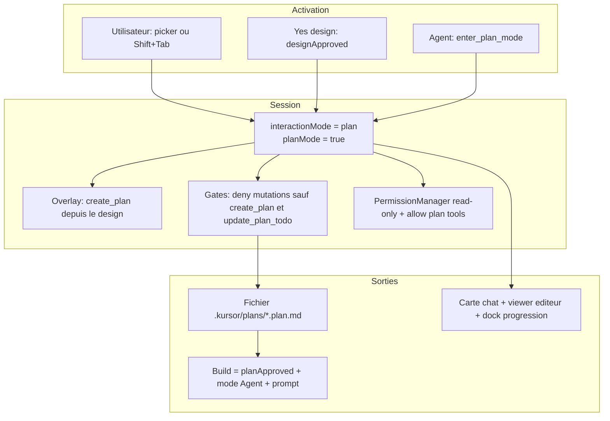
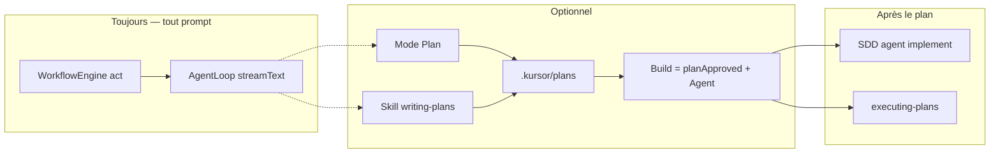

# Mode Plan

Document **as-built**. Source de vérité : `src/lib/agent/modes.ts`, `src/lib/agent/workflow/` (`sessionState`, `gates`, `planPath`, `harness`), `src/lib/agent/plans/` (`planFile`, `buildPlan`), `src/lib/agent/tools/` (`workflowTools`, `planTools`), `src/stores/planStore.ts`, `src/lib/agent/AgentRuntime.ts`, `src/components/agent/AgentModePicker.tsx`.

Ce document décrit le **mode d’interaction Plan** (read-only). Il ne décrit pas une architecture cible. [agent-workflow.md](./agent-workflow.md) reste le chemin d’exécution d’un prompt. [workflow-observability.md](./workflow-observability.md) décrit la projection graphe (nœud pédagogique `writing-plans`). [agent-workflow-ideal.md](./agent-workflow-ideal.md) et [kursor-harness.md](./kursor-harness.md) sont des **cibles** ; en cas de divergence, le code gagne ici.

Trois notions portent le mot « plan » et ne sont **pas** interchangeables :

| Nom | Qu’est-ce que c’est | Dans le mode Plan ? |
| --- | --- | --- |
| **Mode Plan** | `interactionMode: "plan"` — session read-only | Oui, ce document |
| **Skill `writing-plans`** | Procédure Superpowers : produire le plan via l’outil `create_plan` (`.kursor/plans/*.plan.md`) | Souvent utilisée *pendant* le mode Plan, aussi chargeable en mode Agent |
| **Carte chat `PlanCardBlock`** | `type: "plan-card"` : nom, overview, **View Plan** + **Build** | Oui — créée par l’événement `plan-created` |
| **Bloc chat `PlanBlock`** | Timeline des steps `WorkflowEngine` / orchestration (`type: "plan"`) | Non — collision de nom. Affiche « Act », pas le document d’implémentation |
| **Step `plan` de `FEATURE_DEVELOPMENT`** | Step historique du workflow multi-étapes | **Non exécuté.** `WorkflowEngine.run` n’envoie qu’un step `act` |
| **Status `"planning"`** | Statut UI transitoire dans `AgentLoop` | Non — flash avant `"thinking"` sur **tout** tour |

---

## 0. Résumé

Le mode par défaut est **Agent**. Le mode Plan est un **overlay de session**, pas une phase du moteur.

- L’utilisateur l’active dans le composer (liste **Agent / Plan / Debug / Ask**) ou avec **Shift+Tab**.
- Un prompt *build* reste en **Agent** pour le brainstorming. Un « oui » chat pose `designApproved` et **entre alors en Plan** (tant que `planApproved` est faux). `create_plan` est deny tant que le design n’est pas validé.
- L’agent peut l’activer **lui-même** via `enter_plan_mode` ou `switch_agent_mode` (`mode: "plan"`). Il **ne peut pas** activer Ask ni Debug, et **ne peut pas** repasser en Agent tant que l’humain n’a pas cliqué **Build**.
- Il **n’est pas** une phase du moteur : chaque prompt, y compris en mode Plan, passe par le même `WorkflowEngine` step `act` → `runTurn` → `streamText`.
- En Plan, les outils mutants sont refusés, **sauf** `create_plan` / `update_plan_todo` (seule écriture autorisée, avec règle allow dédiée) — et seulement **après** `designApproved`.
- Après le yes design, le tour Plan **doit** finir par `create_plan` (overlay + filet runtime `shouldNudgePlanMode`, une relance max), sauf si le tour a posé une question. Pas de nudge tant que le design n’est pas validé, ni une fois `planPath` posé.
- Valider le plan, c’est le bouton **Build** uniquement : `planApproved = true`, passage en Agent, envoi du prompt d’implémentation inline. Un « oui » chat n’implémente pas. `design-gate` `approved` s’affiche comme une notice de mode, pas une erreur « Unable to continue ».
- Le plan s’affiche dans une **carte chat** (View Plan + Build), un **viewer éditeur** (`.plan.md` → Markdown + todos cochables + Build) et un **dock de progression** (« n of m To-dos »). Le bandeau chat « Plan 0/1 » reste le step `act`, pas ce fichier.



---

## 1. Les quatre modes d’interaction

`AGENT_INTERACTION_MODES` = `agent` → `plan` → `debug` → `ask` (cycle Shift+Tab).

| Mode | Qui peut l’activer | Mutations | Overlay system |
| --- | --- | --- | --- |
| **Agent** | Utilisateur + agent | Oui, sous gates (1 %, HARD-GATE, **Build** / `planApproved`, SDD) | Sur un *build* sans design : overlay brainstorming (attendre yes/oui) |
| **Plan** | Utilisateur + agent + auto **après** yes design | Non, sauf `create_plan` / `update_plan_todo` après `designApproved` | Après yes : **finir par `create_plan` depuis le design** ; dire à l’humain de presser Build |
| **Debug** | **Utilisateur seulement** | Patches après `systematic-debugging` ; `run_command` autorisé | Enquête avec preuves avant patch |
| **Ask** | **Utilisateur seulement** | Non | Q&A read-only ; pas de plan d’implémentation sauf demande |

`SWITCHABLE_AGENT_MODES` = uniquement `agent` et `plan`. C’est la liste que les outils agent ont le droit de demander.

`planMode` (booléen) est un **alias legacy** : `setInteractionMode("plan")` pose `planMode = true`. Les snapshots anciens avec seulement `planMode: true` sont migrés vers `interactionMode: "plan"`.

---

## 2. Comment l’utilisateur l’active

### 2.1 Picker du composer

`AgentModePicker` est dans `AgentComposer`, à gauche des actions d’envoi. Quatre options, icône `ListTodo` pour Plan, label **Plan**, couleur ambre (`.mode-picker-btn.mode-plan`).

Choisir une option appelle `runtime.setInteractionMode(mode)` **immédiatement**, sans envoyer de message. Le mode vit sur `WorkflowSessionState` et est recopié dans `agentStore.agentMode`.

Placeholder du textarea en Plan : `Plan mode — describe what to design...`

### 2.2 Shift+Tab

Dans le textarea, **Shift+Tab** appelle `runtime.cycleInteractionMode()` :

```text
agent → plan → debug → ask → agent
```

Tab sans Shift sert au menu slash-skills, pas au mode.

### 2.3 Bandeau au-dessus du chat

Dès que le mode n’est plus Agent, `AgentPanel` affiche :

> Plan mode (read-only). Research and write a plan; edits are blocked. Shift+Tab to cycle.

### 2.4 Notice dans la timeline

`setInteractionMode` émet `agent-mode` (timeline) et `plan-mode` (événement **caché**, utilisé par le store / le graphe).

`agent-mode` devient un `SystemNotice` kind `"mode"` : même texte que le bandeau (`modeNoticeText`).

`plan-mode` ne crée **pas** de bulle chat (`CHAT_EVENT_POLICY["plan-mode"] = "hidden"`).

Le mode est persisté dans le snapshot de session (`workflowSession.interactionMode` / `planMode`) et restauré au `resumeTask`.

---

## 3. Est-ce que l’agent peut l’activer tout seul ?

**Oui**, pour Plan et Agent seulement.

Outils builtin (`registerBuiltinTools`) :

| Outil | Arguments | Effet |
| --- | --- | --- |
| `switch_agent_mode` | `mode`: `agent` \| `plan` (requis) | `harness.switchAgentMode` |
| `enter_plan_mode` | `enabled` (bool) et/ou `mode` | Alias du précédent. `enabled: false` → Agent. Défaut si rien de valide → Plan |
| `create_plan` | `name`, `overview`, `body`, `todos[]` | Écrit `.kursor/plans/<slug>.plan.md`, pose `planPath`, émet `plan-created`. Ne pose **pas** `planApproved` |
| `update_plan_todo` | `todo_id`, `status`, `plan_path?` | Met à jour le fichier + store, émet `plan-todo-updated` (puis `plan-completed` si tout est coché) |

`switch_agent_mode` / `enter_plan_mode` refusent `ask` et `debug` (`mode_locked` : « Ask and Debug can only be selected by the user. »).
Plan → Agent via ces outils est aussi refusé tant que `!planApproved` : *Implementation starts when the human clicks Build.* Le picker utilisateur (`setInteractionMode`) peut encore changer de mode ; les writes restent bloquées sans Build.

Le system prompt (`toolGuidance`) dit d’entrer en Plan et d’attendre **Build** pour coder. Un yes/oui chat valide le design, pas l’implémentation.

Consignes Superpowers (`using-superpowers`) :

- Avant le yes design : charger **brainstorming**, poser des questions, présenter le design. Ne pas recharger brainstorming après le yes.
- Si l’humain a **déjà** choisi Plan dans le composer pendant le design : rester read-only et **attendre le yes chat** ; `create_plan` reste deny tant que `!designApproved`.

Ces outils sont dans `SKILL_CHECK_TOOLS` : l’agent peut changer de mode **avant** le check 1 % du tour. Après un `load_skill`, le filet 1 % ne se réarme plus (`invokedSkillIds`). `create_plan` marque le check (`writing-plans`) mais exige `designApproved` sur un *build*.

Le changement est **immédiat** sur la session. Les outils **suivants du même** `streamText` voient déjà les gates Plan. L’overlay system (« You are in Plan mode… ») n’est assemblé qu’au **début** de `runTurn` : il ne se met à jour qu’au message utilisateur suivant.

Les sous-agents (`workflowSession.child()`) **ne héritent pas** du mode Plan. Ils démarrent en Agent, avec `skipProcess` / skill check déjà satisfait.

---

## 4. Le mode Plan est-il dans le workflow de base (mode Agent) ?

**Pour un *build* : après le yes design.** Si `goalKind === "build"`, `designApproved` et `!planApproved`, `ensurePlanModeForBuild` passe en Plan (et émet `agent-mode` / `plan-mode`). Le premier prompt *build* reste en Agent. Ask et Debug ne sont pas auto-basculés.

Chaque `sendMessage` fait :

```text
beginUserTurn → WorkflowEngine.run (un step "act") → runTurn → AgentLoop → streamText
```

C’est le même chemin en Agent, Plan, Debug et Ask. `shouldOrchestrate` = `false`. Les steps `specify` / `plan` de `FEATURE_DEVELOPMENT` ne sont **pas** joués.

Sur un prompt *build* :

1. Mode Agent : skill `brainstorming`, questions, design. HARD-GATE jusqu’à `designApproved`. `create_plan` est deny (`WAIT_FOR_DESIGN_PLAN_REASON`).
2. Check 1 % (`load_skill` / `check_skills`) jusqu’au premier skill de session. Un « oui » ou un Retry **ne reset pas** le filet une fois `invokedSkillIds` non vide.
3. Yes chat / `ask_user_question` : `designApproved`, auto-Plan, notice « Design approved… » (pas une erreur). Overlay : ne pas recharger brainstorming ; `create_plan` depuis le design.
4. `create_plan` (seule écriture autorisée en Plan).
5. **Build** → `planApproved` + mode Agent.

`create_plan` reste possible en Agent une fois le design validé (picker) ; ça ne pose pas `planApproved`. Sans Build, `mutationDenied` refuse quand même les writes (`WAIT_FOR_BUILD_REASON`) dès que le goal est *build*.

La carte Run allume `writing-plans` si `enter_plan_mode` / `create_plan` / `plan-created` / `plan-written` / `plan-mode` arrivent, `executing-plans` si `update_plan_todo` / `plan-build-started` — c’est une **projection**, pas un driver.



---

## 5. Comportement une fois le mode Plan actif

### 5.1 Overlay modèle

Préfixé au system prompt. Variantes selon `designApproved` / `planPath` :

- Plan **sans** design : recherche only ; **ne pas** appeler `create_plan` tant que l’humain n’a pas dit yes/oui.
- Plan **avec** design, sans fichier : ne pas recharger brainstorming ; charger `writing-plans` si besoin ; `create_plan` **depuis le design déjà convenu**.
- Plan **avec** `planPath` : dire de presser Build ; ne pas rappeler `create_plan`.

Filet runtime (`AgentRuntime.runTurn`) : si le tour Plan a `designApproved`, pas de `planPath`, et ni `create_plan` / `update_plan_todo` ni `ask_user_question`, un message « Call `create_plan` now… » est **replié dans `systemPrompt`** (pas `messages[].role=system`) et la boucle relancée **une fois** (`MAX_PLAN_NUDGES = 1`, prédicat `shouldNudgePlanMode`). Pas de nudge avant le yes design.

Le modèle ne peut pas s’auto-débloquer via `switch_agent_mode({ mode: "agent" })` tant que Build n’a pas posé `planApproved`.

### 5.2 Gates workflow (`evaluateWorkflowGate`)

Ordre : 1 % → **planWriteBeforeDesignDenied** → **planModeDenied** → askModeDenied → mutationDenied → SDD.

En Plan :

- Autorisés sans check 1 % : `load_skill`, `check_skills`, `ask_user_question`, `enter_plan_mode`, `switch_agent_mode`, `create_plan`, `update_plan_todo`. Le filet 1 % est aussi sauté si `invokedSkillIds` n’est pas vide.
- Mutations **deny**, message *Plan mode is read-only…* / *Plan mode blocks mutating tools*.
- Exception après `designApproved` : uniquement `create_plan` et `update_plan_todo` (`PLAN_WRITE_TOOLS`). `write_file` / `create_file` sont refusés **même** vers `.kursor/plans/` en mode Plan.
- Un *build* sans `designApproved` refuse `create_plan` / `update_plan_todo` (`WAIT_FOR_DESIGN_PLAN_REASON`) **et** les mutations (`HARD-GATE`). Après le yes design, les mutations restent deny jusqu’à **Build** (`planApproved`), même sans `planPath`.
- Un deny workflow n’émet plus `design-gate` (évite un faux « Unable to continue »). Seul un yes design émet `design-gate` `approved`, rendu en notice de mode.

`approveDesign` **ne sort plus** du mode Plan. Un yes design en chat pendant un Plan laisse la session en Plan.

### 5.3 Couche permissions (deuxième filet)

`AgentLoop` force `PermissionMode = "read-only"` dès que `isReadOnlyInteraction` (Plan ou Ask). En read-only, `filesystem.write` est **deny** — sauf que, en mode Plan uniquement, `AgentLoop` injecte des règles allow `{ tool: "create_plan" }` et `{ tool: "update_plan_todo" }`. Les gates restent le vrai verrou : tout autre outil mutant est deny avant même les permissions.

### 5.4 Sortie du mode Plan

| Déclencheur | Résultat |
| --- | --- |
| Picker / Shift+Tab vers Agent (ou Debug / Ask) | Mode demandé. Les writes d’un *build* restent deny sans `planApproved` |
| `switch_agent_mode({ mode: "agent" })` ou `enter_plan_mode({ enabled: false })` | Refusé tant que `!planApproved` |
| `approveDesign(...)` | Entre en Plan si Agent + *build* ; **ne sort jamais** de Plan |
| `create_plan` seul | **Ne sort pas** du mode Plan, ne pose pas `planApproved` |
| **Build** (`buildPlan`) | `planApproved` + mode Agent + prompt d’implémentation |

Implémenter exige de quitter Plan (Build le fait). Sinon les patches restent deny.

---

## 6. Comment on valide le plan

Deux états de session distincts :

| Flag | Signifie | Débloque |
| --- | --- | --- |
| `designApproved` | L’humain a dit oui au design (brainstorm / *build*) | HARD-GATE brainstorming ; writing-plans |
| `planApproved` | Un plan d’implémentation est enregistré comme approuvé (bouton **Build**) | `git_branch` puis writes, `run_command`, `agent(subagent_type: "implement")` |

Le chemin normal est le bouton **Build**. Ni `ask_user_question` ni un yes chat ne posent `planApproved`.

### 6.1 Build (`buildPlan`) — chemin complet

Déclencheurs : bouton **Build** de la carte chat, bouton **Build** du viewer éditeur, ou **Ctrl+Enter** dans le composer vide quand un plan brouillon existe (`latestBuildablePlanId`).

```text
planStore.approve + markBuilding (+ sauvegarde fichier)
planPath = .kursor/plans/<slug>.plan.md
designApproved posé si absent (le plan approuvé vaut design)
planApproved = true
événement plan-build-started (caché du chat, allume executing-plans)
setInteractionMode("agent")
sendMessage(buildPromptForPlan) → inline, todo par todo
```

Le prompt ordonne : lire le plan, `git_branch create` dans le checkout ouvert, implémenter dans l’ordre sans sauter de todo, `update_plan_todo(in_progress)` avant / `completed` après chaque tâche. Refus si plan inconnu, sans todos, ou si un build est **réellement** en cours (`isBusy`). Un statut `building` orphelin (run crash / timeout / cancel) redevient `approved` et le bouton Build est à nouveau cliquable.

### 6.2 `create_plan` seul (pas une validation)

`create_plan` pose `planPath` et émet `plan-created` (+ `plan-written` pour compat graphe). Il **ne pose pas** `planApproved` et **ne sort pas** du mode Plan. Tant que `planApproved` est faux (goal *build* **ou** `planPath` posé) et sans `skipProcess`, les mutations hors `create_plan` / `update_plan_todo` sont deny : *The plan is written. Ask the human to click Build.*

### 6.3 `ask_user_question` (design seulement)

Pendant brainstorming, un yes (`kind` `question` / `design` / `plan`) pose **uniquement** `designApproved`. Ça débloque le HARD-GATE, pas l’implémentation d’un plan déjà écrit. `kind: "plan"` ne pose plus `planApproved`.

### 6.4 Yes en chat libre (design seulement)

Au `beginUserTurn`, un message court affirmatif pose `designApproved` si brainstorming est chargé ou si le goal est *build*. Il **ne** pose **pas** `planApproved`, **ne reset pas** le skill check, et **n’entre pas** en Agent.

### 6.5 Pendant le build

Chaque `update_plan_todo` réécrit le fichier, met à jour `planStore` (via `noteDiskChange`) et émet `plan-todo-updated`. Quand tout est `completed` : `plan-completed` + `status: "done"`, visible dans le dock.

Sans `planApproved` (et sans `skipProcess`), `agent` implement reste deny : *Implement subagents require an approved plan (SDD).* Même garde dans `AgentRuntime.spawnAgent`.

---

## 7. Comment le plan s’affiche

### 7.1 Mode Plan (chrome)

- Bouton composer **Plan** (ambre).
- Bandeau sous le header du panel.
- Notice timeline `agent-mode`.
- Graphe Run : nœud `writing-plans` si `plan-mode` / `enter_plan_mode` / `create_plan` / `plan-created` / `plan-written` ; `executing-plans` si `update_plan_todo` / `plan-build-started`.

### 7.2 Carte chat (`PlanCardBlock`)

`ConversationItem` `type: "plan-card"` (créé par `plan-created`, toujours déplié) : « Created Plan », nom, overview, compteur « n of m To-dos », lien **View Plan** (ouvre `.plan.md` dans l’éditeur), bouton **Build Ctrl+↵** (cliquable pour `draft` / `approved` / `building` orphelin ; « Building… » tant que l’agent stream ; « Done » ensuite).

### 7.3 Viewer éditeur (`PlanEditorView`)

Tout onglet `*.plan.md` rend le viewer au lieu de Monaco : header « Plans › fichier » + bascule **Preview / Raw** + **Build**, corps via `MarkdownRenderer`, section **To-dos** cochables (clic = `setTodoStatus` + sauvegarde), champ **+ New**. L’onglet garde l’icône `ListTodo`. L’écriture agent (`update_plan_todo`) passe par le disque + watcher (`handleExternalChange` + `planStore.noteDiskChange`) ; en mode Raw, Monaco édite la source via `editorStore`.

### 7.4 Dock de progression (`PlanProgressDock`)

Monté dans `AgentPanel` à côté de `ChangeReviewDock`. Visible quand le plan actif est `building` / `done` (fermable une fois `done`) : **Build** + nom + « n of m To-dos Completed » + réouverture ↶, liste repliable avec `StatusGlyph`.

### 7.5 Fichier de plan

Chemin canonique : `.kursor/plans/<slug>.plan.md` (`docs/superpowers/plans/` reste reconnu comme document legacy par les gates). Frontmatter (`id`, `slug`, `name`, `overview`, `status`, `createdAt`, `updatedAt`, `todos: [{id, content, status}]`) + corps Markdown (`parsePlanFile` / `serializePlanFile`). `plan-created` est **timeline**, `plan-todo-updated` / `plan-build-started` / `plan-completed` / `plan-written` sont **hidden**.

### 7.3 `PlanBlock` — ne pas confondre

`ConversationItem` `type: "plan"` → `PlanBlock` : liste repliable « Plan n/m completed » / « Completed n tasks ».

Alimenté par `workflow-started` / `workflow-step` / `orchestration-started`. Aujourd’hui `WorkflowEngine` n’émet que le step **`act`**. Chaque tour peut donc montrer un « plan » d’une tâche **Act**. Ça n’est ni le mode Plan, ni le fichier `.kursor/plans/` (voir `PlanCardBlock` §7.2 pour celui-ci).

Déplié tant que `status === "running"` ; l’utilisateur peut forcer l’état.

### 7.4 Tâches sous-agents

Après `planApproved`, les spawns implement apparaissent comme `type: "task"` (`subagent-task-started`, alias lecture `sdd-task-started`), éventuellement sticky — autre bloc encore. Explore pendant brainstorm/plan utilise le même event.

---

## 8. Enchaînement type

```text
1. Prompt build → Agent : load brainstorming, questions, design
2. Yes/oui chat (ou ask_user_question) → designApproved + auto-Plan
3. Overlay : ne pas recharger brainstorming ; writing-plans + create_plan depuis le design
4. 1 % déjà satisfait si brainstorming a été chargé
5. create_plan .kursor/plans/….plan.md  → planPath + carte chat (nudge si oublié)
6. Humain relit (carte / viewer), ajuste les todos si besoin
7. Build (carte, viewer, Ctrl+Enter) → planApproved + Agent + prompt
8. Agent implémente todo par todo (update_plan_todo) ; dock n/m
9. Tout coché → plan-completed → Done
```

Si l’humain part de **Agent** sur un *build* :

```text
brainstorming (Agent) → yes design (HARD-GATE) → auto-Plan
  → create_plan depuis le design → Build → exécution inline
```

---

## 9. Ce qui n’existe pas

| Attendu | As-built |
| --- | --- |
| Planner LLM / JSON de plan | **NOT FOUND.** Un tour `streamText` + skill Markdown + outils `create_plan` |
| Step moteur `plan` obligatoire | `FEATURE_DEVELOPMENT.plan` n’est pas exécuté |
| Entrée auto en Plan après brainstorm | `ensurePlanModeForBuild` entre en Plan quand `designApproved` est posé sur un *build* |
| Plan sans todos | Refusé : `create_plan` exige ≥ 1 todo ; nudge runtime sinon |
| Agent qui active Ask / Debug | Refusé (`mode_locked`) |
| Sous-agent coincé en Plan | `child()` remet Agent |

---

## 10. Carte des fichiers

| Fichier | Rôle |
| --- | --- |
| `src/lib/agent/modes.ts` | Modes, cycle, overlay, notices, placeholders, migration `planMode` |
| `src/lib/agent/workflow/sessionState.ts` | `interactionMode`, `planMode`, `planPath`, `planApproved`, yes chat |
| `src/lib/agent/workflow/gates.ts` | Deny mutations en Plan ; SDD exige `planApproved` ; filet wait-for-Build |
| `src/lib/agent/workflow/planPath.ts` | Pont legacy vers `plans/planFile` (`.kursor/plans/` + `docs/superpowers/plans/`) |
| `src/lib/agent/plans/planFile.ts` | Parse/serialize `.plan.md`, slugs, chemins |
| `src/lib/agent/plans/buildPlan.ts` | `buildPlan`, `buildPromptForPlan`, `latestBuildablePlanId` |
| `src/lib/agent/tools/workflowTools.ts` | `enter_plan_mode`, `switch_agent_mode`, `ask_user_question` |
| `src/lib/agent/tools/planTools.ts` | `create_plan`, `update_plan_todo` |
| `src/stores/planStore.ts` | Plans, todos, statuts Build, `noteDiskChange` |
| `src/lib/agent/AgentRuntime.ts` | `setInteractionMode`, overlay, nudge `create_plan`, `resumeTask` → `loadPlan`, spawn SDD |
| `src/lib/agent/AgentLoop.ts` | Permission `read-only` si Plan/Ask + allow `create_plan` / `update_plan_todo` en Plan |
| `src/lib/agent/context/identity.ts` | Consigne outils Agent ↔ Plan + `create_plan` / `update_plan_todo` |
| `src/components/agent/AgentModePicker.tsx` | Menu composer |
| `src/components/agent/AgentComposer.tsx` | Shift+Tab, placeholder, Ctrl+Enter → Build si composer vide |
| `src/components/agent/AgentPanel.tsx` | Bandeau + wiring picker + `PlanProgressDock` |
| `src/components/agent/blocks/PlanCardBlock.tsx` | Carte chat : View Plan + Build |
| `src/components/agent/PlanProgressDock.tsx` | Dock « n of m To-dos » pendant le build |
| `src/components/plans/PlanEditorView.tsx` | Viewer `*.plan.md` : Markdown + todos + Build + Raw |
| `src/components/agent/blocks/PlanBlock.tsx` | Timeline steps `act` / orchestration (**homonyme**) |
| `src/components/agent/blocks/ApprovalDock.tsx` | Allow/Deny questions (design / workflow, pas une validation de plan) |
| `src/lib/agent/skills/builtin/writing-plans/SKILL.md` | Format et chemin du document |
| `src/lib/agent/skills/builtin/executing-plans/SKILL.md` | Exécution inline après plan |
| `src/lib/workflow/pipelineSchema.ts` | Nœud pédagogique Writing plans |

Documents liés : [agent-workflow.md](./agent-workflow.md) (moteur `act`), [workflow-spec.md](./workflow-spec.md), [workflow-observability.md](./workflow-observability.md), [skills-system.md](./skills-system.md), [skills.md](./skills.md).
