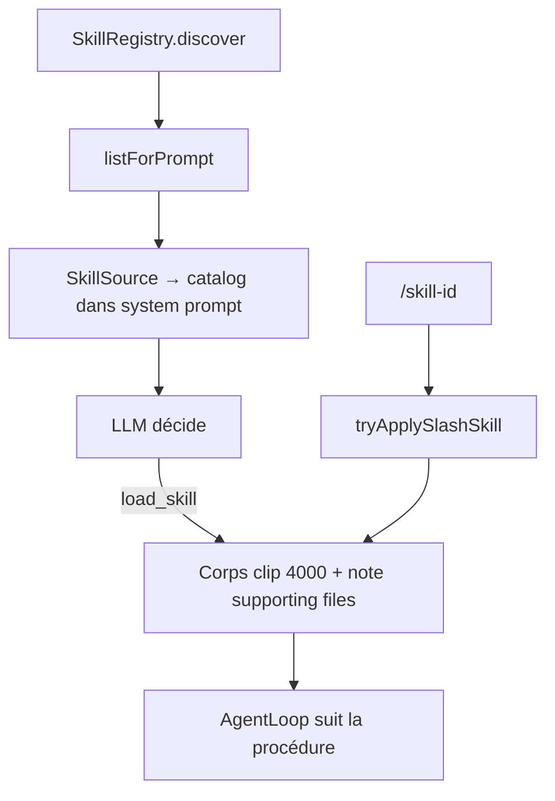

# Skills — système, sélection & cycle de vie

Document **as-built**. Source de vérité : `SkillRegistry`, `parseSkill`, `invokeSkill`, `SkillDocument`, `SkillPack`, `SkillSource`, outil `load_skill`, `CapabilityService`.

Pour le détail historique / PROPOSED, voir aussi [skills.md](./skills.md). Moment dans le run : [agent-workflow.md](./agent-workflow.md) § skills. Mode Plan + skill `writing-plans` : [plan-mode.md](./plan-mode.md).

---

## 0. Vue d’ensemble

Un **Skill** Kursor est une **procédure en Markdown** (dossier + `SKILL.md`). Ce n’est pas un exécuteur, pas un outil, pas un agent.

Le runtime fait quatre choses :

1. **Découvrir** les skills (builtin + user/global + projet)
2. **Lister** id + description dans le system prompt (jamais le corps)
3. **Charger le corps** via `/skill-id` (humain) ou `load_skill` (modèle)
4. **Accorder** `allowedTools` comme grants de tour (`TaskGrantStore`) — sans réduire le pool d’outils visible



---

## 1. Structure d’un skill

### 1.1 Layout obligatoire

```text
<skill-id>/
  SKILL.md                 # requis — frontmatter + instructions
  references/foo.md        # optionnel — fichiers support
  tests.md                 # optionnel
  scripts/loop.sh          # optionnel (texte, non exécuté)
```

- **Id** = nom du **dossier** (pas le champ frontmatter `name`). Pattern : `^[a-z][\w.-]*$`
- Sans `SKILL.md` non vide → le dossier est ignoré à la découverte

### 1.2 Origines & chemins

| Origin | Disque | Découverte |
| --- | --- | --- |
| `builtin` | Bundle Vite (`import.meta.glob` sur `builtin/*/SKILL.md` + superpowers) | Chargé en mémoire au boot |
| `global` / user | `{app_data}/skills/<id>/SKILL.md` | `userDataApi` via `userContextFiles`, dir logique `skills/` |
| `project` | `.kursor/skills/<id>/SKILL.md` | FS projet, seulement si un projet est ouvert |

**Shadowing** (même id) : project **écrase** global **écrase** builtin.

### 1.3 Frontmatter → `SkillDefinition`

| Champ | Rôle |
| --- | --- |
| `name` | Label (défaut = id) |
| `description` | Matching + listing prompt |
| `triggers` | Sous-chaînes dans la requête → score ≥ 0.5 |
| `allowedTools` / `tools` | Grants permission pour le tour après load |
| `modelPreference` | Pin modèle si **exactement une** skill invoquée avec une préférence |
| `enabled` | Défaut `true` |
| `disableModelInvocation` | Exclu du listing modèle ; `load_skill` refusé sauf après slash user du même id |
| `userInvocable` | Si `false`, le slash est ignoré |
| `version` | Métadonnée (défaut `"1.0"`) |
| `requiredCapabilities` / `preferredMcp` | Parsés, **non consommés** runtime |

Corps Markdown = `instructions`. Placeholders à l’invocation : `$ARGUMENTS`, `$0`, `$1`, …

### 1.4 Fichiers support (multi-fichiers, multi-types)

**Oui** : un skill peut contenir **plusieurs fichiers** sous son dossier.

| Aspect | Comportement as-built |
| --- | --- |
| Types | Tout fichier **texte** lisible (`.md`, `.py`, `.sh`, `.ts`, …). Binaires exclus à l’import pack (`BINARY_EXTENSIONS`) |
| Exécution | **Aucune** — le contenu est renvoyé au modèle comme texte |
| Découverte listing | Seul `SKILL.md` est parsé pour le catalogue |
| Accès agent | Après load : note `Supporting files — call load_skill with file=…` ; puis `load_skill({ skill, file: "tests.md" })` |
| Création UI | `SkillDraft.files: [{ path, content }]` écrit à côté de `SKILL.md` |
| Import pack | `discoverSkillPacks` regroupe `SKILL.md` + extras du même dossier (hors sous-skills imbriqués) |

Exemples builtins : `using-superpowers/references/kursor-tools.md`, `subagent-driven-brainstorming/explore-prompt.md`, `test-driven-development/writing-good-tests.md`.

---

## 2. Comment l’agent « choisit » un skill

Il n’y a **pas** de classifieur LLM dédié aux skills. Deux couches :

### 2.1 Listing déterministe (toujours, avant le modèle)

`SkillSource.collect` → `SkillRegistry.listForPrompt(request)` :

1. `discover()` recharge global + project (pas de cache disque persistant dans le registry)
2. Filtre : `enabled` + pas dans overlay disabled + `!disableModelInvocation`
3. Score = trigger substring **ou** `lexicalScore` sur id/name/triggers/tokens description
4. Tri score décroissant
5. Si catalogue ≤ **48** skills : toutes les descriptions détaillées ; sinon top **8** en détail, le reste = id seul

Injecté dans le system prompt sous **Skills** :

```text
Available skills (name + description). Check for a relevant skill before any action (1% rule).
Load one with load_skill. Use check_skills if none apply. The user may type /id to load a skill.
- brainstorming: …
- prefer-const: …
```

`SkillRegistry.select()` (score > 0) existe pour tests / API — **pas** branché sur `ContextEngine` pour auto-injecter le corps.

### 2.2 Chargement du corps (choix du modèle ou de l’humain)

| Voie | Qui | Effet |
| --- | --- | --- |
| `/skill-id args` | Humain | Message user **remplacé** par `formatLoadedSkillMessage` avant le tour |
| `load_skill` | Modèle | Tool result avec `prompt` (= instructions clip 4000) + `supportingFiles` |
| `check_skills` | Modèle | Trace « j’ai regardé le catalogue » (règle 1 %) — ne charge rien |

Guidance + skill `using-superpowers` poussent la **règle 1 %** : si un skill listé pourrait s’appliquer, appeler `load_skill` (ou `check_skills` si aucun).

Gates workflow : avant le skill-check, seuls certains tools (dont `load_skill` / `check_skills` / `ask_user_question`) sont autorisés.

### 2.3 Après load

- Event `skill-selected` / `skill-loaded` (observabilité)
- Grants `allowedTools` pour la **durée du tour** (`duration: "task"`)
- Pin modèle éventuel via `invokedModelPin` (une seule skill + une préférence)

Le skill **n’exécute rien** : le modèle suit le texte et appelle les tools habituels (`read_file`, `run_command`, …).

---

## 3. Quand un utilisateur crée un skill

### 3.1 Via UI (Capabilities)

`CapabilityService.createSkill(scope, draft)` → `skillDocuments.create` :

| Scope UI | Écriture | Origin registry |
| --- | --- | --- |
| `user` | `{app_data}/skills/<id>/SKILL.md` (+ extras) | `global` |
| `project` | `.kursor/skills/<id>/SKILL.md` (+ extras) | `project` (projet ouvert requis) |

Import dossier/zip : `SkillPack.discoverSkillPacks` → `importSkillPack`.

### 3.2 Est-ce pris en compte par l’agent ?

**Oui**, au **prochain** assemblage de contexte / `resolve` :

1. `discover()` relit les dossiers à chaque `listForPrompt` / `resolve`
2. Le nouveau skill apparaît dans le catalogue system prompt (si enabled, et pas `disableModelInvocation`)
3. Le modèle peut `load_skill` avec le nouvel id ; l’humain peut `/id`

Pas besoin de redémarrer l’app. Pas d’index RAG dédié aux skills.

**Conditions pour qu’il « marche » vraiment** :

| Condition | Sinon |
| --- | --- |
| `SKILL.md` présent et non vide | Ignoré |
| Id valide | Refusé à la création |
| `enabled: true` + pas disabled dans capabilities overlay | Filtré |
| Description / triggers pertinents | Listé mais rarement choisi / scoré bas |
| Projet ouvert pour un skill project | Non découvert si `includeProject: false` |
| Builtin shadowé par même id project/global | Le shadow gagne |

Créer un skill **ne force pas** son chargement : sans `/id` ni `load_skill`, seul le listing (description) est visible.

### 3.3 Édition / suppression

- `update` / `remove` via `SkillDocumentService`
- Builtins : lecture seule (`builtin_readonly`)
- Supporting files : sync à l’update si `files` fourni (supprime les extras absents de la liste)

---

## 4. Intégration dans le tour agent

```text
sendMessage
  → tryApplySlashSkill (éventuel remplacement du message)
  → ContextEngine.build
       → SkillSource : catalogue only
  → AgentLoop.streamText
       → 1er tool souvent load_skill / check_skills (gates)
       → load_skill → instructions dans tool result
       → suite avec tools métier
```

Sous-agents (`explore` / `implement` / `review`) ont aussi `load_skill` / `check_skills` dans leurs tools read.

---

## 5. Ce qu’un skill n’est pas

| Concept | Différence |
| --- | --- |
| Tool | Schéma + `execute()` ; le skill n’a pas d’exécution native |
| Rule | Toujours dans le prompt (budget) ; skill = listing puis corps à la demande |
| Spec (knowledge center) | Connaissance produit/user ; skill = procédure d’action — voir [specs-knowledge-center.md](./specs-knowledge-center.md) |
| MCP | Serveur externe d’outils ; skill = Markdown local |
| Agent / Workflow | Identité d’exécution / lots d’étapes ; skill ne forke pas le runtime |

---

## 6. Limites numériques & fichiers clés

| Constante | Valeur |
| --- | --- |
| `MAX_SKILL_CHARS` | 4000 (corps à l’invocation) |
| `SKILL_LISTING_FULL_THRESHOLD` | 48 |
| `SKILL_LISTING_DETAIL_TOP` | 8 |
| Pack file clip | 256_000 chars / fichier à l’import |

---

## 7. Post-run reflection (propose-only)

Après un run parent **completed**, `AgentRuntime` lance `KnowledgeReflector.schedule` en fire-and-forget (pas pendant le reflect lui-même). Un LLM cheap (`completeText`) reçoit le catalogue skills/specs + un clip de la conversation, et propose JSON `skillActions` / `specActions`.

- **Jamais d’écriture** sans Accept dans la carte timeline
- Setting `knowledgeReflectEnabled` (défaut on) : « Suggest skills & specs after runs »
- Gates skip : disabled, tour reflector, in-flight même conversation, run trivial (`< 2` messages utiles, ou aucun outil mutant **et** goal court), pas de projet, pas de LLM
- Persist SQLite `knowledge_proposals` (`pending` → Accept `applied` / Reject `rejected`)
- Apply : `skillDocuments.create` / `update` ; specs via `writeNewSpec` / write / delete / reorganize + `graphService.updateFile`
- Events Pipeline : `knowledge-reflect-started` | `skipped` | `completed` (nœud après Result)

Voir [workflow-observability.md](./workflow-observability.md) et [specs-knowledge-center.md](./specs-knowledge-center.md) § Post-run reflection.

## 8. Fichiers clés

| Zone | Fichiers |
| --- | --- |
| Registry / matching | `src/lib/agent/skills/SkillRegistry.ts` |
| Parse / builtins | `parseSkill.ts` |
| Invoke / slash | `invokeSkill.ts` |
| CRUD + supporting | `SkillDocument.ts` |
| Import multi-fichiers | `SkillPack.ts` |
| Contexte | `context/sources/skill.ts` |
| Outils | `tools/loadSkill.ts`, `tools/workflowTools.ts` (`check_skills`) |
| UI / create | `CapabilityService.ts`, `SkillEditorDialog.tsx` |
| Post-run reflect | `src/lib/agent/knowledge/` |
