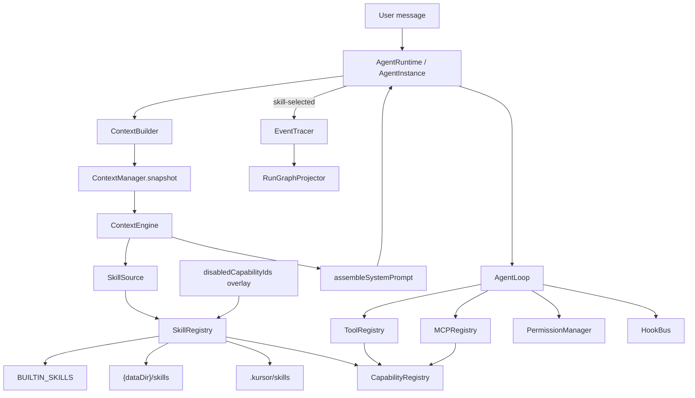
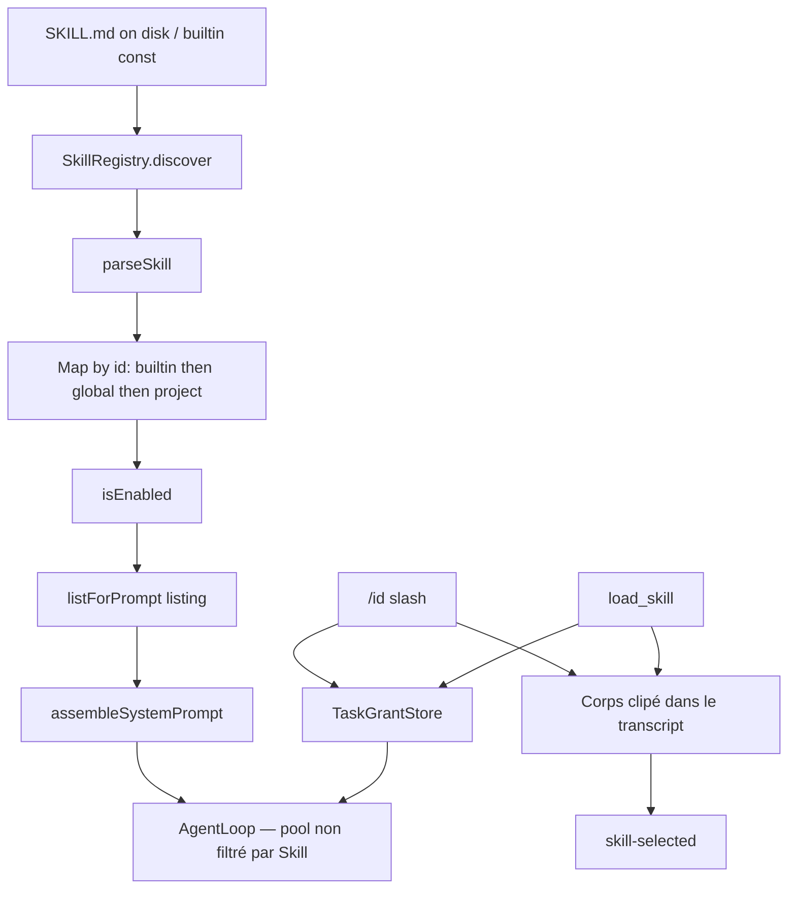
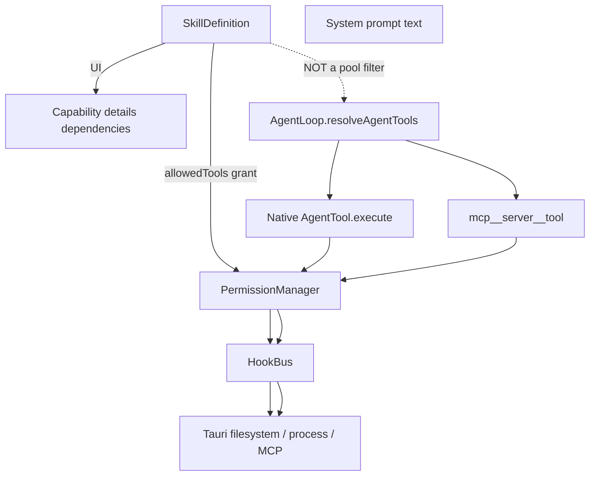
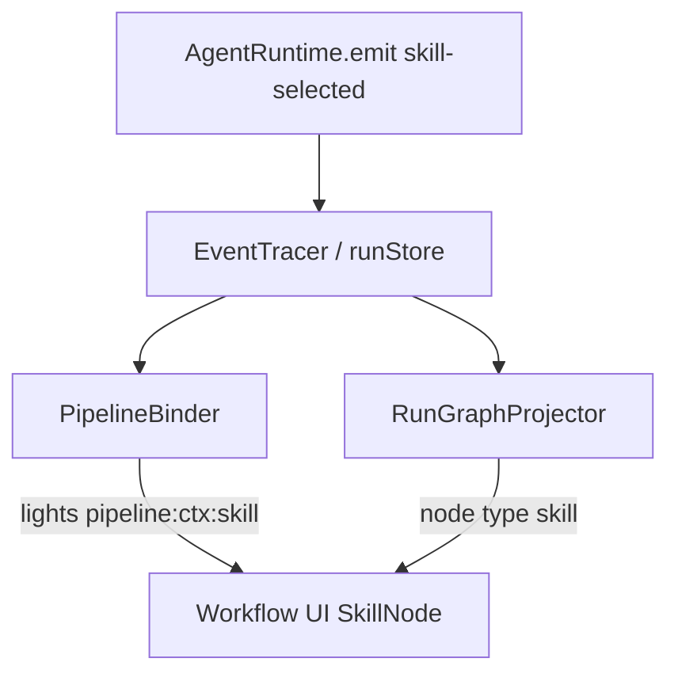

# Kursor Skills System

> **Guide opérationnel concis (as-built)** : [skills-system.md](./skills-system.md) — structure multi-fichiers, sélection agent, création user, `load_skill`.

Documentation de référence du système de Skills. Elle décrit **ce que le code fait aujourd’hui**, pas une architecture idéale.

Trois niveaux de vérité sont utilisés partout :

- **CURRENT** — implémenté et observable dans le repository.
- **PARTIAL** — présent (type, champ, UI, événement) mais incomplet ou non branché.
- **PROPOSED** — recommandation d’évolution. Ce n’est pas l’état actuel.

Les documents `kursor-harness.md` et `inspiration-matrix.md` décrivent une **cible de conception**. Lorsqu’ils divergent du code, le code gagne ici. La cible est reprise uniquement dans les sections marquées **PROPOSED**.

Le moment où les Skills interviennent dans un run (listing déterministe vs `load_skill` dans `streamText`) est décrit dans [agent-workflow.md](./agent-workflow.md) §8.

---

## 1. Overview

### CURRENT

Un Skill Kursor est une **procédure Markdown portable** (`SKILL.md` + frontmatter YAML). Il n’est pas un exécuteur, pas un outil, pas un serveur MCP, pas un agent.

Le système actuel fait quatre choses :

1. **Découvrir** des Skills depuis trois origines (builtin, user/global, projet). Shadowing inchangé : projet > global > builtin.
2. **Lister** `name` + `description` dans le system prompt (`SkillSource` / `SkillRegistry.listForPrompt`). Jamais le corps.
3. **Charger le corps** via `/skill-id` (humain) ou l’outil `load_skill` (modèle). Clip 4000 caractères à l’invocation (`renderSkill`).
4. **Accorder** `allowedTools` comme règles d’allow **pour ce tour** via `TaskGrantStore` (`duration: "task"` = un `runTurn`). Le pool d’outils visible **n’est pas** réduit — `AgentLoop.allowedTools` n’est pas utilisé pour les Skills.

Conséquence directe : un Skill influence le **comportement du modèle** une fois chargé (comment accomplir une tâche). Il n’exécute rien. Les side effects passent par Tools / MCP, derrière `PermissionManager` et Rust.

Il n’existe pas de classes `SkillLoader`, `SkillResolver`, `SkillExecutor` ou `SkillManager`. Le listing est `SkillRegistry.listForPrompt()`. Le chargement unique est `src/lib/agent/skills/invokeSkill.ts`. L’émission d’observabilité `skill-selected` part **uniquement d’une invocation** (slash ou `load_skill`), plus du listing.

### PARTIAL

Plusieurs champs et types existent sans enforcement runtime :

- `allowedTools` — **CURRENT** comme grant de tour (`TaskGrantStore`) ; **n’isole pas** le pool (`AgentLoop.allowedTools` des subagents reste un filtre distinct).
- `modelPreference` — pin modèle seulement si **exactement une** skill **invoquée** (slash ou tool) porte une préférence compatible. Plus de pin sur les slices de listing.
- `requiredCapabilities` / `preferredMcp` — parsés, jamais consommés.
- `SkillScope = "agent"` — déclaré, jamais produit par le registry.
- `CapabilityInstaller` / `CapabilityManifest` — types morts.

### Pourquoi c’est dans Kursor

Kursor vise un harness agentique (`Understand → Plan → Execute → Tools/MCP → Verify → Recover → Remember`). Le Runtime doit rester un moteur générique. Les Skills sont l’unité d’extension **procédurale** : ajouter une spécialisation sans forker `AgentRuntime`.

Aujourd’hui cette séparation est réelle pour le **texte d’instruction**, pas encore pour les **capacités d’exécution**.

---

## 2. What is a Skill?

### CURRENT — définition opérationnelle

Un Skill est un dossier nommé par identifiant, contenant un fichier `SKILL.md` :

```text
<origin-root>/<skill-id>/SKILL.md
```

`parseSkill()` (`src/lib/agent/skills/parseSkill.ts`) produit un `SkillDefinition` :

| Champ | Rôle | Obligatoire ? |
| --- | --- | --- |
| `id` | Identifiant = **nom du dossier**, pas le frontmatter `name` | Oui (fourni par le loader) |
| `name` | Label. Défaut = `id` | Non |
| `description` | Texte de matching + affichage. Défaut = `""` | Non |
| `triggers` | Sous-chaînes testées dans la requête | Non (tableau vide) |
| `instructions` | Corps Markdown après le frontmatter | Non (peut être vide) |
| `allowedTools` | Alias frontmatter `tools` accepté | Non |
| `modelPreference` | Id de modèle à pinner | Non (`null`) |
| `version` | Métadonnée. Défaut `"1.0"` | Non |
| `enabled` | Frontmatter. Défaut `true` | Non |
| `origin` | `"builtin"` \| `"project"` \| `"global"` | Oui (fourni par le loader) |
| `sourcePath` | Chemin du `SKILL.md` | Non |
| `disableModelInvocation` | Alias `disable-model-invocation`. Exclu du listing modèle ; `load_skill` refuse sauf slash du même id | Non (défaut `false`) |
| `userInvocable` | Alias `user-invocable`. Défaut `true`. Si `false`, le slash est ignoré | Non |
| `requiredCapabilities` | **PARTIAL** — parsé, unused | Non |
| `preferredMcp` | **PARTIAL** — parsé, unused | Non |

Un Skill **contient** : une procédure en langage naturel, des métadonnées de découverte, éventuellement une liste d’outils *déclarés*.

Un Skill **ne contient pas** :

- de code exécutable ;
- de schéma d’outil ;
- de connexion MCP ;
- de politique de permission enforceable ;
- de scripts, de dossier `references/` lu par le runtime ;
- d’état de session.

### Problème résolu

Sans Skills, toute procédure spécialisée (refactor TS, debug, checklist de release…) devrait vivre dans `CODING_AGENT_RULES` (`src/lib/agent/context/identity.ts`) ou dans le code du Runtime. Chaque nouvelle spécialisation forcerait un changement du moteur.

Le Skill déplace cette procédure **hors du Runtime**, dans un artefact Markdown découvrable.

### Ce qu’il n’est pas

| Concept | Différence actuelle |
| --- | --- |
| Tool | Un Tool a un `execute()`, un schéma, un `riskLevel`, une approval. Un Skill n’a aucune fonction d’exécution. |
| MCP | MCP expose tools/resources/prompts d’un serveur externe. Un Skill est du texte local. |
| Rule | Une Rule est une instruction persistante (toujours chargée si le budget le permet). Un Skill n’injecte son **corps** qu’à l’invocation ; le listing (descriptions) est toujours présent s’il y a des skills enabled. |
| Hook | Un Hook est déterministe et peut `block` / `warn` / `modify` un outil. Un Skill ne peut pas bloquer. |
| Agent | Un Agent (`AgentDefinition`) a tools, `permissionMode`, budget de steps. Un Skill n’a pas d’identité d’exécution. |
| Workflow | Un Workflow est une séquence d’étapes du harness (`WorkflowEngine`). Un Skill n’ordonne pas le run. |

---

## 3. Philosophy and Design Principles

### Modularité

**CURRENT.** Les Skills ne sont pas compilés dans `AgentLoop`. Ajouter un Skill projet = ajouter un dossier `.kursor/skills/<id>/` ; le Runtime n’est pas modifié.

Limite actuelle : le builtin unique (`prefer-const`) est **dupliqué en constante** dans `parseSkill.ts`, pas lu depuis le fichier `builtin/prefer-const/SKILL.md` au runtime. Ajouter un builtin exige encore de toucher `BUILTIN_SKILLS`.

### Spécialisation

**CURRENT.** La spécialisation est **à la demande**. Le listing expose les descriptions. Le corps n’entre dans le transcript qu’après `/prefer-const` ou `load_skill`. Le ranking lexical/triggers sert uniquement à choisir les **top 8 descriptions** quand le catalogue a plus de 12 skills.

Ce n’est pas une spécialisation d’agent : le même `coding-agent` tourne. Seul le prompt / transcript change.

### Réutilisabilité

**CURRENT.**

- Builtin : toutes les sessions.
- Global (`{dataDir}/skills`) : tous les projets du compte local.
- Projet (`.kursor/skills`) : un workspace, uniquement si un projet est actif (`includeProject`).

Le même fichier Markdown peut être copié entre projets. Il n’y a pas de registry réseau, pas de package, pas de versioning sémantique.

### Évolutivité

Préférer des Skills à un mega-prompt, parce que :

- le matching évite d’injecter toutes les procédures à chaque tour ;
- le clip `MAX_SKILL_CHARS = 4000` borne le coût ;
- le catalogue UI (`listCatalog`) n’expose pas le corps des instructions.

**CURRENT.** Listing descriptions (cap top-8 si catalogue > 12) + `load_skill` / slash. Le corps n’est plus auto-injecté au match lexical.

### Contextualisation

La requête de matching est `ContextManager.snapshot().request` : **dernier message utilisateur**. Pas le type de fichier, pas le language server, pas le graphe, pas l’agent specialist.

Un Skill projet peut encoder des conventions d’équipe. Un Skill global encode des habitudes utilisateur. Un builtin encode une politique produit Kursor.

### Séparation des responsabilités

```text
Agent Runtime / AgentLoop     moteur générique : tour, fallback, verify
        ↓
ContextEngine + SkillSource   listing name + description (pas le corps)
        ↓
/id ou load_skill             corps clipé + grants de tour
        ↓
Skill (Markdown)              comment accomplir la tâche
        ↓
ToolRegistry / MCP            ce que le modèle peut appeler
        ↓
PermissionManager + Hooks     politique déterministe ; grants skill lus à chaque tool call
        ↓
Tauri / Rust                  contenance OS, dernière barrière
        ↓
Project / Filesystem
```

**CURRENT.** Cette pile est respectée pour le listing. `allowedTools` **accorde** (grant `task`) sans filtrer le pool. Passer `skill.allowedTools` à `AgentLoop.allowedTools` serait incorrect : ce champ **filtre** le pool des subagents.

### Extensibilité

On peut ajouter un Skill projet ou global **sans modifier le Runtime**. On ne peut pas aujourd’hui :

- enregistrer une nouvelle origine (marketplace, git remote) sans changer `SkillRegistry.discover` ;
- attacher un Skill à un Agent specialist ;
- déclarer une dépendance MCP qui démarre un serveur.

---

## 4. Skills vs Tools vs MCP vs Rules vs Agents

Tableau **CURRENT**, vérifiable dans le code.

| Concept | Rôle | Contient quoi ? | Qui l’utilise ? | Quand intervient-il ? |
| --- | --- | --- | --- | --- |
| **Skill** | Procédure spécialisée listée puis chargée à la demande | `SKILL.md` : instructions + métadonnées | `SkillRegistry` → listing / `load_skill` / slash → modèle | Listing à chaque assemble ; corps à l’invocation |
| **Tool** | Action exécutable native | `AgentTool` (`name`, schéma, `execute`, risk, approval) | `AgentLoop` via `resolveAgentTools` | Pendant le stream, sur tool call du modèle |
| **MCP** | Capabilities externes (tools/resources/prompts) | Serveur + discovery | `MCPRegistry` / `MCPServerManager` | Connexion + appels `mcp__server__tool` |
| **Rule** | Instruction persistante (conseil) | `KURSOR.md`, `AGENTS.md`, `.kursor/rules/*.md`, `{dataDir}/rules`, overlay agent | `RuleLoader` → `RuleSource` | Chaque assemble, si projet / user files, budget 8000 chars |
| **Hook** | Interception déterministe | Handlers TS + YAML projet `.kursor/hooks/*.yaml` | `HookBus` → `ToolExecutor` | `before_tool` / `after_tool` / compaction / session… — **aucun événement skill** |
| **Workflow** | Orchestration d’étapes du harness | `Workflow` + steps, complexité | `WorkflowEngine` | Avant/autour de `runTurn` selon la tâche |
| **Agent** | Identité d’exécution (specialist) | `AgentDefinition` : instructions, tools, permissionMode, budgets | `AgentInstance` / orchestrateur | Runs medium/complex : research, coding, testing, review |

### Normatif vs procédural vs contextuel — CURRENT

Il n’existe **pas** de couche de priorité déclarée Skill vs Rule vs Identity.

Ordre **effectif** dans `assembleSystemPrompt()` :

1. `CODING_AGENT_RULES` (identité, toujours)
2. Skills
3. Memory, Graph, RAG, Project, Editor, Git, Web, Tool results
4. Rules : agent, puis projet, puis user
5. `toolGuidance`

Les Rules arrivent **après** les Skills dans le prompt. Ce n’est pas un moteur de conflit. En cas d’instructions contradictoires, le modèle arbitrage seul.

`kursor-harness.md` §4.7 affirmait « rules priment sur skills ». **PARTIAL** : l’ordre de prompt va dans ce sens (rules plus tard), mais aucun resolver n’applique cette règle.

---

## 5. Current Architecture

### CURRENT — schéma réel

```text
User prompt
    │
    ▼
AgentRuntime.runTurn / AgentInstance
    │
    ▼
ContextBuilder.build
    │
    ▼
ContextManager.snapshot   (request = last user message)
    │
    ▼
ContextEngine.build       (11 sources en parallèle)
    │
    ├─ SkillSource.collect
    │       │
    │       ▼
    │  SkillRegistry.listForPrompt(request)
    │       │
    │       ├─ discover()
    │       │     ├─ BUILTIN_SKILLS
    │       │     ├─ globalFiles  → {dataDir}/skills/*/SKILL.md
    │       │     └─ files        → .kursor/skills/*/SKILL.md
    │       ├─ isEnabled (overlay + Map + frontmatter)
    │       ├─ exclut disableModelInvocation
    │       └─ si catalogue > 12 : descriptions complètes pour le top 8 lexical/triggers
    │
    ├─ RuleSource, MemorySource, RagSource, …
    │
    ▼
rank / caps / token budget
    │
    ▼
assembleSystemPrompt  (Skills = listing)
    │
    ▼
AgentRuntime (slash avant build)
    ├─ /id → rewrite user message + grants + skill-selected
    ├─ emit context-assembled
    ├─ pin modèle si 1 skill invoquée + 1 modelPreference
    └─ AgentLoop.run(systemPrompt, tools du registry, grants, skillSession)
            │
            ▼
      load_skill → corps JSON + grants + skill-selected
            │
            ▼
      PermissionManager.evaluate lit grants.match
            │
            ▼
      skill-selected → EventTracer → RunGraphProjector (nœud type "skill")
                    → CapabilityService (usage stats)
                    → PipelineBinder (allume pipeline:ctx:skill)
```

### Mermaid — architecture



Ce schéma n’a pas de classe `SkillExecutor`. Le chargement est `invokeSkill.ts` + l’outil `load_skill`.

---

## 6. Components

### 6.1 `SkillDefinition` / `SkillCatalogEntry` / `SelectedSkill`

- **Emplacement :** `src/lib/agent/skills/types.ts`
- **Responsabilité :** contrat de données.
- **État :** `SelectedSkill` ajoute `score`. `SkillCatalogEntry` omet `instructions` (volontaire : le catalogue UI ne fuit pas le corps).

### 6.2 `parseSkill()`

- **Emplacement :** `src/lib/agent/skills/parseSkill.ts`
- **Entrée :** Markdown brut, `id`, `origin`, `sourcePath?`
- **Sortie :** `SkillDefinition`
- **Dépendance :** `parseFrontmatter` / YAML simplifié (`src/lib/agent/yaml.ts`)
- **Validation :** **Non implémenté actuellement.** Pas de schéma, pas d’erreur si description vide, pas de rejet d’outils inconnus.
- **Builtin :** `BUILTIN_SKILLS` = `[prefer-const]` via constante `PREFER_CONST_SKILL_MD`. Le fichier `src/lib/agent/skills/builtin/prefer-const/SKILL.md` est une copie humaine ; **il n’est pas lu au runtime**.

### 6.3 `SkillRegistry`

- **Emplacement :** `src/lib/agent/skills/SkillRegistry.ts`
- **Responsabilité :** discovery, overlay enabled, sélection.
- **API :**
  - `bindFiles(files, globalFiles)`
  - `setEnabled(id, enabled)` / `isAvailable(skill)`
  - `get(id)` / `resolve(id)` — case-insensitive, strip `skill:` / origin prefix
  - `listDefinitions()` / `listCatalog()`
  - `listForPrompt(request)` — listing sans corps ; cap top-8 si > 12
  - `select(request)` — ranking `score > 0` (plus utilisé pour l’injection)
- **Singleton :** `skillRegistry`
- **Merge par `id` :** builtin → global → project (dernier gagne). Un Skill projet `prefer-const` **remplace** le builtin.
- **Cache :** **Non implémenté actuellement.** `discover()` relit le disque à chaque `select` / `list*`.

### 6.4 `SkillSource`

- **Emplacement :** `src/lib/agent/context/sources/skill.ts`
- **Responsabilité :** `ContextSource` id `"skill"`.
- **Entrée :** `ContextSnapshot`
- **Sortie :** une slice catalogue `{ id: skill:catalog, priority: projectRules (7), score, text, meta.ids/names }`
- **Format texte injecté :**
  ```text
  Available skills (name + description). Load one with the load_skill tool using its id. The user may type /id to load it.
  - prefer-const: Use when the user asks to refactor...
  - other-id
  ```
  Jamais `instructions`. Si catalogue > 12, seules les 8 meilleures (lexical/triggers) ont la description ; les autres : `id` seul.
- **Erreurs :** catch → `skipReason: "skill discovery failed"`. Jamais d’abort du build.

### 6.5 `ContextEngine`

- **Emplacement :** `src/lib/agent/context/ContextEngine.ts`
- **Branche** `skillRegistry.bindFiles(files, userFiles)` si on n’injecte pas un registry de test.
- **User files :** `{dataDir}/skills` et `{dataDir}/rules` via `userDataApi` (`src/lib/tauri/userDataApi.ts` → commandes Rust `user_data_*`).

### 6.6 `ContextBuilder` / `ContextManager`

- `ContextBuilder` (`src/lib/agent/ContextBuilder.ts`) : snapshot + `engine.build`.
- `ContextManager.snapshot()` : `request` = dernier message `role === "user"`.

### 6.7 `AgentRuntime` / `AgentInstance`

- `src/lib/agent/AgentRuntime.ts` `runTurn()` :
  - parse slash **avant** `contextBuilder.build` ;
  - rewrite `Skill <name> loaded.\n\n<body>\n\n<args>` si match `userInvocable` ;
  - calcule `skillPin` depuis les skills **invoquées** ;
  - `emit("context-assembled")` ; `skill-selected` seulement via `recordSkillInvocation`.
- `src/lib/agent/agents/AgentInstance.ts` : slash + `skillSession` pour `load_skill` ; plus d’émission listing.
- `src/lib/agent/skills/invokeSkill.ts` : `render`, `assertModelMayLoad`, `assertUserMayInvoke`, grants, slash.
- `src/lib/agent/tools/loadSkill.ts` : outil `load_skill` (`filesystem.read`, approval `auto`). Input `{ skill, args? }`. Output `{ skill, origin, path?, args, description, prompt }`.

### 6.8 `CapabilityRegistry` / `CapabilityService`

- **Emplacement :** `src/lib/capabilities/`
- **Rôle :** façade UI unifiée Skill | Tool | MCP.
- Ids stables : `builtin.skill.prefer-const`, `project.skill.<id>`, `user.skill.<id>` (`skillOriginNamespace("global") === "user"`).
- `CapabilityRegistry.getSkill` expose `instructions` **redactées** (`redactCapabilityText`).
- `allowedTools` → `dependencies[]` de type tool.
- `setEnabled` : overlay `disabledCapabilityIds` dans `settingsStore` + `skillRegistry.setEnabled`.

### 6.9 Observabilité workflow

- Événement : `{ type: "skill-selected"; skillId; name; reason?; version? }` (`src/lib/agent/types.ts`)
- Chat : **hidden** (`src/lib/agent/conversation/chatPolicy.ts`)
- Trace canvas : `RunGraphProjector.onSkillSelected` → nœud `type: "skill"`
- Pipeline : `PipelineBinder` allume `pipeline:ctx:skill`
- Usage : `usageFromSkillSelected` → stats Capabilities

### 6.10 Absents (noms souvent attendus)

| Nom | Statut |
| --- | --- |
| `SkillLoader` | **Non implémenté actuellement** (`loadSkillDir` privé) |
| `SkillResolver` | **Non implémenté actuellement** (`select` + `matchScore`) |
| `SkillExecutor` | **Non implémenté actuellement** (volontaire). Chargement : `invokeSkill` + `load_skill` |
| `SkillManager` | **Non implémenté actuellement** |
| Outil `load_skill` | **CURRENT** — `src/lib/agent/tools/loadSkill.ts`, enregistré dans `registerBuiltinTools` / `TOOL_CATALOG` |

---

## 7. Skill Lifecycle

### CURRENT — étapes qui existent

```text
Definition (SKILL.md)
   ↓
Discovery (listDirectory + readFile SKILL.md)
   ↓
Parse (parseSkill, pas de validation)
   ↓
Registration (Map in-memory, merge by id)
   ↓
Enablement check (overlay / setEnabled / frontmatter)
   ↓
Listing (name + description, cap top-8 si > 12)
   ↓
Assemble system prompt (pas le corps)
   ↓
Invocation slash ou load_skill
   ↓
Clip instructions (4000 chars) + $ARGUMENTS / $0
   ↓
TaskGrantStore allowedTools (duration task)
   ↓
Emit skill-selected
   ↓
Agent execution
   ↓
Workflow projection + capability usage
```

### Étapes demandées qui n’existent pas

| Étape | Statut |
| --- | --- |
| Validation schéma / outils connus | **Non implémenté actuellement** |
| Résolution LLM | **Non implémenté actuellement** |
| Chargement à la demande (`load_skill`) | **CURRENT** — outil + slash |
| Exécution du Skill | **Non implémenté actuellement** — le Skill n’a pas de runtime |
| Dépendances Tools/MCP enforced | **Non implémenté actuellement** |
| Versioning / migration | **Non implémenté actuellement** |
| Hot reload watcher dédié | **Non implémenté actuellement** (relecture à chaque select) |
| Marketplace / provenance / trust | **Non implémenté actuellement** |

### Erreurs possibles (CURRENT)

| Situation | Comportement |
| --- | --- |
| Dossier sans `SKILL.md` ou fichier vide | Ignoré (`continue`) |
| `listDirectory` / `readFile` throw | `catch` → tableau vide ou skip source |
| Frontmatter malformé | YAML permissif ; clés inconnues ignorées |
| Skill disabled | Exclu du listing et de `select` |
| Catalogue vide | `skipReason` `"no skills"` |
| Budget tokens dépassé | Slice listing droppée (`over budget`) ; pas d’événement skill-selected (le listing n’en émet plus) |

Le `skipReason` listing est `"no skills"` ou `"skill discovery failed"`. Sans projet, les builtins restent listés.

### Mermaid — lifecycle



---

## 8. Skill Structure

### CURRENT — format

Un Skill = **un répertoire + `SKILL.md`**. Seul `SKILL.md` est lu. Aucun autre fichier du dossier n’est chargé.

Frontmatter YAML simplifié (listes inline `[a, b]` ou `- item`, booléens, strings). Pas de YAML complet (anchors, multiline `|` non gérés comme un parseur réel).

### Exemple réel du repository

Fichier : `src/lib/agent/skills/builtin/prefer-const/SKILL.md`

```yaml
---
name: prefer-const
description: Use when the user asks to refactor JavaScript or TypeScript bindings.
triggers: [refactor, javascript, typescript]
allowedTools: [read_file, apply_patch]
version: "1.0"
enabled: true
---
Prefer const over let unless reassignment is required.
```

Au runtime, c’est la constante `PREFER_CONST_SKILL_MD` qui est parsée, pas ce fichier.

### Exemple minimal générique (valide aujourd’hui)

```text
.kursor/skills/debug-failures/SKILL.md
```

```markdown
---
name: debug-failures
description: debug failures
triggers: [debug]
---
Look for evidence before changing code.
```

Champs omis : `version` → `"1.0"`, `enabled` → `true`, `allowedTools` → `[]`, `name` pourrait être omis (alors `id` = `debug-failures`).

`description` n’est pas obligatoire pour parser, mais sans description ni triggers, le matching lexical sera très pauvre.

### Propriétés souvent supposées, non imposées

- `version` n’est **pas** obligatoire ; aucun comparateur de versions.
- `allowedTools` n’est **pas** obligatoire. À l’invocation, chaque nom connu du `ToolRegistry` devient un grant `task` `{ kind: "tools", names: [tool] }`. Ce n’est **pas** un filtre de pool `AgentLoop.allowedTools`.
- `references/` : **Non implémenté actuellement**.
- `scripts/` : **Non implémenté actuellement**.
- Champ `permissions` Skill : **Non implémenté actuellement**.
- `risk` du design harness : **Non implémenté actuellement** (le parseur l’ignorerait).

---

## 9. Skill Discovery

### CURRENT — trois origines

| Origin | Chemin | Condition | Capability id |
| --- | --- | --- | --- |
| `builtin` | Constante `BUILTIN_SKILLS` | `includeBuiltins !== false` | `builtin.skill.<id>` |
| `global` | `{appData data_dir}/skills/<id>/SKILL.md` | `globalFiles` bound | `user.skill.<id>` |
| `project` | `<projectRoot>/.kursor/skills/<id>/SKILL.md` | `files` bound **et** `includeProject !== false` | `project.skill.<id>` |

Rust crée `{data_dir}/skills` à la demande (`user_kind_root` dans `src-tauri/src/commands/system.rs`). Listing : uniquement les **sous-dossiers** ; un `SKILL.md` posé à la racine de `skills/` est ignoré.

`SkillSource` passe `includeProject: Boolean(snapshot.project)`. Sans projet ouvert : builtins + globaux seulement.

### Algorithme `loadSkillDir`

1. `files.listDirectory(directory)`
2. Filtrer `kind === "directory"`, trier par nom
3. Lire `<dir.path>/SKILL.md`
4. Skip si vide
5. `parseSkill(raw, dir.name, origin, path)` — **`id` = `dir.name`**

### Conflits d’id

Pas de warning. `Map.set` : project écrase global écrase builtin.

### Watcher

`user_data_watch_specs` surveille **specs**, pas skills. Les Skills sont relus au prochain `select`. Pendant un `AgentLoop` déjà lancé, le prompt du tour en cours ne change pas.

---

## 10. Skill Loading

### CURRENT

Chargement = lecture UTF-8 + parse frontmatter. Pas de compilation, pas d’import JS, pas d’évaluation.

`listCatalog()` charge les définitions mais **n’inclut pas** `instructions` (testé dans `SkillRegistry.test.ts`).

Clip : `clipText(skill.instructions, MAX_SKILL_CHARS)` dans `select()`, donc le catalogue interne sélectionné est déjà borné avant injection.

### PARTIAL — user data I/O

`userDataApi.write` / `create` / `delete` existent pour `kind: "skills"`. Aucun écran Skills dédié ne s’en sert pour CRUD (l’UI Capabilities toggle enable/disable, n’édite pas le Markdown). Créer un Skill = écrire le fichier soi-même (éditeur / disque).

---

## 11. Skill Resolution

### CURRENT — déterministe, non-LLM

`matchScore(request, skill, haystack)` :

1. `haystack` = `id`, `name`, `triggers`, tokens de `description` (longueur ≥ 4, stopwords exclus : the, and, for, when, user, asks, use, with, this, that, from, your, into).
2. Si un `trigger` non vide est une **sous-chaîne** (case-insensitive) de la requête entière → score = `max(lexicalScore, 0.5)`.
3. Sinon → `lexicalScore(request, haystack)` = fraction des tokens requête (longueur ≥ 3) présents dans le haystack tokenisé.

Un skill est retenu si `score > 0`.

`lexicalScore` n’a **pas** de seuil (0.3, etc.). Un seul token commun suffit. Exemple testé : `"help me debug this failure"` sélectionne un skill dont la description contient `debug failures` ; le corps `"Look for evidence"` **seul** ne matche pas (`ContextEngine.test.ts`).

### Qui sélectionne

`SkillRegistry.listForPrompt`, appelé par `SkillSource`. Le ranking lexical n’injecte plus le corps. Slash : utilisateur. `load_skill` : modèle.

### Ce qui n’existe pas

| Mécanisme | Statut |
| --- | --- |
| Matching par type de fichier / langage | **Non implémenté actuellement** |
| Matching par agent specialist | **Non implémenté actuellement** |
| Skills obligatoires | **Non implémenté actuellement** |
| Skills incompatibles | **Non implémenté actuellement** |
| Priorité explicite / cap du nombre de skills | **CURRENT** pour le listing : si catalogue > 12, descriptions complètes pour le top 8. Tous restent chargeables. |
| Contexte utilisateur au-delà de la requête | **Non implémenté actuellement** |

Tri listing : `score` desc, tie-break `id` asc. Toutes les skills enabled (sauf `disableModelInvocation`) sont listées.

### Historique (pre-v1)

Jusqu’à la v1 composite, `SkillRegistry.select()` injectait le corps clipé (4000) dans le system prompt dès qu’un trigger ou `lexicalScore > 0`. Ce chemin n’alimente plus `SkillSource`.

### PROPOSED — résolution

Voir §26. En résumé : le listing + `load_skill` / slash est **CURRENT**. Resterait optionnel : seuil lexical plus strict, `explain(score)`, fork / `!command` (hors v1).

---

## 12. Skill Selection

La « sélection » actuelle **est** la résolution : il n’y a pas de seconde passe.

UI Capabilities (`CapabilityService.findCapabilities`) est une recherche catalogue (nom, description, triggers), **indépendante** de `select()` du run. Désactiver une capability la retire du matching du run via overlay.

`reason` émis dans `skill-selected` vient de l’invocation (`Invoked with /id` ou `Loaded with load_skill`).

---

## 13. Context Integration

### CURRENT — pile assemblée

```text
CODING_AGENT_RULES          # identity, toujours, hors slices
+ Skills                    # LAYER_ORDER premier
+ Memory
+ Graph
+ RAG
+ Project
+ Editor
+ Git
+ Web
+ Tool results
+ Agent rules
+ Project rules
+ User rules
+ toolGuidance              # toujours, hors slices
```

Conversation **n’entre pas** dans le system prompt : `assembleMessages` ne garde que les slices `conversation` comme messages modèle.

### Priorités de drop (`CONTEXT_PRIORITIES`)

Les Skills partagent `projectRules = 7` avec les Rules. `dropOrder` enlève d’abord les priorités **élevées** (RAG 9, memory 8, puis 7…). Le user request (1) n’est jamais droppé.

Il n’y a **pas** de cap `maxSkills`. Le budget tokens global (`maxContextChars / 4`) est le seul frein, plus le clip 4000/skill.

### Explosion de contexte

**CURRENT.** Le listing est court (descriptions, cap top-8). Le corps (clip 4000) n’entre qu’à l’invocation, dans le **transcript** (slash) ou le résultat d’outil. La compaction de session résume le transcript ; le prochain `build()` relit le listing depuis le disque.

### Memory / RAG

Aucune API Skill → Memory. Un Skill peut *demander* au modèle d’utiliser la mémoire, mais `MemorySource` est indépendant.

---

## 14. Tools Integration

### CURRENT

```text
Skill.allowedTools
    → TaskGrantStore (duration task) à l’invocation
    → CapabilityDependency[] dans l’UI détail
    ✗ pas passé à AgentLoop.run({ allowedTools })  # ce champ filtre le pool des subagents
```

`AgentLoop` filtre les tools via `resolveAgentTools` :

- `allowedTools` / `deniedTools` des **specialists** (`AgentDefinition.tools`) ;
- `disabledCapabilityIds` overlay (tools et MCP, pas dérivé du Skill).

`AgentRuntime.runTurn` **n’envoie pas** `skill.allowedTools` comme filtre de pool. Après `load_skill` / slash, `PermissionManager.evaluate` lit `grants.match` : un tool listé qui serait `ask` (ex. `fetch_url` en `read-only`) passe en `allow` pour ce tour.

Donc `prefer-const` déclare `[read_file, apply_patch]` : ces tools sautent l’ask **si** le skill est invoqué ; le modèle peut toujours *voir* `write_file` / `run_command` dans le pool.

### Mermaid — Skill → Tool / MCP réel



### PROPOSED

Si un Skill est sélectionné **et** déclare `allowedTools`, intersecter avec les tools du loop (ou union bornée). Aujourd’hui ce serait un changement de comportement, pas l’existant.

---

## 15. MCP Integration

### CURRENT

`preferredMcp` est parsé. Aucun appel à `MCPRegistry` / `MCPServerManager` depuis `SkillRegistry` ou `SkillSource`.

Les tools MCP apparaissent au modèle comme les natives. Un Skill peut *écrire* « utilise le serveur GitHub » dans ses instructions ; le harness ne démarre, n’autorise, ni n’attend ce serveur pour autant.

Les specialists peuvent autoriser `"mcp__*"` dans `AgentDefinition.tools` — c’est une politique **agent**, pas skill.

`Workflow.preferredMcp` / `requiredCapabilities` : mêmes champs sur `src/lib/agent/workflows/types.ts`, **unused** dans le moteur workflow.

### Secrets / disponibilité

Pas de secrets liés au Skill. Les secrets MCP restent dans le SecretStore / config serveur. Un Skill malveillant peut seulement *inciter* le modèle à appeler un tool MCP déjà connecté et autorisé.

---

## 16. Rules Integration

### CURRENT

| Artefact | Loader | Activation |
| --- | --- | --- |
| Identity `CODING_AGENT_RULES` | `identity.ts` | Toujours |
| Overlay `.kursor/agents/<agentId>.md` | `RuleLoader` | Projet ouvert, layer `agent` |
| `KURSOR.md`, `AGENTS.md`, `.kursor/rules/*.md` | `RuleLoader` | Projet ouvert |
| `{dataDir}/rules/*.md` | `RuleLoader` | Si `userFiles` |
| Skills | `SkillRegistry.listForPrompt` | Listing enabled ; corps via slash / `load_skill` |

Rules : budget cumulé `MAX_RULE_CHARS = 8000`. Skills : listing court ; corps clipé 4000 **à l’invocation**.

Pas de lien Skill → Rule (un Skill ne charge pas une rule). Pas de lien inverse.

Priorité de conflit : **Non implémenté actuellement** comme politique. Ordre de prompt seulement (§13).

---

## 17. Workflow Integration

Le graphe Run **n’est pas** la source de vérité. C’est une projection du journal (`docs/architecture/workflow-observability.md`).

### CURRENT — événements → nœuds



`RunGraphProjector.onSkillSelected` :

- id nœud = `payload.skillId` s’il contient `:` sinon `skill:<id>`
- status `completed` immédiat (sélection ≠ exécution longue)
- metadata : `skillId`, `reason`, `version`, `capabilityId`, `capabilityType: "skill"`
- **Limitation :** `capabilityId` est calculé avec `skillCapabilityId("builtin", payload.skillId)`. Un Skill projet peut être étiqueté `builtin.skill.*` sur le graphe.

`fromGraph.capabilityIdFromNode` est plus fidèle s’il trouve `meta.origin`.

Filtres graphe : catégorie `skills: ["skill"]`.

Chat : l’événement est hidden ; le nœud graphe reste le moyen d’observer.

### Ce que le graphe ne représente pas

Pas de nœuds « Skill Resolution », « Skill Dependency », « Skill Context » distincts au-delà :

- slices `source: "skill"` dans `context-assembled` (pipeline context + search) ;
- nœud `skill` par événement `skill-selected`.

Le Workflow Engine n’a pas d’étape « charger skill ». `Workflow.requiredCapabilities` n’est pas évalué.

---

## 18. Permissions and Security

### CURRENT — Skills hors du PermissionManager

```text
Skill  --text-->  Model
Model  --tool call-->  PermissionManager --> HookBus --> Tool / MCP --> OS
```

Le Skill n’a pas de `Capability` permission (`filesystem.write`, etc.). Il ne passe pas le gate.

Protections existantes **autour**, pas **dans** le Skill :

| Contrôle | Effet sur un Skill |
| --- | --- |
| Overlay disable | Empêche sélection / injection |
| Frontmatter `enabled: false` | Idem |
| `redactCapabilityText` | Masque secrets évidents dans l’UI détail, pas dans le prompt modèle |
| PermissionManager | S’applique aux tools que le modèle appelle ensuite |
| Hooks `before_tool` | Peuvent deny un tool, pas un Skill |
| Rust path containment | S’applique aux tools FS, pas au Markdown |
| Deny-first tools | Indépendant du Skill |

### Risques réels

| Risque | CURRENT |
| --- | --- |
| Skill malveillant (prompt injection) | Le corps est injecté comme instruction. Un Skill projet est du code d’équipe non signé. Pas de provenance. |
| Incitation à des tools dangereux | Le modèle peut obéir ; le gate tools/hooks/Rust reste. `allowedTools` ne réduit pas la surface. |
| MCP | Même chose : incitation seulement. |
| Instructions contradictoires | Pas d’arbitre. |
| Exécution de code dans SKILL.md | Le loader n’évalue pas le Markdown. Risque = ce que le **modèle** fait ensuite. |
| Secrets dans le Skill | Injectés au modèle (pas redactés dans `SkillSource`). Redaction UI seulement. |
| Escalade de permissions | Un Skill ne peut pas élargir `PermissionMode`. Il peut convaincre le modèle de demander des tools déjà visibles. |
| Skill global partagé tous projets | Un Skill user s’applique à tous les workspaces une fois matché. |

### PARTIAL

Pas d’isolation par Skill, pas de sandbox, pas de signature, pas d’allowlist d’auteurs.

---

## 19. Creating a Skill

### CURRENT — procédure développeur

1. Choisir le scope :
   - projet : `<project>/.kursor/skills/<skill-id>/SKILL.md`
   - user : `{dataDir}/skills/<skill-id>/SKILL.md`
   - builtin produit : ajouter à `BUILTIN_SKILLS` dans `parseSkill.ts` (le fichier `builtin/` seul ne suffit pas)
2. `skill-id` = nom de dossier, identifiant stable. Éviter les collisions avec `prefer-const`.
3. Frontmatter : `name`, `description`, `triggers` recommandés pour le matching.
4. Corps = procédure. Pas de JS.
5. Optionnel : `allowedTools`, `version`, `enabled`, `modelPreference`.
6. **Enregistrement :** aucun appel `register()`. Discovery au prochain `select` / `listCatalog`.
7. Disponibilité Agent : ouvrir un projet (pour un Skill projet) ; ne pas disable la capability `project.skill.<id>` / `user.skill.<id>` / `builtin.skill.<id>`.
8. Vérifier :
   - vue Capabilities : le Skill apparaît (`CapabilityRegistry.list`) ;
   - lancer une requête contenant un trigger ;
   - graphe Run : nœud skill après `skill-selected` ;
   - tests : motif de `SkillRegistry.test.ts`.

Kursor ne « détecte » pas un Skill par watcher. Il le relit quand le Context Engine rebuild.

### Exemple projet complet

```text
.kursor/skills/frontend-react/
└── SKILL.md
```

```markdown
---
name: frontend-react
description: Use when changing React components or hooks in this app.
triggers: [react, component, hooks]
allowedTools: [read_file, apply_patch, search_files]
version: "1.0"
enabled: true
---
Prefer existing component patterns in src/components.
Use apply_patch for edits. Do not introduce a new state library.
```

`references/` peut exister sur disque ; **Kursor ne le chargera pas**.

---

## 20. Modifying a Skill

| Changement | CURRENT |
| --- | --- |
| Instructions / metadata | Éditer `SKILL.md`. Prochain `ContextEngine.build` relit. |
| Version | Champ cosmétique. Aucune migration, aucun pin de version. |
| `enabled: false` | Plus sélectionné. Reste listé dans le catalogue (`enabled: false`). |
| Overlay disable (UI) | Persisté dans settings `disabledCapabilityIds`. |
| `setEnabled` in-memory seul | Survit jusqu’au reload processus ; l’UI écrit aussi l’overlay. |
| Renommer le dossier | Nouvel `id`. L’ancien disparaît. Pas de redirect. |
| Même `id` projet vs builtin | Le projet **remplace** silencieusement le builtin. |
| Run **actif** (tour en cours) | Prompt déjà assemblé : inchangé jusqu’au tour suivant. |
| Cache | Pas de cache à invalider. |

Suppression : effacer le dossier. Builtin : retirer de `BUILTIN_SKILLS` (changement code).

**Non implémenté actuellement :** API uninstall, rollback de version, diff de Skill entre runs.

---

## 21. Testing Skills

### CURRENT

Fichiers :

- `src/lib/agent/skills/__tests__/SkillRegistry.test.ts` — matching, disable, overlay, global vs project, catalogue sans instructions.
- `src/lib/agent/context/__tests__/ContextEngine.test.ts` — lexical match, non-match sur le corps seul.
- `src/lib/capabilities/__tests__/CapabilityRegistry.test.ts` — id `builtin.skill.prefer-const`, find par trigger.
- `src/lib/capabilities/__tests__/CapabilityUsage.test.ts` — `usageFromSkillSelected`.
- `src/lib/workflow/__tests__/RunGraphProjector.test.ts` — nœud skill + capabilityId.
- `src/lib/capabilities/__tests__/fromGraph.test.ts` — pont graphe → id.

Pattern de test : `SkillRegistry` + `MemoryFiles` / `FakeFiles`, `ContextEngine.build(snapshot)`.

Les evals harness (`src/lib/agent/eval/runner.ts`) remplissent `skillSet` avec **tous** les ids `BUILTIN_SKILLS`, pas les skills effectivement sélectionnés du scénario. Ce n’est pas un test de Skill.

**Non implémenté actuellement :** harness d’eval « le modèle a suivi la procédure du Skill » (writing-skills Superpowers, reporté dans `inspiration-matrix.md`).

---

## 22. Debugging Skills

### CURRENT — signaux

1. Vue **Capabilities** : présent ? enabled ? origin ? triggers ? instructions redactées ?
2. Event `context-assembled.trace` entrée `source: "skill"` : `included`, `reason` (`selected`, `over budget`, `no matching skills`, `skill discovery failed`).
3. Events `skill-selected` (hidden chat, visibles Run / traces SQLite / JSONL).
4. Graphe Trace : nœud `skill`.
5. Pipeline : nœud Skills allumé.
6. Stats usage : `CapabilityService.getUsage("builtin.skill.prefer-const")` — origin souvent forcé builtin (§24).

Si le Skill n’apparaît pas : mauvais dossier (pas un directory), `SKILL.md` vide, `includeProject` false, overlay, `enabled: false`, score 0 (triggers trop spécifiques / description sans tokens ≥ 4), ou drop budget.

`SkillRegistry.get()` sans `list*`/`select` préalable peut renvoyer `undefined` alors que le fichier existe (pas de discover).

---

## 23. Scope and Configuration

### CURRENT

| Scope demandé | Existe ? | Représentation |
| --- | --- | --- |
| Global / Account-level | **Oui** (user data dir) | `origin: "global"` → capability `user.skill.*`, UI `scope: "global"` |
| Project | **Oui** | `origin: "project"`, chargé seulement si projet actif |
| Builtin (produit) | **Oui** | `origin: "builtin"`, UI scope `"global"` |
| Agent | **Type seulement** (`SkillScope` inclut `"agent"`) | **Non implémenté actuellement** comme origine de Skill |
| Session | **Non implémenté actuellement** | |
| Run | Sélection **par tour** (rebuild contexte) | Pas de Skill « attaché au run » persisté |

Account vs project : aligné sur `docs/architecture/account-project-model.md` — skills globaux dans `{appData}/skills`, projet dans `.kursor/skills`.

Disable : setting global `disabledCapabilityIds` (account-level overlay), pas per-project overlay **distinct** au-delà du fichier projet lui-même.

`SkillCapability.scope` : `"project"` ou `"global"` uniquement dans `getSkill`.

---

## 24. Current Limitations

Limitations **observées dans le code**, pas de problèmes inventés.

### L1 — `allowedTools` n’est pas un filtre de pool

- **Problem (historique) :** déclaré et montré, ignoré par `AgentLoop`.
- **Current behavior :** grant de tour via `TaskGrantStore` ; le pool reste complet (choix Claude, pas claw/ECC).
- **Impact :** un Skill ne peut pas *cacher* `run_command` ; il peut faire sauter l’ask pour les tools listés.
- **Severity :** moyenne (comportement voulu v1).
- **Recommended solution :** hors scope v1 — `disallowedTools` qui retire du pool.

### L2 — Ranking lexical du listing

- **Problem :** si catalogue > 12, le top 8 descriptions utilise encore `matchScore` sans seuil fort.
- **Impact :** descriptions hors sujet possibles dans le top 8 ; le corps n’est plus auto-injecté.
- **Severity :** basse.
- **Recommended solution :** seuil, ou triggers-only pour le ranking des descriptions.

### L3 — `requiredCapabilities` / `preferredMcp` morts

- **Problem :** parsés, jamais lus ailleurs que le type.
- **Impact :** fausse impression d’un graphe de dépendances.
- **Severity :** moyenne (dette API).
- **Recommended solution :** consommer ou retirer.

### L4 — Pas de versioning

- **Problem :** `version` est une string d’affichage.
- **Impact :** pas de coexistence v1/v2, pas de changelog runtime.
- **Severity :** basse aujourd’hui (peu de skills).

### L5 — Pas de validation

- **Problem :** outils inconnus, YAML partiel, id = folder name silencieux.
- **Severity :** moyenne pour l’UX développeur.

### L6 — Builtin non lu depuis le fichier

- **Problem :** double source `PREFER_CONST_SKILL_MD` vs `builtin/.../SKILL.md`.
- **Impact :** drift.
- **Severity :** basse mais réelle.

### L7 — Graphe / usage forcent origin builtin

- **Problem :** `onSkillSelected` et `CapabilityService` live usage n’passent pas `origin`.
- **Impact :** stats et capability highlight faux pour skills projet/user.
- **Severity :** moyenne pour l’observabilité.

### L8 — `get()` sans discover

- **Problem :** API piège.
- **Severity :** basse.

### L9 — Pas de fork / `!command` / plugins

- **Problem :** écart vs Claude Code produit (fork, bash, skill-create).
- **Current behavior :** listing + `load_skill` + slash + grants tour. Hors scope v1 : `context: fork`, `!command`, plugins, catalogue ECC.
- **Impact :** pas un clone Claude ; volontaire.
- **Severity :** informative.

### L10 — Un seul builtin

- **Problem :** design visait `systematic-debugging` + `verification-before-completion`.
- **Current :** `prefer-const` only.
- **Severity :** basse (produit), informative.

### L11 — Evals `skillSet` non sélectif

- **Problem :** liste des builtins, pas des skills du run.
- **Severity :** basse.

### L12 — Pas de marketplace, trust, isolation, installer

- Types `CapabilityInstaller` / `CapabilityPackage` : **Non implémenté actuellement**.
- Cohérent avec `inspiration-matrix.md` (**Rejeter** marketplace). Pas un bug, une limite volontaire + types en avance.

### L13 — Hooks aveugles aux Skills

- Aucun `HookEventName` skill. Impossible d’enforce une procédure Skill par hook sans parser le prompt.

### L14 — Conflits d’id silencieux

- Project shadowing builtin sans log.

---

## 25. Critical Evaluation

Évaluation **CURRENT**, justifiée par l’implémentation.

| Critère | Niveau | Justification |
| --- | --- | --- |
| Modularité | Correcte pour le texte | Nouveau Skill projet sans toucher `AgentLoop`. Builtin encore couplé à `parseSkill.ts`. |
| Extensibilité | Partielle | Origins figées (3). Pas de plugin source. |
| Réutilisabilité | Correcte | Copie de dossiers ; global vs project réel. Pas de package. |
| Maintenabilité | Correcte | Surface petite (`SkillRegistry` ~150 lignes). Champs morts (`preferredMcp`) brouillent le contrat. |
| Context management | Partielle | Clip 4000 + budget global. Pas de cap skills, pas de lazy load. |
| Sécurité | Faible côté Skill | Markdown = prompt. Pas d’enforcement tools. Protections = couche tools existante. |
| Observabilité | Partielle | Event + graphe + usage. Origin souvent perdu. Chat masque l’événement. |
| Performance | Acceptable | Relit le disque chaque tour ; OK tant que peu de skills. Pas d’index. |
| UX développeur | Correcte | Format SKILL.md simple. Pas de scaffolding, pas de validation, pas de hot-reload UI. |
| Scalabilité | Non prouvée | Matcher O(n) + injection totale. Inadapté à des dizaines de skills bruyantes. |

Maturité globale : **fondation opérationnelle (V1 injection)**, pas encore un système de capabilities procédurales complet. Comparable à un « skill pack lité », pas à Superpowers/ECC.

---

## 26. Target Architecture

Tout ce qui suit est **PROPOSED**, sauf mention d’un élément déjà CURRENT.

### Principes à conserver (déjà vrais)

- Runtime agnostique : pas de logique métier React/Docker dans `AgentLoop`.
- Skill = Markdown, pas de code dans le loader.
- Matcher déterministe **et** règle Superpowers 1 % (bootstrap `using-superpowers` + filet harness).
- Graphe = projection d’événements.
- Skills compte (`{dataDir}/skills`) vs projet (`.kursor/skills`).
- Pas de marketplace comme prérequis (`inspiration-matrix.md`).

### Schéma cible

```text
                 Capability Registry (CURRENT façade, à approfondir)
                            │
             ┌──────────────┼──────────────┐
             ▼              ▼              ▼
          Skills          Tools           MCP
             │              │              │
             │         Permission Layer
             │              │
             └──────► Context Engine
                            │
                      Agent Runtime
                            │
                      Execution Layer (Tools/MCP only)
```

Le Skill reste **en amont** de l’exécution. Il ne contourne jamais Rust.

### Ce qui doit rester générique

`AgentLoop`, `PermissionManager`, `HookBus`, `VerificationEngine`, compaction, routing.

### Ce qui doit être extensible

- origins de discovery (interface `SkillOrigin`) ;
- politique de matching (triggers / lexical / optional classifier) ;
- packing Markdown (références lazy).

### APIs proposées (n’existent pas telles quelles)

- `SkillRegistry.select` reste ; éventuellement `explain(score, triggerHits)`.
- Ne pas créer de `SkillExecutor`.
- Si lazy load : tool `load_skill` **ou** chargement loop-side après match, borné — c’est la cible `kursor-harness.md`, pas le code actuel.

### Versioning / dépendances / confiance

- Traiter `version` comme semver d’affichage + conflict on same id.
- `allowedTools` / MCP : résoudre via `CapabilityRegistry.resolve` **avant** le loop.
- Confiance : Skills projet = trust workspace (comme `.kursor/hooks` YAML). Skills globaux = trust user. Builtins = trust produit. Pas de Skills réseau sans design trust explicite.

---

## 27. Future Evolution

**PROPOSED**, priorisé par dette réelle :

1. Brancher `allowedTools` (L1) ou cesser de le documenter comme contrainte.
2. Propager `origin` dans `skill-selected` (L7).
3. Seuil / cap de sélection (L2).
4. Builtin files as source of truth (L6).
5. Consommer ou supprimer `preferredMcp` / `requiredCapabilities` (L3).
6. Builtins manquants du design : systematic-debugging, verification-before-completion — **en Skills**, pas dans le kernel (le Verifier runtime existe déjà à part).
7. Catalogue + corps à la demande si le nombre de Skills croît.
8. Evals de procédure (reporté dans la matrice d’inspiration).
9. Scope agent : Skills attachés à un `AgentDefinition` — seulement si un besoin specialist le justifie.

Spécialisations visées (React, Fabric, Docker, …) : **fichiers Markdown**, pas de forks Runtime. Elles n’existent pas encore dans `builtin/` hors `prefer-const`.

---

## 28. Architecture Decisions

### ADR-S1 — Skill existe comme Markdown découvrable

- **Decision :** Unité d’extension = dossier + `SKILL.md`.
- **Why :** Portable, diffable git, aligné Superpowers/ECC, zéro eval de code au load.
- **Alternatives :** procédures dans `identity.ts` ; plugins JS ; skills-as-tools only.
- **Trade-offs :** prompt injection plus facile qu’un bytecode signé ; matching approximatif.
- **Status :** CURRENT.

### ADR-S2 — Skill ≠ Tool

- **Decision :** Pas de `execute()` sur un Skill.
- **Why :** Séparer « comment » (procédure) et « quoi » (side effect). Side effects restent derrière permissions.
- **Alternatives :** Skill-tool unique qui run un script.
- **Trade-offs :** le modèle peut ignorer la procédure ; pas de garantie d’application.
- **Status :** CURRENT.

### ADR-S3 — Skill ≠ MCP

- **Decision :** MCP est une origine de tools/resources ; Skill est local et textuel.
- **Why :** MCP a un cycle de vie réseau/process ; Skill non.
- **Status :** CURRENT (dépendance MCP **PROPOSED** / champs PARTIAL).

### ADR-S4 — Skill ≠ Agent

- **Decision :** Les specialists ont tools + permissionMode ; les Skills n’ont pas d’identité d’exécution.
- **Why :** Évite 68 agents ECC. Un coding agent + procédures.
- **Status :** CURRENT.

### ADR-S5 — Listing + invocation, ranking lexical seulement pour le cap descriptions

- **Decision :** `listForPrompt` ; `matchScore` pour top-8 si catalogue > 12.
- **Why :** IDE = micro-tâches ; éviter d’injecter tous les corps.
- **Status :** CURRENT (v1 composite).

### ADR-S6 — Runtime agnostique, grants via PermissionManager

- **Decision :** `AgentLoop` ne filtre pas selon le Skill ; `ToolContext.skillSession` porte grants + emit.
- **Why :** `AgentLoop.allowedTools` est un filtre de pool (subagents). Claude accorde, il ne restreint pas.
- **Status :** CURRENT.

### ADR-S7 — Catalogue + `load_skill` / slash, plus d’injection du corps au match

- **Decision :** listing name+description ; corps à l’invocation.
- **Why :** composite Claude listing + claw tool + grants tour. Le test prefer-const n’attend plus le corps dans le system prompt.
- **Status :** CURRENT (casse le comportement pre-v1).
- **Historique :** pre-v1 injectait le corps clipé dès `lexicalScore > 0`.

### ADR-S8 — Pas de marketplace V1

- **Decision :** origins builtin / user / project only.
- **Why :** Kursor n’est pas un store ; surface trust.
- **Status :** CURRENT (rejet documenté). Types installer = **PARTIAL** / mort.

### ADR-S9 — Overlay disable unifié Capabilities

- **Decision :** `disabledCapabilityIds` pour skills, tools, MCP.
- **Why :** une UI Capabilities, une persistence settings.
- **Trade-offs :** disable skill projet stocké au niveau account settings, pas dans `.kursor/`.
- **Status :** CURRENT.

---

## 29. Developer Guide

### Je veux créer un Skill, où dois-je commencer ?

Créer `.kursor/skills/<id>/SKILL.md` (projet) ou `{dataDir}/skills/<id>/SKILL.md` (user). S’inspirer de `prefer-const`. Relire §19. Pour un builtin produit : `BUILTIN_SKILLS` dans `src/lib/agent/skills/parseSkill.ts`.

### Je veux modifier le système de Skills, quels fichiers dois-je toucher ?

| Intention | Fichiers |
| --- | --- |
| Parse / champs | `skills/parseSkill.ts`, `skills/types.ts`, `yaml.ts` |
| Discovery / matching | `skills/SkillRegistry.ts` |
| Injection prompt | `context/sources/skill.ts`, `context/assemble.ts`, `context/budget.ts` |
| Bind FS / user dir | `context/ContextEngine.ts`, `tauri/userDataApi.ts`, `src-tauri/src/commands/system.rs` |
| Events runtime | `AgentRuntime.ts`, `agents/AgentInstance.ts`, `types.ts` |
| Graphe | `workflow/RunGraphProjector.ts`, `PipelineBinder.ts`, `pipelineSchema.ts` |
| UI catalogue | `capabilities/CapabilityRegistry.ts`, `CapabilityService.ts`, `components/capabilities/*` |
| Ids | `capabilities/ids.ts` |
| Tests | `skills/__tests__/SkillRegistry.test.ts`, `context/__tests__/ContextEngine.test.ts` |

### Je veux ajouter une nouvelle source de Skills, où dois-je intervenir ?

`SkillRegistry.discover` + `SkillRegistryOptions` + `bindFiles`. Aujourd’hui deux `ContextFileStore` (projet, user). Une origine git/http exigerait un nouveau store et un `origin` dans `SkillDefinition` (actuellement union fermée de 3 valeurs).

### Je veux qu’un Skill utilise un Tool, comment faire ?

**CURRENT :** citer l’outil dans les instructions et optionnellement `allowedTools` (prompt + UI). Le tool doit déjà être registered et non disabled.

**Ce qui ne marche pas :** s’attendre à ce que seuls ces tools soient exposés au modèle.

### Je veux qu’un Skill utilise un serveur MCP, comment faire ?

**CURRENT :** le décrire dans les instructions ; configurer/activer le serveur MCP séparément. `preferredMcp` **ne fait rien**.

### Je veux observer l’utilisation d’un Skill dans Workflow, comment faire ?

Lancer un run qui matche. Onglet Run / Trace : nœud `skill`. Filtre `skills`. Pipeline : nœud Skills. Traces `skill-selected`. Capabilities → usage (méfiance origin builtin, L7).

### Je veux tester un Skill, comment faire ?

Vitest + fake `ContextFileStore` comme `SkillRegistry.test.ts`. Vérifier présence de la **description** et absence du corps dans `assembled.systemPrompt` jusqu’à invocation.

### Je veux empêcher un Skill dangereux d’utiliser un outil, comment faire ?

**CURRENT :**

1. Disable le Skill (overlay / frontmatter) ; et/ou
2. Disable le tool (`builtin.tool.*`) ; et/ou
3. Hook `before_tool` deny ; et/ou
4. PermissionMode / deny rules.

Le Skill peut accorder des tools listés pour le tour. Pour *interdire* un outil : overlay / hook / permissionMode. `allowedTools` n’est pas un `disallowedTools`.

---

## 30. Glossary

Définitions **adaptées à Kursor tel qu’implémenté**.

| Terme | Définition Kursor |
| --- | --- |
| **Skill** | Procédure Markdown découvrable. Listing des descriptions dans le system prompt ; corps chargé via `/id` ou `load_skill`. |
| **Capability** | (1) Entrée unifiée Skill/Tool/MCP dans `CapabilityRegistry`. (2) Permission atomique (`filesystem.write`, `mcp.invoke`, …) dans `permissions/types.ts`. Deux vocabulaires distincts. |
| **Tool** | `AgentTool` natif ou MCP runtime (`mcp__server__name`) avec `execute`. |
| **MCP** | Serveur externe dont tools/resources/prompts sont découverts et optionnellement exposés au loop. |
| **Agent** | Soit le coding agent principal (`AgentRuntime`), soit un specialist (`AgentDefinition` : research/coding/testing/review). |
| **Agent Runtime** | Coordinateur TS : contexte, workflow turn, loop, events, recovery. |
| **Context** | `AssembledContext` : systemPrompt, messages, slices, trace, tokensUsed. |
| **Rule** | Markdown persistant (projet/user/agent overlay), injecté sans matching lexical de requête. |
| **Hook** | Handler déterministe sur le cycle outil/session/compaction. Ne s’applique pas au chargement Skill. |
| **Workflow** | Séquence d’étapes harness (`WorkflowEngine`) et/ou graphe d’observabilité (projection). |
| **Run** | Une exécution agent (`runId`), journal d’`AgentRunEvent`. |
| **Memory** | Faits/préférences persistés, source contexte séparée, préfixés comme données non exécutables. |
| **RAG** | Retrieval projet (FTS + embeddings), source contexte séparée. |
| **Permission** | Décision allow/ask/deny avant un tool, pas avant un Skill. |
| **Registry** | Catalogue in-process : `SkillRegistry`, `ToolRegistry`, `MCPRegistry`, façade `CapabilityRegistry`. |
| **Resolver** | Listing : `SkillRegistry.listForPrompt`. Invocation : `invokeSkill` / `load_skill` / slash. Pour les tools : `resolveAgentTools`. |
| **Executor** | `ToolExecutor` / `AgentLoop`. Chargement Skill : `invokeSkill.ts` + outil `load_skill` (pas d’exécuteur de procédures). |

---

## Source of Truth

### Fichiers principaux

| Fichier | Rôle |
| --- | --- |
| `src/lib/agent/skills/types.ts` | `SkillDefinition`, catalogue, selected |
| `src/lib/agent/skills/parseSkill.ts` | Parse + builtin `prefer-const` |
| `src/lib/agent/skills/SkillRegistry.ts` | Discovery, enable, listing, resolve |
| `src/lib/agent/skills/invokeSkill.ts` | Render, slash, grants, skill-selected |
| `src/lib/agent/skills/session.ts` | `SkillTurnSession` |
| `src/lib/agent/skills/ids.ts` | `normalizeSkillId` |
| `src/lib/agent/tools/loadSkill.ts` | Outil `load_skill` |
| `src/lib/agent/skills/builtin/prefer-const/SKILL.md` | Copie humaine du builtin (non lue au runtime) |
| `src/lib/agent/yaml.ts` | Frontmatter |
| `src/lib/agent/context/sources/skill.ts` | Listing contexte (pas le corps) |
| `src/lib/agent/context/ContextEngine.ts` | Orchestration sources + bind files |
| `src/lib/agent/context/assemble.ts` | Ordre system prompt |
| `src/lib/agent/context/budget.ts` | `MAX_SKILL_CHARS` |
| `src/lib/agent/context/tokens.ts` | `lexicalScore`, `clipText` |
| `src/lib/agent/ContextBuilder.ts` | Pont snapshot → engine |
| `src/lib/agent/ContextManager.ts` | `request` = last user |
| `src/lib/agent/AgentRuntime.ts` | `skill-selected`, pin modèle |
| `src/lib/agent/agents/AgentInstance.ts` | Idem pour specialists |
| `src/lib/agent/types.ts` | Event `skill-selected` |
| `src/lib/capabilities/ids.ts` | `skillCapabilityId` |
| `src/lib/capabilities/CapabilityRegistry.ts` | Catalogue UI + dépendances tools |
| `src/lib/capabilities/CapabilityService.ts` | Enable/disable + usage |
| `src/lib/capabilities/overlay.ts` | `disabledCapabilityIds` |
| `src/lib/capabilities/types.ts` | `SkillCapability`, installer mort |
| `src/lib/tauri/userDataApi.ts` | I/O `{dataDir}/skills` |
| `src-tauri/src/commands/system.rs` | Commandes `user_data_*` |
| `src/lib/workflow/RunGraphProjector.ts` | Nœud graphe skill |
| `src/lib/workflow/PipelineBinder.ts` | Pipeline Skills |
| `src/lib/workflow/pipelineSchema.ts` | Spec pipeline skills |
| `src/components/workflow/nodes/WorkflowNodes.tsx` | `SkillNode` |
| `src/components/agent/AgentComposer.tsx` | Autocomplete `/id` |
| `src/components/capabilities/*` | UI catalogue |

### Types / interfaces

`SkillDefinition`, `SkillCatalogEntry`, `SelectedSkill`, `SkillCapability`, `SkillScope`, `ContextSource`, `ContextSlice`, `AgentEvent` (`skill-selected`), `CapabilitySummary`.

### Services / singletons

`skillRegistry`, `capabilityRegistry`, `capabilityService`, `contextBuilder` (engine interne avec `skillRegistry` par défaut).

### Points d’entrée

- Run : `ContextBuilder.build` → `SkillSource.collect` → `SkillRegistry.listForPrompt` ; corps via slash / `load_skill`
- UI : `CapabilityService.listCapabilities` / `setEnabled` ; autocomplete `/` dans `AgentComposer`
- Observabilité : `recordSkillInvocation` emit `skill-selected`

### Tests importants

- `src/lib/agent/skills/__tests__/SkillRegistry.test.ts`
- `src/lib/agent/skills/__tests__/invokeSkill.test.ts`
- `src/lib/agent/tools/__tests__/load_skill.test.ts`
- `src/lib/agent/context/__tests__/ContextEngine.test.ts` (cas skills)
- `src/lib/agent/__tests__/PermissionManager.test.ts` (grants skill)
- `src/lib/capabilities/__tests__/CapabilityRegistry.test.ts`
- `src/lib/capabilities/__tests__/CapabilityUsage.test.ts`
- `src/lib/workflow/__tests__/RunGraphProjector.test.ts`

### Documents liés (cible vs as-built)

| Doc | Rapport aux Skills |
| --- | --- |
| `docs/architecture/kursor-harness.md` §13 | **Cible** (catalogue, `load_skill`, autres builtins). Diverge du code. |
| `docs/architecture/workflow-spec.md` §5 | As-built contexte + matching, globalement aligné. |
| `docs/architecture/account-project-model.md` | Chemins global/projet, aligné. |
| `docs/architecture/inspiration-matrix.md` | Décisions d’adoption (1 % V1, marketplace rejeté). |
| `docs/architecture/agent-workflow-ideal.md` | Cible runtime : bootstrap `using-superpowers`, filet 1 %, HARD-GATE. |
| `docs/architecture/workflow-observability.md` | Graphe = projection. |

---

*Fin de la référence Skills. En cas de divergence, le TypeScript listé dans Source of Truth prime sur ce document ; ce document prime sur `kursor-harness.md` pour décrire l’existant.*
