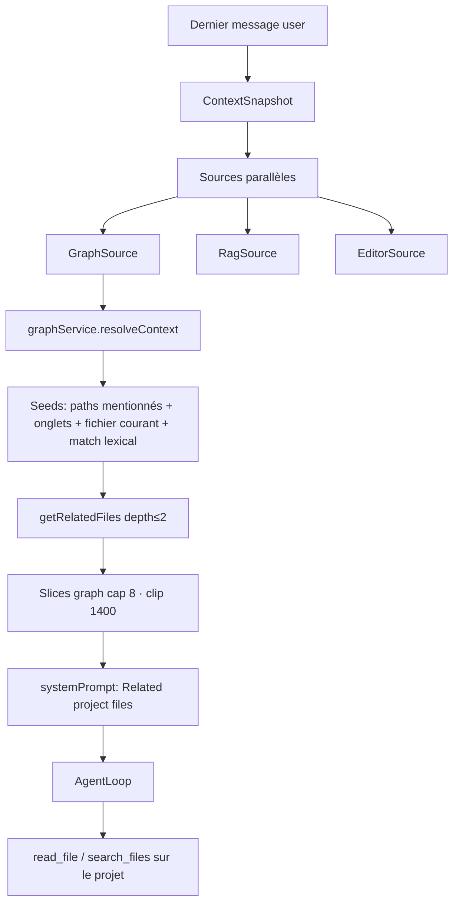

# Specs — file system & intégration agent

Document **as-built**. Source de vérité : `src/lib/graph/` (`classify`, `createSpec`, `mergedStore`, `ProjectGraph`, `ContextResolver`, `RelationshipAnalyzer`), `src/lib/agent/context/` (`GraphSource`, `ContextEngine`), `src/lib/tauri/userDataApi.ts`, `src-tauri/src/commands/system.rs`.

Ce document décrit le **Knowledge Center** (spécifications utilisateur / projet persistées en Markdown). Ce n’est **pas** l’artifact éphémère du step workflow `specify` (voir [workflow-spec.md](./workflow-spec.md)).

---

## 0. Vue d’ensemble

Les specs sont des fichiers Markdown classés dans deux scopes :

| Scope | Où ça vit | Chemin logique (graphe / UI) | Persistance |
| --- | --- | --- | --- |
| **Account** (user) | App data Kursor | `account/specs/...` | `{data_dir}/specs/account/...` |
| **Project** | Racine du projet ouvert | `.kursor/specs/project/...` (+ legacy) | FS du projet |

Elles sont indexées dans le **ProjectGraph** (nœuds + arêtes), exposées dans **SpecExplorer**, et injectées passivement dans le prompt agent via la source de contexte **`graph`**.

```mermaid
flowchart LR
  subgraph storage [Stockage]
    appData["{data_dir}/specs/account"]
    projectFs[".kursor/specs/project"]
  end
  subgraph virtual [Chemins logiques]
    accountV["account/specs/..."]
    projectV[".kursor/specs/project/..."]
  end
  subgraph runtime [Runtime]
    merged[MergedGraphStore]
    graph[ProjectGraph]
    ctx[ContextEngine GraphSource]
    agent[AgentLoop]
  end
  appData --> accountV --> merged
  projectFs --> projectV --> merged
  merged --> graph --> ctx --> agent
```

---

## 1. File system

### 1.1 Account specs (préférences / identité utilisateur)

**Disque (Tauri)** — `user_kind_root("specs")` :

```text
{app_data_dir}/specs/
  └── account/
        ├── preferred-stack.md          # fichier à la racine account
        ├── stack/typescript.md         # groupe "stack"
        ├── information/profile.md
        ├── coding-style/conventions.md
        └── preferences/stack.md
```

- Création auto du dossier `account/` à l’accès (`user_data_*`).
- Watch native : `user_data_watch_specs` → event `user:specs-changed` → `useAccountSpecsWatcher`.

**Chemin virtuel** (graphe, éditeur, explorer) :

```text
account/specs/<groupe?>/<fichier>.md
```

Mapping (`classify.ts`) :

| Virtuel | Relatif user_data |
| --- | --- |
| `account/specs/auth.md` | `account/auth.md` |
| `account/specs/stack/ts.md` | `account/stack/ts.md` |

Ces fichiers **ne sont pas** dans le dépôt projet. Ils survivent au switch de projet et appartiennent au compte local.

### 1.2 Project specs (contrats du dépôt)

**Chemin canonique (création UI / `writeNewSpec`)** :

```text
.kursor/specs/project/
  ├── technical/auth.md
  ├── database/schema.md
  ├── missions/onboarding.md
  ├── architecture/overview.md
  └── ui/dashboard.md
```

**Chemins legacy encore classés `project`** (`specScope`) :

```text
.kursor/specs/<groupe>/...     # ex. .kursor/specs/business/finance/margin.md
specs/<groupe>/...             # ex. specs/ui/dashboard.md
```

L’explorer affiche un arbre **sans** les wrappers `.kursor`, `specs`, `project` (`specDisplayRelative` + `buildSpecTree`).

### 1.3 Contenu d’un fichier spec

Création via `specFileContent` / `specFrontmatterBlock` :

```markdown
---
scope: project
type: technical
title: Auth
---

# Auth
```

Frontmatter optionnel (`parseSpecFrontmatter`) :

| Clé | Rôle |
| --- | --- |
| `scope` | `account` \| `project` (sinon déduit du path) |
| `type` | kind sémantique (`technical`, `stack`, …) — prioritaire sur le dossier |
| `title` | titre ; sinon premier heading Markdown |

Le corps est du Markdown libre. Les mentions de chemins / basenames alimentent les arêtes du graphe.

---

## 2. Construction & classification

### 2.1 Kinds (groupes)

**Account** (`ACCOUNT_GROUP_KINDS`) : stack, information, identity, projects, preference, workflow, tools, editor, git, communication, language, models, skills, coding-style, environment, security.

**Project** (`PROJECT_GROUP_KINDS`) : technical, functional, business, ui, constraints, documentation, database, missions, stack, architecture, api, security, infrastructure, testing, deployment, domain, integrations, auth, observability, product, data, environments, roadmap, ci.

Résolution du kind (`resolveSpecKind`) :

1. Frontmatter `type` (si reconnu / sanitisé)
2. Sinon premier segment de chemin reconnu dans `specDisplayRelative`
3. Sinon défaut : `preference` (account) ou `generic` (project)

Aliases : `preferences` → `preference`, `coding_style` → `coding-style`, `constraint` → `constraints`.

### 2.2 API de création

| Opération | Entrée | Effet |
| --- | --- | --- |
| `graphService.createSpec` | `{ scope, kind?, group?, fileName }` | écrit Markdown + met à jour le graphe |
| `graphService.createSpecGroup` | `scope`, `group` | crée le dossier (account : via `.keep`) |
| `graphService.listSpecGroups` | `scope` | liste les dossiers existants (+ legacy project) |

Chemins produits :

- Account : `account/specs/{group?}/{file}.md`
- Project : `.kursor/specs/project/{group}/{file}.md`

### 2.3 Catégorie graphe

Tout path avec `specScope !== "none"` → catégorie **`specifications`** (`classifyFile`). Les specs sont donc distinctes de `documentation` (autres `.md` hors arbres specs).

### 2.4 Store fusionné

`createProductionGraphStore()` = projet FS **∪** account specs :

```text
walkFiles  = projet + account (préfixe virtuel account/specs)
read/write = route(isAccountVirtualPath ? accountStore : projectStore)
```

Sans ce merge, les prefs user n’apparaîtraient pas dans le ProjectGraph du projet ouvert.

---

## 3. Graphe de connaissances

### 3.1 Indexation

À l’ouverture / rebuild projet (`graphService.rebuild`) :

1. Scan (`FileScanner`) — extensions texte/code/md, hors `node_modules`, `.git`, etc. (`.kursor` **n’est pas** exclu)
2. `extractDescriptor` — tokens, title, mentions, `scope`, `specType`
3. `RelationshipAnalyzer` — arêtes entre nœuds

Watchers :

- Fichiers projet → `useProjectWatcher` → `graphService.updateFile`
- Specs account → `useAccountSpecsWatcher` → même update avec path virtuel

### 3.2 Relations utiles aux specs

| Relation | Condition typique |
| --- | --- |
| `influences` | Spec **account** → spec **project** ou code (basename / keywords / références) |
| `implements` | Spec project → fichier code (basename / mention de fichier) |
| `documents` / `references` | Doc/spec ↔ autres fichiers |
| `related_to` | Fallback lexical |

Ces arêtes permettent au resolver de **remonter** d’un fichier code ouvert vers la spec liée (et inversement).

### 3.3 UI

- **SpecExplorer** : arbre account | project, création de fichiers/groupes, filtre texte sur path/title/tokens
- **GraphCanvas / GraphInspector** : nœuds `specifications`, filtres scope `account` / `project` et kinds
- **Éditeur** : `openFile` route les paths `account/specs` vers `userDataApi`, le reste vers le FS projet

---

## 4. Intégration dans l’agent IA

Les specs n’ont **pas** d’outil dédié (`read_spec`, etc.). Elles arrivent au modèle par **trois canaux** (plus les outils FS classiques sur le projet).



### 4.1 Injection passive — `GraphSource` (principal pour les specs)

À chaque `runTurn`, `ContextEngine.build` collecte `GraphSource` :

1. **Seeds**
   - Chemins extraits du message (`mentionedPaths`)
   - Onglets ouverts + fichier courant
   - Jusqu’à 5 nœuds scorés par tokens / basename / nom de fichier vs la query
2. **Expansion** — `ContextResolver.resolve` → pour chaque seed, `ProjectGraph.getRelatedFiles` (profondeur 2, confiance min config)
3. **Budget** — `maxGraphFiles` (cap 8 par défaut), priorité `CONTEXT_PRIORITIES.graph` (= relevantCode)
4. **Assemble** — section system prompt **« Related project files »**, après skills/memory, avant RAG

Le modèle voit donc le **contenu** (clippé) des specs (et fichiers liés) **sans** appeler d’outil, si elles matchent la requête ou le voisinage graphe.

**Limite as-built (account)** : le retriever graph lit le contenu via `fileSystemService.readFile`. Les paths virtuels `account/specs/...` ne sont pas sur le FS projet → contenu souvent vide côté slice (path quand même listé, score réduit). Les specs **projet** (`.kursor/specs/...`) sont lues normalement. L’éditeur et l’index graphe, eux, passent bien par le store fusionné / `userDataApi`.

### 4.2 Outils FS (recherche active)

| Outil | Specs project | Specs account |
| --- | --- | --- |
| `read_file` / `search_files` / `list_files` | Oui (chemins relatifs projet, ex. `.kursor/specs/project/technical/auth.md`) | Non — hors racine projet |
| Éditeur humain | Oui | Oui (routage user data) |

Guidance agent : les chemins sont relatifs à la racine projet ; pas de notion explicite de `account/specs` dans `toolGuidance`.

### 4.3 RAG

L’index RAG parcourt le **projet** (plan natif + `fileSystemService`). Les specs sous `.kursor/specs` / `specs/` peuvent donc remonter via `RagSource` (chunks sémantiques / FTS), indépendamment du graphe.

Les specs **account** ne sont **pas** dans la partition RAG projet.

### 4.4 Autres sources (pas des specs, mais voisines)

| Source | Rôle vs specs |
| --- | --- |
| **Rules** (`.kursor/rules`, user rules, `AGENTS.md`) | Instructions impératives ; pas le même rôle que les specs descriptives |
| **Skills** | Procédures d’exécution ; listing dans le prompt, corps via `load_skill` |
| **Memory** | Souvenirs project-scoped ; pas le file system specs |
| **Editor** | Si une spec est ouverte dans un onglet, son contenu entre via `EditorSource` (y compris account, si l’UI l’a ouvert) |

### 4.5 Ce que l’agent ne fait pas

- Pas de chargement exhaustif de toutes les specs à chaque tour
- Pas de step workflow « lire le knowledge center » obligatoire
- Pas de sync automatique account → project (seulement arêtes `influences` si similarité détectée)
- L’artifact `spec` du step `specify` (WorkflowEngine catalogue) est un **résumé de tour**, pas un fichier sous `.kursor/specs`

---

## 5. Spécificités user vs projet

| Dimension | Account (user) | Project |
| --- | --- | --- |
| Portée | Tous les projets du compte | Un dépôt (`projectId` + `root_path`) |
| Exemples | stack préférée, coding-style, language, models, identity | auth technique, schéma DB, missions, UI, architecture |
| Stockage | App data, hors git | Dans le projet (committable si `.kursor` versionné) |
| Création défaut kind | `preference` | `documentation` si kind générique |
| Label UI `stack` | « Preferred Stack » | « Stack » |
| Influence graphe | Source typique des arêtes `influences` | Cible / specs métier-tech |
| Visibilité agent passive | Match lexical / voisinage ; contenu slice souvent vide | Contenu injecté si seed/related |
| Visibilité agent outils | Non | Oui via chemins projet |
| Switch de projet | Conservé, ré-indexé dans le nouveau graphe | Remplacé avec le workspace |

**Intention produit** : l’account exprime *comment / avec quoi l’utilisateur préfère travailler* ; le project exprime *ce que ce dépôt doit faire et comment il est structuré*. Le graphe relie les deux quand les basenames / mots-clés se recoupent (ex. `account/specs/auth.md` → `.kursor/specs/project/technical/auth.md`).

---

## 6. Cycle de vie typique

```text
1. User crée une spec (SpecExplorer) ou édite un .md sous .kursor/specs
2. Watcher → graphService.updateFile → extractDescriptor + recompute edges
3. User pose une question / demande une feature dans l’AgentPanel
4. ContextEngine :
     - seeds (message, onglets, tokens)
     - resolveContext → fichiers liés (souvent specs)
     - assemble « Related project files »
     - (+ RAG si chunks matchent)
5. AgentLoop : le modèle peut encore read_file sur .kursor/specs/... pour approfondir
6. Implémentation : arêtes implements / mentions aident à rester aligné avec la spec
```

---

## 7. Post-run reflection (propose-only)

Après un run **completed**, `KnowledgeReflector` analyse le transcript (catalogue skills + nœuds specs injectés, pas d’outils FS) et propose créations / mises à jour / suppressions / réorganisations. L’utilisateur valide dans la carte timeline (Accept selected / Reject). Aucune écriture automatique.

- Spec create → `writeNewSpec` puis overlay du corps markdown
- Spec update → write du path existant
- Spec delete → delete + `graphService.updateFile(..., "remove")`
- Spec reorganize → copy vers `targetPath` (groupe via `createSpecGroup` si besoin) puis delete de l’ancien

Voir [skills-system.md](./skills-system.md) §7.

## 8. Fichiers de référence

| Zone | Fichiers |
| --- | --- |
| Classification / paths | `src/lib/graph/classify.ts` |
| Création | `src/lib/graph/createSpec.ts`, `extract/frontmatter.ts` |
| FS fusionné | `src/lib/graph/mergedStore.ts`, `src/lib/tauri/userDataApi.ts` |
| Graphe | `ProjectGraph.ts`, `ContextResolver.ts`, `analyze/RelationshipAnalyzer.ts` |
| UI | `SpecExplorer.tsx`, `stores/graphStore.ts`, `stores/editorStore.ts` |
| Agent contexte | `context/sources/graph.ts`, `ContextEngine.ts`, `assemble.ts` |
| Native account | `src-tauri/src/commands/system.rs` (`user_data_*`) |
| Post-run reflect | `src/lib/agent/knowledge/` |

Voir aussi : [account-project-model.md](./account-project-model.md) (identité compte/projet), [workflow-spec.md](./workflow-spec.md) §5.1–5.2 (pipeline contexte), [skills.md](./skills.md) (procédures ≠ specs).
