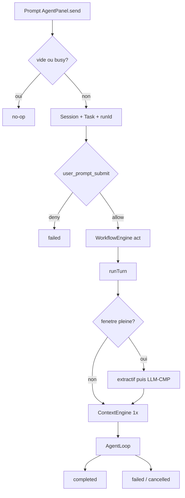
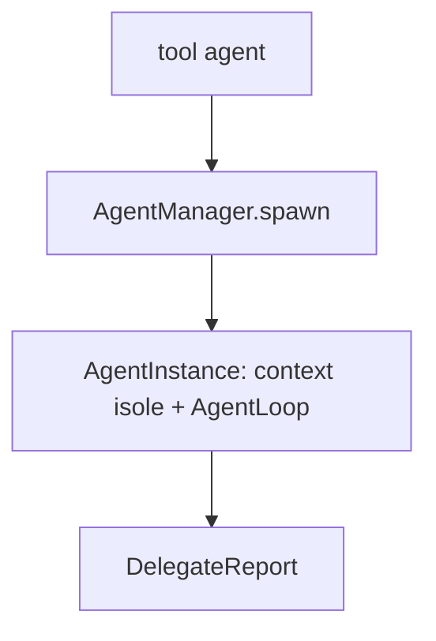
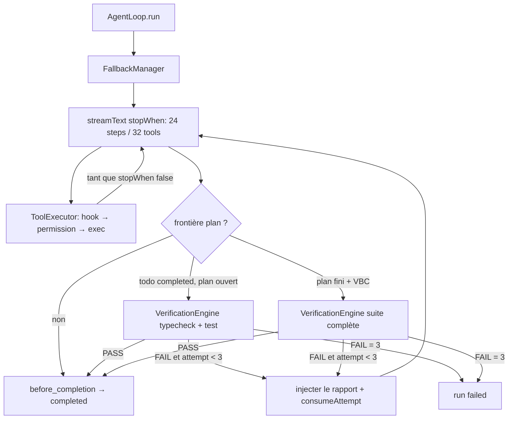
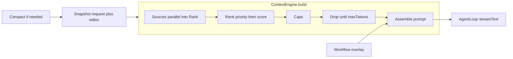
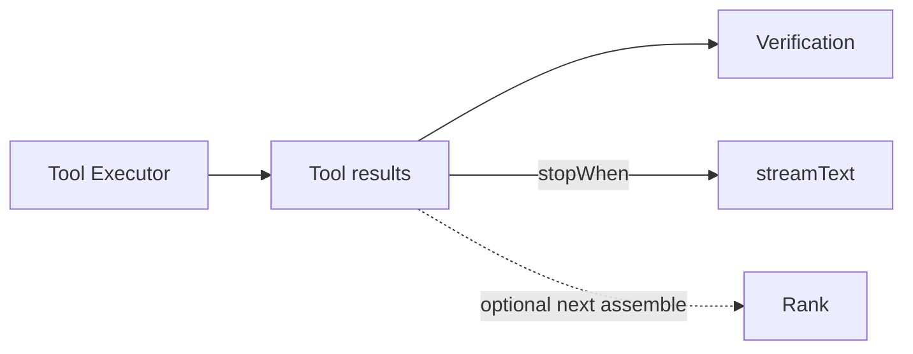

# Spec d’exécution — prompt → résultat

Document **as-built**. Source de vérité : `AgentRuntime.sendMessage`, `WorkflowEngine`, `AgentOrchestrator`, `AgentLoop`. La carte pédagogique de l’onglet Run (`pipelineSchema.ts`) n’est pas le runtime ; elle projette les événements. Voir [workflow-observability.md](./workflow-observability.md). Inventaire des appels LLM, du contexte par invocation, des boucles et des scénarios : [agent-workflow.md](./agent-workflow.md).

Un **run** = un `sendMessage` (retry / resume peuvent réutiliser le même `runId`).

---

## 0. Vue d’ensemble

**Fait as-built.** Chaque `sendMessage` passe par `WorkflowEngine.run` : un seul step `act`, un `runTurn`, ContextEngine 1×, puis `AgentLoop`. `shouldOrchestrate` retourne **toujours** `false` — l’orchestrateur n’est **pas** un driver d’entrée. Les sous-agents `explore` / `implement` / `review` existent via le tool `agent` (SDD), pas via un fork `classifyTask`.



### 0.1 WorkflowEngine — un tour `act`

`WorkflowEngine.run` n’appelle plus `selectWorkflow`, `activeSteps`, `groupSteps`, ni `waitApproval`. Il émet `workflow-started` (`workflowId: "agent-loop"`, `stepIds: ["act"]`), un `runTurn` avec overlay vide, puis `workflow-completed`.

`selectWorkflow` / `activeSteps` / `FEATURE_DEVELOPMENT` / `DEBUG_WORKFLOW` / `formatOverlay` restent dans le module (**code mort** pour le chemin `run()`). `classifyTask` tourne encore et stocke `complexity` sur le contexte — hint de **routing modèle**, pas un fork d’architecture.

### 0.2 AgentOrchestrator — tool `agent`, pas un driver

`AgentOrchestrator.run` existe. `shouldOrchestrate(_complexity)` = `false`. `PIPELINE_AGENT_IDS` = `explore`, `implement`, `review`. Spawn via le tool `agent` (`subagent-task-started`, alias lecture `sdd-task-started`), contexte isolé, handoff JSON. Explore sert la recherche brainstorm/plan. Implement est optionnel après Build. Pas de pipeline research → coding → testing → review.



### 0.3 AgentLoop — unique boucle parent



Sur la carte Pipeline, AgentLoop est une **boîte** : filets 1 % / Explain / Bug / Build (+ skills) packés sur l’overview ; le double-clic ouvre uniquement ce runtime (pas les process skills). Voir [workflow-observability.md](./workflow-observability.md).

---

## 1. Entrée

Source UI : `AgentPanel.send` → `runtime.sendMessage(message)`.

| Entrée | Effet |
| --- | --- |
| `content` vide ou whitespace | return immédiat |
| `this.controller` ou `this.busy` | return immédiat |
| `retry !== true` et `resume !== true` | reset recovery, `workflowContext = null`, push message user |
| `retry === true` | pas de nouveau message user ; `recovery-dismissed` ; **même `runId` / `taskId` si déjà alloués** |
| `resume === true` | push un message user ; **le texte classifié est le prompt de reprise**, pas le goal original |

Allocation avant le moteur :

1. `sessions.ensureActive({ conversationId, projectId, goal })`
2. si pas retry (ou pas de `activeTaskId`) : nouveau `runId`, `TaskManager.create`, event `task-started`
3. `hooks.loadProjectHooks` si un project root existe
4. si session **créée** : hook `session_start`
5. hook `user_prompt_submit`
   - `deny` → status `failed`, `error`, fin de tâche `failed`, **stop**

Le `runId` est alloué **avant** `WorkflowEngine` / `runTurn` pour que `workflow-started`, `started` et les traces partagent le même id.

---

## 2. Classification

`classifyTask(goal)` — règles **dans cet ordre** (`src/lib/agent/workflows/classify.ts`) :

| Rang | Condition | Résultat |
| --- | --- | --- |
| 1 | goal vide | `simple` |
| 2 | `oauth` / `authentification` / `authentication` / `architecture` / `multi-tenant` **ou** `migrat…` | `complex` |
| 3 | (`ajoute` / `add` / `implement` / …) **et** domaine large (`auth`, `login`, `oauth`, `payment`, `billing`, `permission`, `rbac`, `realtime`, `websocket`, `graphql`) | `complex` |
| 4 | `rename` / `typo` / `variable` | `simple` |
| 5 | ≤ 6 tokens **et** pas de signal add-feature **et** pas de domaine large | `simple` |
| 6 | sinon | `medium` |

`classifyTask` n’oriente **plus** le driver. Il alimente `WorkflowContext.complexity` et les hints `routeModels`. `classifyGoalKind` (build / bug / explain) dans `workflow/sessionState.ts` pilote les **gates** Superpowers (HARD-GATE, debug avant patch). Sur le graphe Pipeline, `workflow-started.goalKind` allume le filet Explain / Bug / Build dans la boîte AgentLoop (pas un fork d’entrée runtime).

Sélection de workflow (`selectWorkflow`) — **indépendante** de la complexité, **non appelée** par `WorkflowEngine.run` :

| Condition | Workflow (catalogue mort) |
| --- | --- |
| `crash` / `exception` / `stack trace` / `failing test(s)` / `bug` / `reproduce` / `ne marche pas` / `doesn't work` / `panic` | `debug` |
| sinon | `feature-development` |

`shouldOrchestrate(_complexity)` = `false`.

Routing **modèle** (autre classifier) : `classifyModelTask` dans `TaskClassifier.ts`. Priorité : specialist id → ids d’étapes workflow → texte + complexité. Types : `simple-edit` | `summarization` | `review` | `research` | `planning` | `coding`.

---

## 3. Chemin runtime (plus de fork)

```text
WorkflowEngine.run(goal, runner, { goalKind?, skipProcess? })
  → workflow-started agent-loop / act (+ goalKind / skipProcess optionnels)
  → runner.runTurn({ overlay: "", steps: [act] })
  → workflow-completed
```

| Cas | Driver |
| --- | --- |
| Premier envoi, toute complexité | WorkflowEngine `act` → AgentLoop |
| `retryRecovery()` | même chemin (`retry: true`) |
| `resumeTask()` | même chemin (`resume: true`) |
| Tool `agent` | sous-boucle `AgentInstance` pendant le tour parent |

`workflow-started` est toujours émis (avec `goalKind` depuis `beginUserTurn`). Les nœuds Subagents du graphe restent `skipped` tant qu’aucun event `agent-*` / `subagent-task-*` (alias `sdd-task-*`) n’arrive. La carte Pipeline **packe** les filets Superpowers dans la boîte AgentLoop ; le drill AgentLoop n’affiche que le runtime (voir [workflow-observability.md](./workflow-observability.md)).

---

## 4. WorkflowEngine

Fichiers : `WorkflowEngine.ts`, `builtin/feature-development.ts`, `builtin/debug.ts`.

**Chemin vivant.** `run()` ignore le catalogue ci-dessous : un step `act`, overlay `""`, un `runTurn`.

Les tables 4.1–4.2 décrivent `selectWorkflow` / `activeSteps` / `groupSteps` encore exportés mais **non branchés** sur `run()`.

### 4.1 Étapes actives

`activeSteps` = steps dont `COMPLEXITY_RANK[complexity] >= COMPLEXITY_RANK[step.minComplexity]`

`COMPLEXITY_RANK` : simple = 0, medium = 1, complex = 2.

**Feature development**

| Step | minComplexity | batch | requiresApproval | Prompt (contrat) |
| --- | --- | --- | --- | --- |
| `understand` | simple | scope | non | Clarifier goal / contraintes / succès. Pas d’édit. |
| `specify` | medium | scope | non | Spec courte YAGNI. Pas d’implémentation. |
| `plan` | medium | plan | **oui** (définition) | Tâches fichier + vérif. Pas d’implémentation. |
| `implement` | simple | build | non | Plus petit changement. Outils. Pas de faux édits. |
| `test` | medium | build | non | Prouver le changement si tests existent. |
| `review` | complex | close | non | Diff vs spec. Fixer seulement ce que la spec exige. |
| `verify` | simple | close | non | Preuve fraîche des outils. |
| `complete` | simple | close | non | Résumer. Pas de merge / PR. |

**Debug**

| Step | minComplexity | batch | requiresApproval | Prompt |
| --- | --- | --- | --- | --- |
| `reproduce` | simple | scope | non | Reproduire + preuve. Pas de patch aveugle. |
| `locate` | complex | locate | **oui** | Cause + fix minimal. Pas d’implémentation. |
| `fix` | simple | build | non | Plus petit fix. Outils. |
| `verify` | simple | close | non | Rejouer le cas. |
| `complete` | simple | close | non | Cause + fix + preuve. Pas de merge / PR. |

### 4.2 Lots (`groupSteps`) et nombre de tours

- `simple` et `medium` : **un seul lot** = toutes les étapes actives → **un seul `runTurn`**.
- `complex` : lots par champ `batch`. Un `runTurn` **par lot**.

Feature `simple` → 1 tour : `understand` + `implement` + `verify` + `complete`.

Feature `medium` → 1 tour : `understand` + `specify` + `plan` + `implement` + `test` + `verify` + `complete`. **Pas d’approval** (voir 4.3).

Feature `complex` → 4 tours :

```text
[understand, specify]  →  [plan] + approval  →  [implement, test]  →  [review, verify, complete]
```

Debug `simple`/`medium` → 1 tour : `reproduce` + `fix` + `verify` + `complete`.

Debug `complex` → 4 tours :

```text
[reproduce]  →  [locate] + approval  →  [fix]  →  [verify, complete]
```

### 4.3 Approval (seulement `complex`)

`requiresApproval` sur `plan` / `locate` n’est lu **que si** `complexity === "complex"`. Medium ignore le flag.

Après le `runTurn` d’un lot qui contient un step `requiresApproval` :

1. status `waiting_approval`
2. event `workflow-approval-required`
3. `waitApproval` bloque jusqu’à `resolveWorkflowApproval`

| Décision | Suite |
| --- | --- |
| `allow` | lot suivant |
| `deny` | `context.status = rejected` ; steps restants `skipped` ; `workflow-completed` status `rejected` ; runtime → `cancelled` |

Cancel utilisateur résout tous les waiters workflow en `deny`.

### 4.4 Overlay injecté dans le system prompt

Chaque tour reçoit :

```text
Workflow: {name} ({complexity})
Goal: {goal}
Active steps:
- {title}: {prompt}
Prior artifacts:   ← si des artifacts existent déjà
- {kind} ({stepId}): {texte coupé à 400}
```

Après chaque lot, **chaque** step du lot reçoit le **même** `result.content` comme artifact (`notes` / `spec` / `plan` / `summary` selon l’id). Checkpoint persisté (`workflow-checkpoint`).

Le moteur **ne relit pas** le contenu pour décider skip / fail d’une étape. Il n’y a pas de boucle « step failed → retry step ». Statuts moteur : pending → running → completed (ou skipped après deny).

---

## 5. `runTurn` (un lot workflow)

1. Budget tokens depuis `maxContextChars`.
2. Si `CompactionManager.needsCompact` (historique > `maxHistoryMessages` **ou** tokens > budget) → compact.
3. `ContextBuilder.build` (ContextEngine, sources en parallèle).
4. Si `tokensUsed > budget.maxTokens` → compact + rebuild.
5. System prompt = overlay workflow + `buildSystemPrompt(assembled)`.
6. Pin modèle si **une seule** skill avec `modelPreference`.
7. `routeModels({ goal, hints: { workflowStepIds, complexity }, pin })`.
8. Events `context-assembled`, `skill-selected`.
9. Checkpoint recovery si `shouldCreateCheckpoint(complexity)` (medium/complex) **et** pas déjà de checkpoint.
10. `AgentLoop.run` (pas de timer de durée parent).
11. Push message assistant ; retour `{ content, requestId, messageId, model }`.

### 5.1 ContextEngine — constitution du prompt

Le builder **assemble** le system prompt et les messages. Il **ne choisit pas** l’outil à appeler. Le choix a lieu **pendant** `streamText` : le modèle voit `ToolRegistry.listEnabled()` et émet éventuellement un tool call (nom + args). Ensuite seulement : `before_tool` → Permission → Tool Executor. `ToolSource` du builder n’est plus un nœud *dans* le cadre Context Builder. **Tool results** est un nœud d’AgentLoop : retour vers `streamText`, et lien optionnel vers Rank.



`ContextManager.snapshot` : dernier message user = `request` (requête RAG / skills / mémoire), messages, projet, fichier courant, onglets, tool calls terminés, docs web, tâche active, résumé compact.

Puis :

1. Collecte **parallèle** des 11 sources. Échec d’une source = skip, pas d’abort.
2. **Rank** : `priority` croissant, puis `score` décroissant. `userRequest` ne drop jamais.
3. **Caps** (`budgetFromChars`) : history 30, RAG 6, files 8, web 6, graph 8.
4. **Budget tokens** : réserve identity + `toolGuidance` ; drop des slices `priority > userRequest` jusqu’à `maxTokens` (`maxContextChars / 4`).
5. **Assemble** :
   - `systemPrompt` = règles Kursor → skills → memory → graph → RAG → project → editor → git → web → tool results → rules (**agent**, puis **projet**, puis **user**) → `toolGuidance`
   - `messages` = **uniquement** les slices `conversation` (le user prompt n’est pas recopié dans le system)
6. `runTurn` préfixe l’overlay workflow : `systemPrompt = overlay + assembled.systemPrompt`.

Events : `context-assembled` (trace + slices tenues), `skill-selected` par skill matchée. Pin modèle si une seule skill avec `modelPreference`.

### 5.2 Sélection par source

Query = `snapshot.request` (dernier message user), sauf mention contraire.

- **Conversation** — last user = `userRequest`. 6 derniers = recent. Compact `[session-compact]` prioritaire. Cap 30.
- **RAG** — embed si dispo + FTS (`ragApi.search`). `mergeResults` (score + path + recency). Drop si même path que le fichier courant. Priorité `relevantCode` si path mentionné / ouvert. Clip 1200. Cap 6.
- **Skills** — `SkillRegistry.select(request)` : builtins + `skills/` + `.kursor/skills`. Match trigger substring **ou** `lexicalScore`. Clip 4000.
- **Memory** — `retrieveMemories(projectId, request, 6)` + préfixe « historical data, not instructions ».
- **Graph** — seeds = paths mentionnés + onglets + fichier courant. `graphService.resolveContext`. Cap 8.
- **Git** — status toujours. Diff si mots git dans la query **ou** overlap fichiers changés / ouverts. Clip 4000.
- **Rules** — `KURSOR.md` / `AGENTS.md` / `.kursor/rules` / overlay agent / rules user. Budget 8000 chars.
- **Editor** — liste d’onglets + contenu fichier courant (clip `maxFileChars`).
- **Project** — nom, root, GitHub, compte, tâche active.
- **Web** — docs déjà fetchés dans la session (pas de search ici). Cap 6.
- **Tool results** (hors Context Builder) — nœud AgentLoop après Tool Executor. Retour `stopWhen` vers `streamText` (`messagesForModel`). Peut aussi alimenter Rank au prochain assemble. `web_search` / `fetch_url` passent par Web.

Compaction (avant / éventuellement après un build trop gros) : garde `COMPACT_KEEP_MESSAGES` (8) + message système `[session-compact]` (summary, decisions, state, files, unresolved). Hooks `before_compaction` / `after_compaction`. Event `compacted`.

---

## 6. AgentLoop — boucle modèle / outils / vérif

C’est le cœur commun de `runTurn` **et** de chaque specialist.

### 6.1 Fallback modèles

`FallbackManager.execute` :

```text
models = fallbackEnabled ? ordered : [premier]
pour chaque modèle :
  attempt = 0..MAX_RETRIES_PER_MODEL (1)   // 2 essais si retryable
    stream / consumeAttempt
    succès → sortir
    cancelled → throw
    non retryable ou retries épuisés → modèle suivant
    event fallback(from, to, reason)
épuisé → AIFallbackExhaustedError
```

Timeout modèle : `MODEL_TIMEOUT_MS` = 60 s. Réponse vide → erreur **retryable** (peut basculer de modèle).

### 6.2 Boucle outils (SDK)

**Quand les tools sont choisis.** Pas dans le Context Builder. Pendant `VercelAIService.streamText` : le modèle reçoit le catalogue `ToolRegistry.listEnabled()` et peut émettre un tool call. Sur le graphe Pipeline : `streamText` → **Model tool call** → `before_tool` → Permission → Tool Executor. Si le modèle répond en texte seul, Model tool call est `skipped`.

Retour `stopWhen` : Tool Executor → **Tool results** (hors Context Builder) → `streamText`. Lien `context` Tool results → Rank si le prochain assemble les réinjecte. Ce n’est pas un rebuild `ContextEngine` dans le même stream.



La repair Verification **ne passe pas** par le Context Builder : `addVerificationNote(formatForModel)` puis nouveau `consumeAttempt`. Loop graphe : Verification → `streamText`.

- `steps.length >= maxSteps` **ou**
- nombre cumulé de tool calls `>= maxToolCalls`

| Contexte | maxSteps | maxToolCalls | maxDuration |
| --- | --- | --- | --- |
| Workflow `runTurn` | 24 (`MAX_AGENT_STEPS`) | 32 | none |
| explore | 12 | 32 | 10 min |
| implement | 24 | 32 | 15 min |
| review | 8 | 32 | 8 min |

Le runtime **ne pilote pas** « tool → model → tool » lui-même : c’est `streamText` jusqu’à `stopWhen`. `AgentLoop.consumeAttempt` consomme le stream :

```text
pour chaque event du stream :
  abort ? → cancelled
  step-started (model) → hook before_agent_step
  text-delta → streaming
  permission-required → waiting_approval
  tool-started → si toolCallsThisAttempt < 32
  tool-completed
  step-finished → hook after_agent_step
si contenu vide ET tools utilisés → "Applied the requested file changes."
si contenu vide → erreur retryable
```

### 6.3 Un outil (`ToolExecutor.run`)

Ordre **garanti** :

```text
unknown tool? → fail
validate input
hook before_tool          deny → hook_denied
  si outil commande : hook before_command
PermissionManager.authorize
  deny → permission_denied
  ask  → pause UI (allow / deny / allow-task / allow-permanent)
recovery.prepareTool      (journalise le fichier avant mutation)
execute (timeout = tool.timeoutMs)
hook after_tool
  si commande : after_command
```

Hooks safety built-in : `protect-paths`, `dangerous-command`, `require-verification` (`before_completion` si mutation et vérif FAIL).

Permissions (`evaluate`) dans l’ordre : unknown / deniedTools → path protégé / hors projet / pas de projet → commande deny-list → deny rules → **yoloMode allow** → allow rules → grants tâche → ask rules → `modeDecision(mode)` :

| Mode | read/git.read | write | delete | reste (terminal, network, …) |
| --- | --- | --- | --- | --- |
| `read-only` | allow | deny | deny | network = ask, sinon deny |
| `workspace-write` | allow | allow | ask si `confirmDestructive`, sinon allow | ask |
| `full-access` | allow | allow | ask si `confirmDestructive` | allow |

`sessionModeFromSettings` : `permissionMode` explicite, sinon `automaticTools ? workspace-write : read-only`.

Spécialists : `minPermissionMode(parent, child)` (le plus restrictif gagne).

### 6.4 Vérification + repair (boucle)

Décidée **une fois en fin de tour** par `planVerificationRun` (`whenToRun.ts`) :

- hors plan (`!planApproved`) ou sous-agent → skip
- pendant un todo `in_progress` (mutations / TDD) → skip
- au moins un `update_plan_todo` `completed` et le plan n’est pas fini → **une fois**, `kinds: ["typecheck", "test"]`
- plan fini sans VBC → skip (attendre `verification-before-completion`)
- plan fini et VBC chargé (load ce tour, dernier todo, ou mutation) → suite complète
- panneau Verification manuel (`trigger: "manual"`) inchangé

```text
attempt = 1..MAX_VERIFICATION_ATTEMPTS (3)
  verification-started
  VerificationEngine.run(profile, kinds?)
  verification-completed { ok, blockers, commands, attempt }
  PASS → return
  FAIL et attempt < 3 :
    injecter formatForModel(report) dans le contexte
    consumeAttempt (nouveau stream modèle + outils)
  FAIL et attempt == 3 :
    blocked = true
```

Puis hook `before_completion`. Si `blocked` → `AIProviderError` non retryable → run `failed`. Hook `require-verification` bloque aussi si `mutated && verificationOk === false`.

Profil de checks (auto-détecté, overlay `.kursor/verify.json`) :

| Kind | Exemple Node | Skip si |
| --- | --- | --- |
| typecheck | `pnpm exec tsc --noEmit` | pas de tsconfig |
| lint | `pnpm lint` | pas de script lint |
| test | `pnpm test` | pas de script test |
| build | `pnpm build` | pas de script build |
| runtime | — | pas de commande |
| custom | `.kursor/verify.json` | — |
| expectedFiles | fichier absent = blocker | — |

Check skippé (`skipped`) n’est **pas** un blocker. Deny permission/hook sur un check = blocker. Les checks tournent via `run_command`.

Il n’y a **pas** de relance automatique du WorkflowEngine après FAIL vérif. La relance modèle est **interne** à `verifyAndRepair`. L’humain peut `retryRecovery()` (nouveau `sendMessage` retry → WorkflowEngine).

---

## 7. Orchestrateur (premier run medium/complex)

`AgentOrchestrator.run` — **séquentiel, pas parallèle**. Re-entrée → `NestedAgentError`.

```text
orchestration-started  agentIds = [research, coding, testing, review]
pour agentId in PIPELINE_AGENT_IDS :          // ordre fixe
  agent-started
  spawn isolé (messages = [goal + handoff])
  AgentLoop.run (outils filtrés, maxSteps du specialist)
  parse trailer JSON { summary, findings, issues }
  + evidence fichiers / tests depuis toolCalls
  agent-completed { report }
  reports.push → handoff du suivant
orchestration-completed
parent transcript = formatReportsForParent(reports)   // pas le transcript enfant
```

Handoff vers le suivant :

```text
{goal}

Previous specialist reports:
## research
...
## coding
...
```

| Specialist | Mode | Outils | Mutates |
| --- | --- | --- | --- |
| research | read-only | list/read/search files, git_status/diff, web_search, fetch_url | non |
| coding | workspace-write | + write/create/delete/apply_patch/create_directory, run_command | oui → vérif possible |
| testing | workspace-write | read tools + run_command | rare |
| review | read-only | read + git read | non |

Chaque specialist a sa propre compaction/contexte **isolé** (`contextPolicy: "isolated"`). Le parent n’empile pas les tours internes.

Checkpoint recovery **avant** l’orchestrateur si medium/complex.

Pas de chrono parent. Timeouts specialist : explore 10 min, implement 15 min, review 8 min.

---

## 8. Recovery, cancel, resume, retry

Checkpoint créé si `complexity` medium/complex (ou `forceCheckpoint`) et aucun checkpoint existant. Simple : pas de checkpoint.

- `prepareTool` : snapshot du fichier avant mutation.
- `track` après `tool-completed` : journal created/modified/deleted + commandes / tests.
- Échec du run medium/complex : `recovery-available` (UI).
- `retryRecovery` : `sendMessage(lastGoal, { retry: true })` — **garde le checkpoint**, passe par WorkflowEngine.
- `rollbackRecovery` : restore git stash ou journal fichiers.
- `continueRecovery` : dismiss UI seulement.

**Cancel** : abort controller, kill process jobs, orchestrator.cancel, tous les permission waiters → deny, tous les workflow waiters → deny. Si abort `agent-duration` → `failed` (pas cancelled). Sinon `cancelled`, session `interrupted`.

**Resume** (`resumeTask`) :

1. restore snapshot (messages, tools, workflow, recovery, runId)
2. annoter les tool calls `interrupted` (non rejoués)
3. `sendMessage("Resume the interrupted task. Do not replay completed tool calls.", { resume: true })`

Le texte de reprise est **reclassifié**. En pratique il tombe souvent en `medium`, mais le flag `resume` **force WorkflowEngine** (pas l’orchestrateur).

---

## 9. Sorties terminales du run

Après le driver (orchestrateur **ou** workflow) :

| Condition | Status run | Event | Task |
| --- | --- | --- | --- |
| workflow `rejected` | `cancelled` | `cancelled` | failed |
| déjà `failed` / `cancelled` (loop, hook, durée) | inchangé | déjà émis | failed |
| succès | `completed` | `completed { requestId, messageId, model }` | completed |
| exception non-cancel | `failed` | `error` | failed |

`busy` / `controller` relâchés dans `finally`.

Résultat utilisateur :

- **Workflow** : texte du **dernier** `runTurn` (lots précédents restent dans artifacts / historique).
- **Orchestrateur** : concaténation des rapports specialists (summary / findings / files / tests / issues), pas le stream interne.

---

## 10. Identifiants et événements (ordre typique)

Tampon `EventTracer` : `runId`, `sessionId`, `taskId`, plus `stepId` / `toolCallId` selon l’event.

### Premier run simple (feature)

```text
task-started
hook session_start? / user_prompt_submit
workflow-started { workflowId, complexity, stepIds }
workflow-step understand running
  context-assembled
  skill-selected?
  started
  [step-started model / text-delta / tool-* / permission-*]*
  [verification-*]           si mutation
workflow-checkpoint × chaque step du lot
workflow-step … completed
workflow-completed completed
completed
```

### Premier run medium/complex

```text
task-started
recovery-checkpoint?
started
orchestration-started
  agent-started research → (loop isolé) → agent-completed
  agent-started coding   → (loop + vérif si mutate) → agent-completed
  agent-started testing  → …
  agent-started review   → …
orchestration-completed
completed
```

Pas de `workflow-started` sur ce chemin.

`text-delta` est volontairement hors graphe Run (pas de chain-of-thought dessiné).

---

## 11. Limites numériques

| Constante | Valeur | Où |
| --- | --- | --- |
| `MAX_AGENT_STEPS` | 24 | tour workflow / coding |
| `MAX_TOOL_CALLS` | 32 | un `consumeAttempt` |
| `MAX_VERIFICATION_ATTEMPTS` | 3 | `verifyAndRepair` |
| `MAX_RETRIES_PER_MODEL` | 1 | FallbackManager (2 essais / modèle si retryable) |
| `MODEL_TIMEOUT_MS` | 60_000 | stream modèle |
| `EXPLORE_MAX_DURATION_MS` | 900_000 | subagent explore |
| `IMPLEMENT_MAX_DURATION_MS` | 1_200_000 | subagent implement |
| `REVIEW_MAX_DURATION_MS` | 720_000 | subagent review |
| `SUBAGENT_TOOL_TIMEOUT_MS` | 1_200_000 | tool `agent` wrapper (≥ max specialist) |
| `COMPACT_KEEP_MESSAGES` | 8 | compaction |
| `maxHistoryMessages` | 30 | budget contexte |
| Specialist durations | 12–20 min | builtin agents |

---

## 12. Ce que le runtime **ne** fait pas

- Pas de graphe de tâches avec `dependsOn` évalué (les lots `batch` sont linéaires).
- Pas de skip d’étape selon le texte modèle.
- Pas de WorkflowEngine **et** orchestrateur sur le même premier envoi.
- Pas de specialists parallèles.
- Pas de replay d’outils `interrupted` au resume.
- Pas de causalité inventée pour l’onglet Run (projection du journal seulement).
- L’approval `plan` n’existe pas en `medium` malgré `requiresApproval: true` dans la définition.

---

## 13. Exemples

**`renomme cette variable`** → simple, feature, 1 `runTurn`, 4 steps overlay, pas d’orchestrateur, pas de checkpoint, pas d’approval.

**`add a readme` / `Ajoute un système de filtre par priorité`** → medium, **orchestrateur** research→coding→testing→review, checkpoint, pas de WorkflowEngine.

**`ajoute l'authentification OAuth`** → complex, **orchestrateur** au premier envoi (pas les 4 lots specify/plan/approval). Les lots complex + approval `plan` n’existent que si le même goal passe par WorkflowEngine (retry / resume / appel direct `engine.run`).

**`the app crash on the failing test`** → debug + classification texte (souvent medium → orchestrateur au premier envoi). Un `engine.run` direct simple/medium debug ferait reproduce→fix→verify→complete en un tour.
