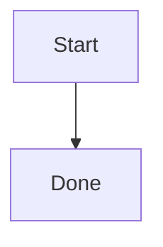

# Writing Plans

## Overview

Write an **execution strategy**, not a junior copy-paste script. Lead with the problem, the existing architecture, and what to KEEP / EXTEND / MODIFY / CREATE / DEPRECATE. Then give capability-sized tasks an engineer can verify. DRY. YAGNI. Frequent commits.

Assume a skilled developer who does not know this repo. Do **not** dump full function bodies or 2–5 minute TDD micro-steps — TDD happens at Build via `executing-plans`.

**Announce at start:** "I'm using the writing-plans skill to create the implementation plan."

**Context:** Write the plan on the current branch. The implementation branch is created later, after the human clicks Build, via `using-git-worktrees` / `git_branch` — not while writing the plan.

**Save plans with the `create_plan` tool** (`name`, `overview`, `body`, `todos` — one todo per implementable capability).
The tool writes `.kursor/plans/<slug>.plan.md`. Never use `write_file` or `create_file` for plans: they are blocked in Plan mode.
- (User preferences for plan location override this default)

**Follow the approved design.** `overview` and `body` MUST cover the human's chosen product, stack, and storage (for example React + Tailwind + localStorage). Do not invent Next.js, Prisma, or another stack unless they asked for it.

## Required `body` (enforced by `create_plan`)

`create_plan` rejects a thin backlog and outline-only plans (mermaid + file table + bullet list). The `body` MUST be a complete strategy an engineer can follow without the chat:

- At least **6000** characters besides mermaid diagrams
- **Problem** (or **Problème**) and **Architecture** as headings or `**Label:**` lines
- **KEEP** and **EXTEND** in an impact table or lists (French: **Conserver** / **Étendre**). Also fill MODIFY / CREATE / DEPRECATE when relevant
- A mermaid diagram (` ```mermaid ` fence). Add a data-flow diagram when the feature has APIs, events, or shared state
- Exact file paths in backticks
- Short **contract** excerpts (existing types, exports, events — typically 5–20 lines). Not the full implementation to paste
- A numbered section per todo (`## 1. Title` matching the todo text) with files and **Test** / **Verification** / **Done when** / **Vérif**

Do not skip `load_skill` `writing-plans`. Do not call `create_plan` until this skill is loaded.

**REQUIRED SUB-SKILL:** `load_skill` `subagent-driven-planning` and dispatch at least two `agent` calls (`subagent_type: "explore"`) in the same response before `create_plan`. Fold explore KEEP / EXTEND / missing into the impact table. You write Problem and architecture; children only research.

## Scope Check

If the spec covers multiple independent subsystems, it should have been broken into sub-project specs during brainstorming. If it wasn't, suggest breaking this into separate plans — one per subsystem. Each plan should produce working, testable software on its own.

## Document order

Use this order. Headings may be English or French.

1. **Objective** — one sentence
2. **Problem** — why it matters, expected behavior, constraints, success criteria
3. **Current architecture** — what already exists (from explore)
4. **Architecture impact** — KEEP / EXTEND / MODIFY / CREATE / DEPRECATE + reason
5. **Invariants** — INV-00n rules that must never be violated, **before** tasks
6. **Architecture + happy path** — 2–3 paragraphs, then mermaid (session → … → done)
7. **Contracts** — short TypeScript/interface excerpts only
8. **Decisions** — D1… options, chosen approach, reason, trade-off (no unexplained stack choices)
9. **Out of scope**
10. **Risks** — R1… + mitigation
11. **Phases** — vertical slices (capabilities), not frontend/backend/utils folders
12. **Tasks** — one todo per deliverable capability

When the plan touches AgentLoop, tools, VerificationEngine, modes, or `AgentRunEvent`, also add: LLM vs deterministic split, a small LLM-call table (purpose / trigger / max repeats), observability event names, and loop/retry limits. Skip that block for a simple UI/CRUD change.

Split tasks by **capability** (session lifecycle, collector, verification), not by folder. Prefer a working happy path before a catalog of edge cases; still name failure behavior per task.

## Architecture impact

Map the real system (AIService, AgentLoop, ToolRegistry, PermissionManager, SkillRegistry, ContextEngine, VerificationEngine, AgentRunEvent, Workflow, Checkpoint, Terminal, Project runtime — plus whatever explore found):

| Component | Action | Reason |
|---|---|---|
| AIService | KEEP | Single LLM interface |
| AgentLoop | EXTEND | New overlay / events |
| DebugSession | CREATE | … |

Actions: **KEEP**, **EXTEND**, **MODIFY**, **CREATE**, **DEPRECATE**. Do not invent a parallel AIService, PermissionManager, or transport.

## Task right-sizing

A task is the smallest unit that carries its own test cycle and is worth a reviewer's gate. Fold setup, scaffolding, and docs into the task whose deliverable needs them. Split only where a reviewer could reject one task while approving its neighbor.

Each task: Goal, Why, Files, dependencies, implementation **reasoning** (order of changes), Failure, Done when, Verification. Code fences are contracts and existing APIs, not the finished module.

## Plan document template

````markdown
# [Feature Name] Implementation Plan

**Objective:** [One sentence]

## Problem

**Why it matters:** …
**Expected behavior:** …
**Constraints:** …
**Success:** …

## Current architecture

What exists and can be reused. What is missing. What must not change.

## Architecture impact

| Component | Action | Reason |
|---|---|---|
| AIService | KEEP | … |
| AgentLoop | EXTEND | … |

## Invariants

- **INV-001** …
- **INV-002** …

## Architecture

[2–3 paragraphs: approach, happy path, why this shape.]



**Tech Stack:** [from the approved design]

## Contracts

```ts
export interface ExampleContract {
  id: string;
}
```

## Decisions

- **D1** — Options: … Chosen: … Reason: … Trade-off: …

## Out of scope

- …

## Risks

- **R1** — … Mitigation: …

## Phases

1. Foundation — …
2. Core runtime — …

## 1. [First todo title]

### Goal
### Why
### Files
- Create: `src/path/file.ts`
- Modify: `src/existing.ts`
- Test: `src/path/file.test.ts`

### Depends on
None

### Implementation
Reason about the change. Quote existing exports if needed. Do not paste the full new file.

### Failure
What happens if this step fails; rollback or stop.

### Done when
- [ ] …

### Verification
Run `pnpm test` / expected UI or event.
````

## No Placeholders

These are **plan failures**:
- "TBD", "TODO", "implement later", "fill in details"
- "Add appropriate error handling" / "add validation" / "handle edge cases" with no behavior
- "Write tests for the above" without **Verification** / **Done when**
- "Similar to Task N" (repeat the intent — the engineer may read tasks out of order)
- Full implementations of every function (that is Build work)
- References to types, functions, or methods not named in Contracts or an earlier task

## Self-Review

After writing the complete plan, look at the spec with fresh eyes — not a subagent dispatch.

**1. Spec coverage:** Each requirement maps to a task. List gaps and fix them.

**2. Placeholder scan:** Fix the patterns above.

**3. Other-developer test:** Could someone who does not know this feature implement it without asking 20 questions? If not, add the missing invariant, decision, or file.

**4. Impact vs todos:** Every CREATE/MODIFY/EXTEND row has a task; no task fights a KEEP.

**5. Excerpts are contracts:** Fences are signatures, events, or existing helpers — not 40-line function bodies.

## Execution Handoff

After saving the plan, tell the human to review it and press **Build**. Do not implement. Do not offer subagent-driven development.

After Build, **REQUIRED SUB-SKILL:** `executing-plans` (inline, one todo at a time, TDD **while writing code**). Then `verification-before-completion` when every todo is complete, then `finishing-a-development-branch`.
